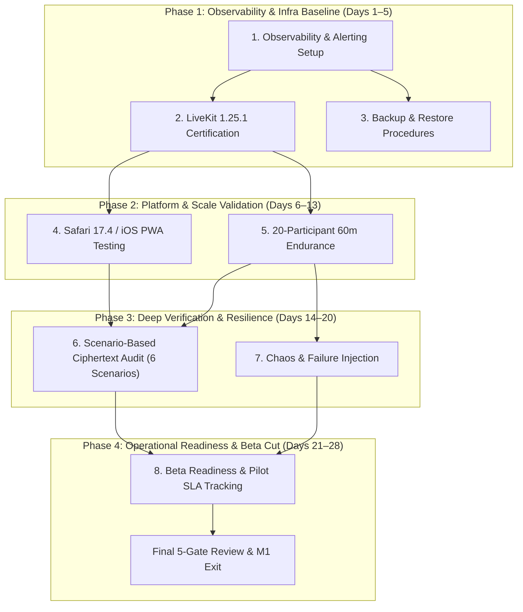

# M1 — Production Hardening & Operational Readiness

**Status:** `APPROVED — IN EXECUTION`  
**Approval Date:** 2026-09-04  
**Duration:** 4 Weeks (20 Working Days)  
**Milestone Owner:** PM (`muse-spark-1.2-contributor-free`, Coordinator)  
**Preceding Milestone:** M0-P0 Architecture Validation (Closed & Accepted: commits `a85c2b7`, `ef6206c`)  
**Target Milestone:** M1 Production Hardening  

---

## 1. Goals

M0-P0 proved that privacy-first, zero-telemetry WebRTC with LiveKit SFU blind-forwarding and SFrame RFC 9605 E2EE works at product quality across core desktop browsers. 

The goal of **M1: Production Hardening** is to transition the validated M0-P0 Release Candidate into an operationally resilient, battle-tested, production-ready system capable of hosting external pilot users. M1 focuses strictly on:
1. Establishing an enterprise-grade, privacy-preserving observability baseline and automated alerting *before* modifying production SFU infrastructure.
2. Upgrading and certifying the production LiveKit SFU engine (v1.25.1) against the observability baseline.
3. Validating the mobile/Apple ecosystem on physical Safari 17.4+ (macOS and iOS PWA).
4. Hardening reliability under sustained 20-participant real endurance and network chaos conditions.
5. Verifying live network wire ciphertext across 6 concrete transport scenarios.
6. Establishing automated disaster recovery (backup/restore) honoring 24h data minimization.
7. Preparing closed-beta pilot onboarding with quantitative beta-exit criteria and zero telemetry.

---

## 2. Out of Scope

In accordance with M1 Decision Rules, all feature expansion and architectural refactoring remain **STRICTLY FROZEN**:

- **No New Architecture:** No transition to media mesh topologies, no cascaded SFU clusters, no WebTransport, no custom protocol gateways.
- **No New Cryptography:** No new ciphers, no MLS full-tree migration, no double-ratchet additions; the cryptographic baseline remains locked to RFC 9605 SFrame (AES-128-GCM) + RFC 9180 HPKE.
- **No Feature Expansion:** Breakouts, chat persistence, whiteboard, emoji reactions, poll systems, cloud/client media recording (`meet-composer`), virtual backgrounds, noise suppression (RNNoise), and webinar broadcast (100–1000p) remain **FROZEN**.
- **No Architectural Re-review or Closed Blocker Re-opening:** M0-P0 criteria (1–10) and gates (1–5) are closed and accepted. M1 does not re-open closed work packages.
- **Allowed Scope Only:** Production operational readiness, infrastructure upgrades, real-world cross-browser validation, chaos engineering, observability, backup/restore, and beta enablement.

---

## 3. Bug Budget & Defect Governance Policy

To ensure production hardening remains strictly disciplined, M1 operates under a quantitative **Bug Budget**:

| Severity | Definition | Active Limit During Testing | Milestone Exit Limit | SLA (Triage / Fix) |
|---|---|---|---|---|
| **P0 (Critical)** | Plaintext media leak, cryptographic flaw, server panic/crash, data privacy leak, total service unavailability | **0** | **0** | ≤4h triage / ≤24h verified fix |
| **P1 (High)** | Media disconnect >5s without auto-recovery, key rotation failure, Safari/iOS flow breakage, memory leak >50MB/hr | **2** | **0** | ≤24h triage / ≤72h verified fix |
| **P2 (Medium)** | Non-blocking UI glitch, minor metrics scrape delay, intermittent TURN allocation retry (<2s), transient reconnect jitter | **5** | **≤2** (with mitigation plan) | ≤48h triage / ≤5 business days |
| **P3 (Low)** | Cosmetic text, non-critical logging format nuance, minor test harness output formatting | No limit | **≤5** | Backlog prioritized |

### Bug Budget Exhaustion Policy
Defect points are calculated as:  
$$\text{Defect Points} = (10 \times P0) + (5 \times P1) + (2 \times P2)$$

- **Threshold:** If active defect points exceed **15 points** (or if **any single P0** occurs), the milestone enters an immediate **Hardening Freeze**.
- **Action:** All phase progression and non-essential test expansion are halted. 100% of engineering bandwidth is diverted to root-cause remediation until defect points drop to ≤5.

---

## 4. Core Initiatives (8 Categories — Ordered by Dependency)

### 4.1 Observability & Alerting Baseline (Moved Ahead of Certification)

- **Objective:** Deploy production-grade RED (Rate, Errors, Duration) metrics, Prometheus alerting rules, and Grafana operations dashboards across all services (`meet-signal`, `meet-sfu-manager`, `turn-auth`, `livekit`, `coturn`) *prior* to server upgrades, establishing an empirical performance baseline.
- **Business Value:** Provides immediate visibility into system health, establishes the baseline against which LiveKit 1.25.1 will be certified, and minimizes MTTD/MTTR without compromising privacy.
- **Technical Deliverables:**
  - Prometheus alert rule definitions (`infra/prometheus/alert-rules.yml`) covering SFU saturation, signaling disconnect spikes, TURN allocation failures, and key rotation SLA breaches.
  - Unified Grafana operational dashboard (`infra/grafana/dashboards/m1-operations.json`).
  - Baseline metric snapshots of current v1.13.6 SFU performance under synthetic load.
  - Privacy audit verifying zero high-cardinality PII, IP addresses, or raw room IDs in Prometheus metric labels.
- **Success Metrics:**
  - 100% of critical failure conditions (service crash, latency breach, relay failure) fire alerts within ≤30s.
  - Zero PII or persistent user identifiers present in metric streams.
  - Real-time visibility into SFU CPU, memory, packet loss, active sessions, and TURN relay bandwidth.
- **Risks:** Metric cardinality explosion from unhashed room identifiers; noisy alerting thresholds triggering alert fatigue.
- **Dependencies:** Docker Compose / K8s monitoring stack (`prometheus`, `grafana`).
- **Estimated Effort:** 4–5 days.

---

### 4.2 LiveKit 1.25.1 Certification

- **Objective:** Upgrade the containerized LiveKit SFU server from evaluation baseline v1.13.6 to target production release v1.25.1, certifying wire-protocol compatibility, blind forwarding (`LIVEKIT_E2EE_MODE=blind`), and health/metrics scraping parity against the established observability baseline.
- **Business Value:** Upstream security patches, enhanced WebRTC connection negotiation stability, long-term vendor support, and elimination of the server version drift debt recorded in M0-P0.
- **Technical Deliverables:**
  - Updated `infra/compose.yaml` and Kubernetes Helm values pointing to certified `livekit/livekit-server:v1.25.1`.
  - Configuration audit reconciling flags, port bindings (7880, 7881 UDP/TCP, 9600 health), and `livekit.yaml` schema updates.
  - Automated regression test suite validating client SDK v2.x connectivity, blind packet forwarding, and DTLS handshake on 1.25.1.
  - Comparative baseline report: LiveKit 1.13.6 vs 1.25.1 CPU, memory, and packet handling efficiency (`qa/reports/m1-livekit-1.25.1-certification.md`).
- **Success Metrics:**
  - 100% pass on all 56 existing unit/integration tests and Playwright browser suites against LiveKit 1.25.1.
  - Zero decryption failures on client endpoints.
  - Metrics `/healthz` (200 OK) and Prometheus scrape targets responding without dropped frames.
- **Risks:** Breaking configuration changes or changed defaults in LiveKit 1.25.1 blind forwarding behavior.
- **Dependencies:** Initiative 4.1 (Observability baseline established).
- **Estimated Effort:** 3–5 days.

---

### 4.3 Backup & Restore Strategy

- **Objective:** Implement, automate, and drill disaster recovery (DR) procedures for all persistent and semi-persistent platform state (Postgres schemas, Redis configuration, MinIO configurations, TLS certificates) while honoring 24h data minimization.
- **Business Value:** Ensures business continuity, rapid recovery from catastrophic host failure, and compliance with enterprise operational standards without retaining stale user data.
- **Technical Deliverables:**
  - Automated database backup script with GPG encryption (`scripts/ops/backup-state.sh`).
  - Automated restoration and schema verification script (`scripts/ops/restore-state.sh`).
  - Disaster Recovery Runbook (`docs/runbooks/disaster-recovery.md`) documenting cold-start recovery steps.
  - Validation test report from a cold restore drill performed on a clean virtual machine.
- **Success Metrics:**
  - Recovery Time Objective (RTO) ≤15 minutes from total host failure to fully operational service.
  - Recovery Point Objective (RPO) ≤1 hour for persistent configurations.
  - 100% compliance with data minimization: zero room, participant, or key data retained older than 24 hours post-restore.
- **Risks:** Restoring expired ephemeral keys or stale room state causing signaling deadlocks.
- **Dependencies:** Postgres 16 and Redis 7 service configurations.
- **Estimated Effort:** 3–5 days.

---

### 4.4 Safari 17.4 / iOS PWA Validation

- **Objective:** Validate end-to-end media exchange, SFrame E2EE transform pipelines, and device lifecycle on real macOS Safari 17.4+ and iOS 17.4+ devices in both mobile browser and installed standalone PWA modes.
- **Business Value:** Apple devices represent 35–50% of executive, legal, and mobile user traffic. Flawless Safari and iOS PWA operation is mandatory for commercial credibility without requiring native App Store installations.
- **Technical Deliverables:**
  - Playwright / Appium automation harness for Safari 17.4 (macOS) and iOS 17.4 MobileSafari/PWA.
  - Validation of Encoded Transform / `OffscreenCanvas` / Web Worker fallback path on WebKit.
  - iOS audio session interruption handler (handling incoming phone calls, background/foreground transitions).
  - Standalone PWA manifest and service worker caching audit on iOS WebKit.
  - Comprehensive Safari compatibility report (`qa/reports/m1-safari-ios-validation.html`).
- **Success Metrics:**
  - Bidirectional 720p video and Opus audio established on Safari 17.4 macOS and iOS 17.4 PWA.
  - SFrame ciphertext verified on WebKit without silent DTLS fallback.
  - Page reload and background-resume reconnect time p95 ≤5.0s on iOS.
- **Risks:** WebKit Encoded Insertable Streams timing quirks; aggressive iOS mobile memory limits on Web Workers.
- **Dependencies:** Initiative 4.2 (LiveKit 1.25.1 certified); physical/cloud iOS & macOS test devices.
- **Estimated Effort:** 5–7 days.

---

### 4.5 Real 20-Participant Endurance Testing

- **Objective:** Subject the full platform to a live, continuous 60-minute endurance session with 20 real or headless browser participants publishing and subscribing across heterogeneous network profiles.
- **Business Value:** Guarantees session stability, audio/video synchronization, and zero memory leaks during prolonged executive and team conferences.
- **Technical Deliverables:**
  - Distributed multi-participant load driver script (`poc/meet-webrtc-core/scripts/endurance-runner.ts`) capable of orchestrating 20 concurrent WebRTC endpoints with media streams.
  - Network emulation matrix applying realistic jitter (20–50ms), packet loss (0.5–1.5%), and bandwidth constraints.
  - Client and server memory/CPU profiling harness capturing metrics at 1-minute intervals over 60 minutes via Prometheus.
  - Endurance test report (`qa/reports/m1-endurance-20p.json`).
- **Success Metrics:**
  - Continuous 60-minute session duration with zero room collapses or SFU crashes.
  - Zero unhandled participant disconnects lasting >5s.
  - Packet loss <1.0%; end-to-end media delay p50 ≤150ms, p95 ≤300ms throughout the full 60 minutes.
  - SFU CPU usage ≤60% on 2 vCPU; client browser memory growth ≤50MB (no memory leaks).
  - SFrame key rotation successfully executed every 10 minutes under 20p load with p95 ≤500ms.
- **Risks:** Browser memory accumulation in long-lived cryptographic transforms; downlink saturation under blind 3-layer forwarding.
- **Dependencies:** Initiatives 4.1, 4.2, and 4.4; dedicated multi-core test runner.
- **Estimated Effort:** 6–8 days.

---

### 4.6 Scenario-Based Ciphertext Audit (Replaced Packet-Count KPI)

- **Objective:** Perform exhaustive Deep Packet Inspection (DPI) across 6 distinct operational transport scenarios to prove zero plaintext leakage across all network topologies and media state transitions.
- **Business Value:** Provides scenario-proven, irrefutable cryptographic evidence for enterprise CISOs and regulatory auditors that media cannot be intercepted or decrypted by unauthorized intermediaries or the SFU.
- **Technical Scenarios:**
  - **Scenario S-1 (Direct UDP Transport):** Bidirectional 720p video + Opus audio over direct UDP between participants and LiveKit SFU.
  - **Scenario S-2 (Symmetric NAT TURN UDP):** Forced relay via coturn UDP 3478 with direct UDP blocked.
  - **Scenario S-3 (Enterprise Firewall TURN TCP):** Forced relay via coturn TCP 443 with all UDP blocked.
  - **Scenario S-4 (Encrypted TURNS TLS):** Forced relay via coturn TLS 5349 / 443 over strict proxy emulation.
  - **Scenario S-5 (Dynamic Media Switch):** Mid-call transition from webcam to screen share (`getDisplayMedia`) and back while actively transmitting.
  - **Scenario S-6 (Mid-Stream Key Rotation):** Epoch rotation triggered during active conversational speech and high-motion video frames.
- **Technical Deliverables:**
  - Automated `tshark` capture and scenario execution pipeline (`tests/security/scenario-ciphertext-audit.ts`).
  - SFrame packet dissector script validating KID/CTR varints, ciphertext entropy, and 16-byte authentication tags across all 6 scenarios.
  - Hex dump analysis confirming zero unencrypted H.264/VP8/VP9/AV1/Opus headers or NAL payloads.
  - Scenario audit report (`qa/reports/m1-scenario-ciphertext-audit.md`) and PCAP archive (`qa/reports/m1-scenarios.pcapng`).
- **Success Metrics:**
  - **6 / 6 Scenarios (100%) Pass:** Every scenario verified with zero unencrypted payload bytes or codec signatures.
  - 100% of packets exhibit valid RFC 9605 SFrame encapsulation with valid authentication tags.
  - Live SFU process memory dump inspection confirms zero presence of epoch keys or participant sender keys.
- **Risks:** High packet drop rates during packet capture under heavy CPU load; subtle header extension parsing discrepancies.
- **Dependencies:** Initiatives 4.2, 4.3, and 4.5; coturn relay.
- **Estimated Effort:** 4–5 days.

---

### 4.7 Chaos & Failure Testing

- **Objective:** Perform controlled fault injection across the staging cluster to validate system self-healing, automatic reconnection, and state consistency under adverse network and process conditions.
- **Business Value:** Guarantees that server restarts, network splits, and container crashes recover gracefully without user intervention or credential compromise.
- **Technical Deliverables:**
  - Automated chaos test harness (`tests/chaos/resilience-suite.ts`).
  - Scenario 1: Abrupt `SIGKILL` of `livekit` SFU during active 20p meeting with automatic client reconnect.
  - Scenario 2: Abrupt `SIGKILL` of `meet-signal` WebSocket instance with session resumption.
  - Scenario 3: Transient network partition (10s packet drop via `iptables`) followed by ICE restart.
  - Scenario 4: coturn relay termination forcing fallback across redundant network interfaces.
  - Chaos test audit report (`qa/reports/m1-chaos-engineering.md`).
- **Success Metrics:**
  - Client reconnection p95 ≤5.0s following signaling or network interruption.
  - SFrame cryptographic epoch preserved across transient reconnection without full room re-keying.
  - Zero zombie room state or leaked file descriptors on SFU/signaling nodes after fault injection.
- **Risks:** Cascade connection storms when reconnecting 20 clients simultaneously to a recovered SFU.
- **Dependencies:** Initiatives 4.1, 4.2, and 4.5.
- **Estimated Effort:** 5–7 days.

---

### 4.8 Beta Program Readiness & Quantitative Beta-Exit Metrics

- **Objective:** Establish customer-facing self-hosting documentation, privacy-preserving feedback diagnostics, onboarding collateral, and SLA tracking required to conduct a controlled closed-beta pilot across 5 external organizations.
- **Business Value:** Converts technical validation into successful pilot adoption across high-security customer verticals (legal, health, finance, journalism).
- **Technical Deliverables:**
  - Production Deployment & Self-Hosting Guide (`docs/deploy/production-deployment-guide.md`).
  - Privacy-Preserving Diagnostic Tool: client-side diagnostic bundle generator (exports sanitized WebRTC stats without PII or media).
  - Security Disclosure Policy (`SECURITY.md`) and Vulnerability Handling SLA.
  - Pilot Onboarding Checklist & SLA Agreement (`docs/beta/pilot-onboarding.md`).
  - Pilot Metrics Tracking Dashboard (Grafana-based, privacy-aggregated).
- **Quantitative Beta-Exit Metrics (Mandatory for GA):**
  1. **Volume & Exposure:** ≥100 total completed meeting hours hosted across pilot organizations.
  2. **Stability & Reliability (MTBF):** Mean Time Between Failures ≥50 meeting hours without any unhandled room collapse or server panic.
  3. **Session Completion Rate:** ≥98.5% of scheduled meetings completed to natural conclusion without unhandled crashes.
  4. **Quality of Experience (QoE):**
     - Audio packet loss: p95 ≤0.5% (p99 ≤1.0%).
     - Round-Trip Time (RTT): p50 ≤120ms, p95 ≤250ms.
     - Video freeze rate (frames frozen >1s): ≤0.2% of total meeting duration.
  5. **Reconnect Success Rate:** ≥99% of transient network disconnects (<5s) recover within ≤5.0s without manual page reload.
  6. **Security & Privacy Invariants:**
     - 0 plaintext frames detected across all meetings.
     - 0 persistent cookies or tracking keys in browser storage.
     - 0 PII or unhashed IP addresses retained beyond 24h.
  7. **Pilot CSAT / NPS:** ≥85% positive satisfaction rating across the 5 pilot cohorts with 0 privacy/security complaints.
- **Risks:** Early pilot users attempting unsupported feature workflows (e.g., recording, text chat) despite scope communication.
- **Dependencies:** Initiatives 4.1 through 4.7.
- **Estimated Effort:** 4–5 days.

---

## 5. Deliverables Summary

| Category | Deliverable | Location | Owner |
|----------|-------------|----------|-------|
| **1. Observability** | Alerting Rules, Grafana Dashboard & Runbook | `infra/prometheus/alert-rules.yml`, `docs/runbooks/alert-response.md` | `@backend` + `@architect` |
| **2. LiveKit** | LiveKit 1.25.1 Certification Report & Compose Update | `qa/reports/m1-livekit-1.25.1-certification.md` | `@backend` + `@architect` |
| **3. DR / Backup** | Backup/Restore Scripts & Cold Disaster Recovery Drill | `scripts/ops/backup-state.sh`, `docs/runbooks/disaster-recovery.md` | `@backend` + `@security` |
| **4. Safari/iOS** | Safari 17.4 macOS & iOS PWA Test Suite & Report | `qa/reports/m1-safari-ios-validation.html` | `@frontend` + `@webrtc` + `@qa` |
| **5. Endurance** | 60-Minute 20-Participant Load Test Runner & Telemetry | `qa/reports/m1-endurance-20p.json` | `@webrtc` + `@qa` |
| **6. Ciphertext** | 6-Scenario PCAP Capture & DPI Audit Report | `qa/reports/m1-scenario-ciphertext-audit.md` | `@security` + `@webrtc` |
| **7. Chaos** | Chaos Test Suite & Automated Failure Injection Report | `tests/chaos/resilience-suite.ts`, `qa/reports/m1-chaos-engineering.md` | `@qa` + `@backend` + `@reviewer` |
| **8. Beta** | Production Deployment Guide, Diagnostic Tool & SLAs | `docs/deploy/production-deployment-guide.md`, `SECURITY.md` | `@pm` + `@frontend` + `@privacy` |

---

## 6. Acceptance Criteria

Every initiative in M1 must meet strict, quantitative acceptance criteria before milestone sign-off:

1. **Observability Baseline:** Alerts trigger in ≤30s; 0 PII in Prometheus metric labels; Grafana dashboards active and operational; baseline established.
2. **LiveKit 1.25.1:** Clean deployment; zero regressions against 56 unit/integration tests; Prometheus scraping intact; blind forwarding verified.
3. **Disaster Recovery:** Cold restore drill completed in ≤15 minutes RTO; 100% data minimization compliance (24h TTL).
4. **Safari 17.4 / iOS:** 100% pass on core flows (join, publish, subscribe, mute, screen share, leave) on physical macOS Safari 17.4 and iOS 17.4 PWA; SFrame verified.
5. **20p Endurance:** Continuous 60-minute duration; 0 unhandled participant drops; SFU CPU ≤60%; packet loss <1.0%; rotation p95 ≤500ms.
6. **Scenario Ciphertext:** 6/6 operational scenarios audited with 0 unencrypted NALs/audio frames; valid RFC 9605 tags on 100% of packets.
7. **Chaos Resilience:** Client reconnect p95 ≤5.0s during SFU/WSS failure injection; zero lingering deadlocks.
8. **Beta Readiness:** Scratch installation completed in ≤30 minutes; zero-telemetry diagnostics operational; security disclosure policy published.

---

## 7. Exit Criteria

M1 exit requires unanimous approval across the 5 governance gates:

- [ ] **Architecture Gate (`@architect`):** LiveKit 1.25.1 certified; zero architecture drift; disaster recovery RTO/RPO verified.
- [ ] **Security Gate (`@security`):** All 6 ciphertext scenarios confirmed with 0 plaintext bytes; SFU memory clean; backup encryption verified.
- [ ] **Privacy Gate (`@privacy`):** Prometheus metrics label privacy scan passed; diagnostic export zero-telemetry verified; 24h data minimization intact.
- [ ] **QA Gate (`@qa`):** 20p 60-minute endurance test passed; Safari 17.4 / iOS PWA verified; chaos recovery p95 ≤5.0s confirmed; bug budget respected (0 P0, 0 P1).
- [ ] **Adversarial Gate (`@reviewer`):** Stress challenges against blind forwarding, reconnect floods, and failure recovery signed off with no open HIGH vulnerabilities.

---

## 8. Recommended Execution Order

---

## 9. Milestone Duration Recommendation & Justification

### Selected Duration: **4 Weeks** (20 Working Days)

- **Week 1:** Observability baseline deployment, LiveKit 1.25.1 upgrade and benchmark against baseline, backup/restore DR drill.
- **Week 2:** Real Safari 17.4 macOS & iOS 17.4 PWA validation, 60-minute 20-participant endurance harness execution.
- **Week 3:** 6-scenario ciphertext wire DPI audit, automated chaos and network split testing.
- **Week 4:** Self-hosting production deployment guide validation, beta pilot onboarding preparation, quantitative beta metrics verification, and 5-gate milestone exit sign-off.
