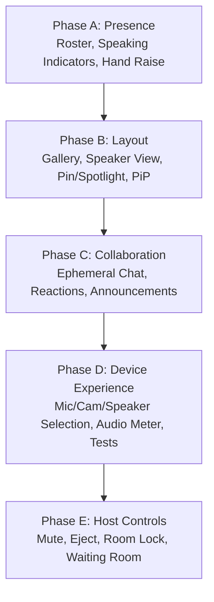

# M2 Milestone Specification — Meeting Experience

**Milestone:** M2 Meeting Experience  
**Status:** AUTHORIZED ✅  
**Prerequisites:** M0-P0 (RC1 Closed), M1 Hardening (Closed, baseline tagged `beta-ready`)  
**Timeline:** 4 Weeks  
**Owner:** PM (muse-spark-1.2-contributor-free, Coordinator)  
**Governance:** 5-Gate Review (`@architect`, `@security`, `@privacy`, `@qa`, `@reviewer`)  

---

## 1. Executive Vision

With infrastructure, cryptographic correctness, SFrame media transport, browser compatibility, and disaster recovery certified in M0-P0 and M1, **all foundational engineering risks are closed**.

M2 marks the transition from foundational proof (*"Can we build it?"*) to product excellence (*"Which feature do we build next?"*). M2 focuses exclusively on **Meeting Experience Quality**—the human-facing interface, device control, spatial layout, and ephemeral collaboration that define user delight in high-security organizations (Legal, Telehealth, Financial Advisory, Investigative Journalism, and Incident Response).

---

## 2. Permanent Product Exclusions ("Will Not Build")

The following items are **permanent architectural constraints**, not deferred backlog items. Any PR attempting to introduce these capabilities will be automatically rejected by governance gates:

```
========================================================================================
                          PERMANENT PRODUCT EXCLUSIONS
========================================================================================
  ✗ AI summaries                   (Zero LLM/ML models processing meeting content)
  ✗ AI transcripts                 (Zero speech-to-text inference or audio ingestion)
  ✗ AI assistants / bots           (Zero automated non-human meeting participants)
  ✗ Attention / gaze tracking      (Zero biometric or behavioral tracking)
  ✗ Usage / engagement analytics   (Zero telemetry SDKs, zero Mixpanel/Google Analytics)
  ✗ Behavioral tracking            (Zero user interaction profiling or clickstream capture)
  ✗ Cloud recording                (Zero server-side media encoding or disk persistence)
  ✗ Cloud transcription            (Zero server-side speech analysis)
  ✗ Server-side media processing   (Zero server-side transcoding, composition, or decryption)
========================================================================================
```

### Core Invariants
1. **100% Ephemeral State:** All chat messages, reactions, hand raises, and device preferences are stored strictly in volatile client memory. Zero disk persistence, zero database storage.
2. **Zero-Knowledge Signaling:** Collaboration messages flow through encrypted WebRTC DataChannels or ephemeral, unpersisted WebSocket frames. The server never reads chat content or participant reactions.
3. **Clean Teardown:** When a meeting ends or a participant leaves, all local and remote meeting artifacts (chat history, participant list, roster state) are immediately garbage-collected.

---

## 3. Five M2 Feature Phases



### Phase A: Real-Time Presence & Awareness
- **Objective:** Give participants immediate, accurate awareness of meeting composition and speaking activity.
- **Deliverables:**
  1. **Participant Roster Drawer:** Side drawer displaying connected participants, local vs. remote status, audio/video toggle states, and quick search/filter.
  2. **Active Speaking Indicators:** Real-time visual speaker highlights (audio level border animations) driven by WebRTC `AudioContext` and LiveKit audio level events.
  3. **Connection Quality Indicators:** Visual signal strength indicator (Excellent / Good / Poor / Disconnected) calculated from active ICE candidate RTT, jitter, and packet loss.
  4. **Join / Leave Toast Notifications:** Ephemeral, non-intrusive toast alerts when participants enter or exit the room.
  5. **Hand Raise Signaling:** Visual badge on participant tiles and roster indicating raised hands, ordered chronologically.
  6. **Host Role Designation:** Clear visual marker for the room leader/host.

### Phase B: Adaptive Visual Layouts
- **Objective:** Provide versatile video layouts tailored to conversation, presentation, and webinar modes.
- **Deliverables:**
  1. **Gallery View (Auto-Balancing Grid):** Dynamic CSS grid adapting cleanly from 1 to 20 participants with Last-N=9 pagination for optimal bandwidth.
  2. **Speaker View:** Large stage area featuring the dominant active speaker, accompanied by a horizontal or vertical filmstrip of thumbnail peers.
  3. **Pinned Participant:** User-level override allowing any attendee to fix a specific participant to the primary stage view.
  4. **Spotlight Participant:** Host-level control that fixes a designated speaker to the main stage for *all* attendees.
  5. **Screen-Share-First Layout:** Automatic transition to maximized content stage when screen sharing starts, preserving a floating presenter strip.
  6. **Picture-in-Picture (PiP) Presenter Layout:** Floating presenter webcam tile overlaid in the corner of shared screen content.

### Phase C: Ephemeral In-Meeting Collaboration
- **Objective:** Enable rich collaboration during calls without compromising data privacy.
- **Deliverables:**
  1. **Ephemeral Meeting Chat:** In-memory, end-to-end encrypted chat over WebRTC DataChannels. Features plaintext and markdown support, zero server logging, and automatic purge on call exit.
  2. **Floating Reactions:** Lightweight emoji reactions (👍, 👏, ❤️, 🎉, ✋) floating upward across video tiles with subtle CSS animations.
  3. **Host Announcements:** Broadcast banner messages triggered by the host that appear prominently at the top of all participants' screens.
  4. **Hand Raise Queue:** Dedicated host panel displaying the chronological order of raised hands with one-click "Lower All" or "Lower Hand" controls.

### Phase D: Device Selection & Hardware Experience
- **Objective:** Ensure seamless hardware setup and rapid self-diagnosis of audio/video issues.
- **Deliverables:**
  1. **Microphone Selection:** Device dropdown querying `navigator.mediaDevices.enumerateDevices()`, allowing hot-swapping of audio inputs mid-call.
  2. **Speaker Selection (`setSinkId`):** Audio output selector allowing routing to external headphones, speakers, or headsets (with graceful fallback on Safari/WebKit).
  3. **Camera Selection:** Video input switcher with live preview tile.
  4. **Microphone Level Test:** Live audio input visualizer meter allowing users to verify mic volume before and during meetings.
  5. **Speaker Test Chime:** One-click pleasant audio chime playback to verify speaker output routing.
  6. **Live Network Diagnostics Modal:** Real-time display of WebRTC stats (bitrate, loss, RTT, SFrame cipher suite, current epoch) using the sanitized diagnostic engine.

### Phase E: Host Management & Governance Controls
- **Objective:** Provide meeting hosts with the authority required to manage orderly, secure conferences.
- **Deliverables:**
  1. **Remote Mute Participant:** Host can mute an attendee's microphone (relayed as an authenticated signaling directive).
  2. **Eject / Remove Participant:** Host can remove an attendee from the room, revoking their session and tearing down peer connections.
  3. **Room Lock:** Host can lock the room, preventing any new participants from joining even with a valid link.
  4. **Waiting Room (Knock Gate):** Attendees knock to join; host must approve or deny entry before credentials are exchanged.
  5. **Screen Share Permissions Policy:** Host toggle to allow/disallow screen sharing by non-host participants.
  6. **Host Transfer:** Host can designate another connected participant as the new room host.

---

## 4. Phase Breakdown & Implementation Roadmap

```
Week 1 (Days 1–5):   Phase A (Presence) & Phase B (Layout Foundations)
Week 2 (Days 6–10):  Phase B (Spotlight/PiP) & Phase C (Ephemeral Collaboration)
Week 3 (Days 11–15): Phase D (Device Experience & Audio Meters)
Week 4 (Days 16–20): Phase E (Host Controls) & 5-Gate Milestone Review
```

---

## 5. Acceptance & Verification Gates

Each phase must meet strict criteria before merge:
- **Unit & Component Testing:** Vitest coverage for all new Zustand store slices, React hooks, and UI components.
- **Zero Telemetry / Zero Storage Audit:** `@privacy` review verifying zero `localStorage`, zero server-side database tables, and zero persistent logs for chat/reactions.
- **Cryptographic Preservation:** `@security` audit verifying that SFrame media transforms and DataChannel encryption operate without regression.
- **Accessibility (a11y):** Keyboard navigation (Tab/Esc/Enter), ARIA announcements (`aria-live="polite"` on speaker/reactions), and WCAG AA contrast.
- **Bug Budget:** Zero P0 bugs, zero P1 bugs.
