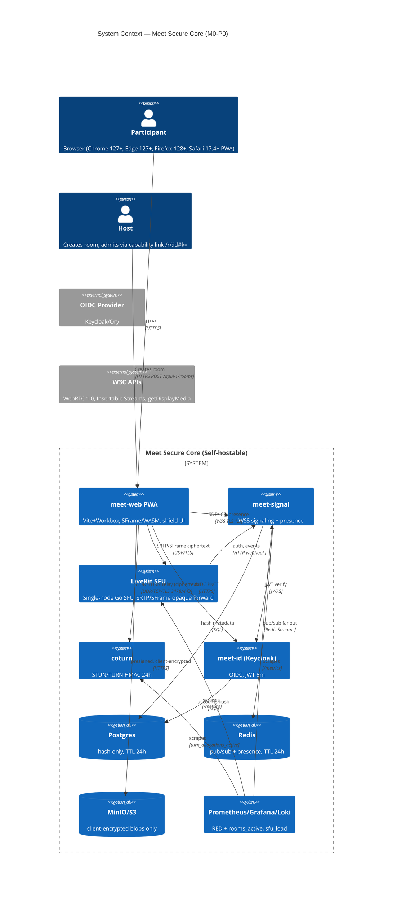
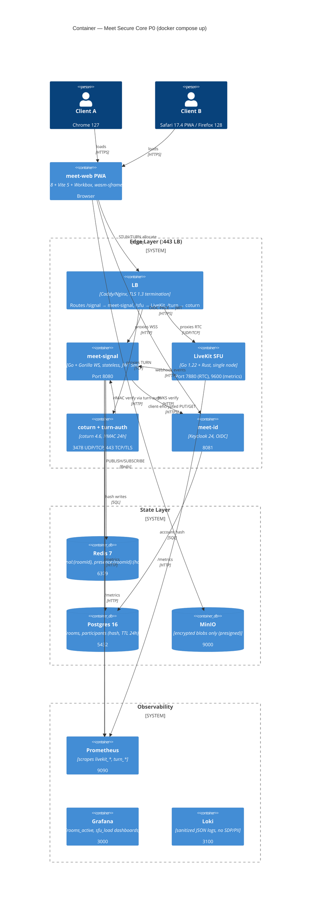

# Meet Secure Core — C4 Model (M0-P0)
**Level 1 (Context) + Level 2 (Container)** | **Scope:** 20p single-SFU, SFrame/WASM, Redis pub/sub, coturn HMAC 24h | **Date:** 2026-09-01 | **Author:** @architect | **Status:** REVIEW REQUIRED

---

## C4 Level 1 — System Context



**External dependencies:** None beyond W3C browser + self-hosted containers. No analytics, no FCM.

---

## C4 Level 2 — Container Diagram (P0 Deploy)



---

## Data Flow Sequences (P0)

### Signaling (WSS) — supports criteria 2,3,6,7
```
Client --WSS JOIN--> LB --→ meet-signal (validate JWT aud=roomId, nonce)
       --PUBLISH signal:{roomId}--> Redis --fanout--> all signal pods --WSS--> peers
       presence SET presence:{roomId}:{hash} EX 24h + heartbeat 5s
```

### Media (SRTP/SFrame) — supports 4
```
Client enc --SRTP/SFrame (SFrame header KID/CTR + ciphertext)--> LB --> LiveKit SFU --opaque forward by SSRC/mid--> peers
SFU never decrypts; Wireshark shows random payload. Dynacast disabled when e2ee=true → blind-forward all 3 layers.
```

### Key Rotation — supports 6
```
Leader --DataChannel Commit(epoch+1) HPKE--> peers + --WSS Welcome HPKE--> joiner
Peers measure performance.now() trigger→setEncryptionKey ack; zeroize on leftAt.
```

### Reconnect — supports 7
```
Network drop --→ client WSS reconnect + POST /rooms/:id/token refresh + ICE restart offer (ice-ufrag new) → signal → SFU
Epoch preserved; buffered commits replayed from Redis signal:{roomId}:buffer TTL 30s.
```

### TURN — supports 8,10
```
Client --POST /turn/credentials--> turn-auth → HMAC(username=expiry:hash, secret) TTL 24h
ICE: STUN → TURN UDP 3478 → TURN TCP 443 → TURNS 443 (relay candidate <2s, candidateType=relay)
Logs: IP hashed, purged 24h; metrics turn_allocations_active scraped.
```

### OIDC — supports 10
```
Client --PKCE--> Keycloak → JWT {sub: hash, aud: roomId, exp: 5m} → WSS auth
PG stores only hash; no plaintext email.
```

---

## Deployment View — Compose (P0) vs K8s (Parity)

| Aspect | **Compose (P0 validated)** | **K8s Helm (parity)** |
|--------|---------------------------|-----------------------|
| Command | `docker compose up --build` (single host 4 vCPU/8GB) | `helm install meet-secure ./charts/meet-secure` |
| SFU | `livekit:1.25` single container `cpus: '2.0'` | `livekit` StatefulSet 1 replica (HPA 1→3 post-P0), headless Service |
| Signal | `meet-signal` 1 replica (scale ` --scale meet-signal=2` tested via Redis pub/sub) | Deployment 2-3 pods HPA CPU>70% or WS>5k |
| Redis | `redis:7-alpine` single | Redis Sentinel 3 nodes (1 master) |
| PG | `postgres:16-alpine` | Patroni 3 nodes |
| TURN | `coturn:4.6` single + `turn-auth` sidecar | DaemonSet or Deployment 1→2 HPA on `turn_allocations_active` |
| LB | `caddy:2` TLS via `caddy` or `nginx` | Ingress-Nginx + cert-manager |
| Obs | `prometheus`, `grafana`, `loki` | Same charts, ServiceMonitor |
| Validation | CI `docker compose config` + `docker compose up --wait` + `GET /healthz` + Prometheus scrape | `helm template` diff vs compose env — digests must match |

**Single-node claim validated:** ≤50 concurrent rooms (each 2-5p) or 1×20p room on 4 vCPU/8GB; beyond requires K8s. Honest, not “unlimited”.

---

## Scale Tier Table (P0 + Frozen)

| Tier | Topology | Nodes | Downlink/Viewer | P0 Status |
|------|----------|-------|-----------------|-----------|
| 1:1 | P2P preferred → SFU fallback | 0-1 SFU | ~1.5 Mbps | FROZEN (SFU≥3 directly for P0) |
| **≤20** | **Single SFU, simulcast 3×2, SFrame blind-forward Last-N=9** | **1× 1 vCPU/2GB (2 vCPU documented)** | **~10 Mbps measured (blind 3 layers, 9 tiles) / 2.5 Mbps if header-aware future** | **P0 VALIDATED** |
| 20-100 | Cascaded SFU mesh + Last-N | 3-5/region | ~2.5 Mbps | FROZEN until GO |
| 1000 webinar | Fanout SFU (recvonly) + edge + HLS fallback (non-E2EE) | 8-10/region | ~1.8 Mbps | FROZEN until GO |

> Note: blind-forward cost is why P0 caps at 20p. 100p would be 3× cost and is explicitly frozen.

---

## Consistent Hashing — `roomId → SFU` (K8s-ready on day 1)

**Rendezvous HRW** (see `architecture-brief.md` §6):

```
nodes = READ redis sfu:nodes (or SFU_NODES env in Compose)
best = max( hash(roomId + "|" + nodeId) / (1+load*10) )
assign = best.nodeId
cache redis sfu:assign:{roomId} TTL 5m
```

- **Compose:** `SFU_NODES=livekit-0:7880` → all rooms → same node.
- **K8s:** headless DNS `livekit-headless:7880` endpoint watch → list dynamic, no config change.
- **Rebalance:** Only rooms on removed node move (HRW minimal movement). No sticky sessions; signal caches 5s.

---

## HA / RTO <60s

| Failure | RTO | Mechanism |
|---------|-----|-----------|
| meet-signal pod | <5s p95 | WSS reconnect + JWT refresh + ICE restart |
| LiveKit SFU | <60s | `restart: unless-stopped` (Compose ~8s) / K8s Always + clients ICE restart to new assignment |
| Redis | <30s | Sentinel failover (K8s) / restart (Compose), presence re-SET |
| coturn | <20s | HPA 1→2, client picks new TURN via ICE restart |
| PG | <60s | Patroni / restart, JWT 5m masks short outage |

---

## Traceability to 10 Criteria

See `architecture-brief.md` §10 matrix. This C4 supports all: L1/L2 shows WSS, SRTP/SFrame, TURN, OIDC, Redis, LB, observability.

---

*End of C4 P0. Pending 5-gate REVIEWED.*
