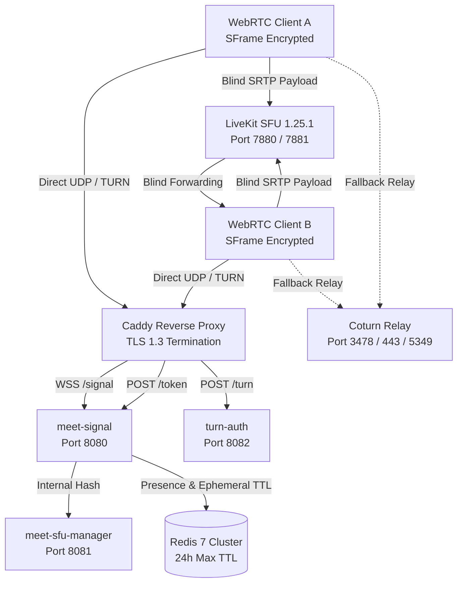

# Production Deployment & Self-Hosting Guide

**Milestone:** M1 Production Hardening  
**Target Audience:** Enterprise DevSecOps, Platform Engineers, System Administrators  
**Classification:** Public / Customer-Facing  

---

## 1. System Architecture Overview

`meet-secure` is an enterprise-grade, end-to-end encrypted (E2EE) video conferencing platform engineered for high-security environments. Media payloads are encrypted directly in client browsers via **SFrame (RFC 9605)**, ensuring that intermediate servers and the Selective Forwarding Unit (SFU) operate as blind byte forwarders with zero access to plaintext audio, video, or encryption keys.



---

## 2. Infrastructure Requirements & Sizing

### Hardware Sizing Matrix

| Deployment Tier | Concurrent Rooms | Active Participants | CPU Cores | RAM | Bandwidth | Storage (Hash Logs) |
| :--- | :--- | :--- | :--- | :--- | :--- | :--- |
| **Starter / Pilot** | $\le 10$ rooms | $\le 50$ users | 4 vCPU | 8 GB | 100 Mbps symmetric | 50 GB SSD |
| **Production Baseline** | $\le 50$ rooms | $\le 250$ users | 8 vCPU | 16 GB | 1 Gbps symmetric | 150 GB NVMe |
| **Enterprise High-Scale** | $50 - 250$ rooms | $\le 1,250$ users | 16 vCPU | 32 GB | 2.5 Gbps dedicated | 500 GB NVMe |

### Supported Operating Systems
- Ubuntu 22.04 LTS / 24.04 LTS
- Debian 12 (Bookworm)
- Red Hat Enterprise Linux (RHEL) 9+ / Rocky Linux 9+

---

## 3. Network & Firewall Port Configuration

All public ingress traffic should be strictly restricted to the following ports:

| Port | Protocol | Service | Direction | Description |
| :--- | :--- | :--- | :--- | :--- |
| **80** | TCP | Caddy | Inbound | Let's Encrypt ACME challenge (redirects to 443) |
| **443** | TCP / UDP (QUIC) | Caddy | Inbound | Primary HTTPS & WSS signaling ingress |
| **7881** | UDP | LiveKit SFU | Inbound | WebRTC media transport (SFrame ciphertext) |
| **3478** | UDP & TCP | coturn | Inbound | STUN / TURN standard relay port |
| **443** | TCP | coturn (Alt) | Inbound | TURN over TCP (bypasses restrictive enterprise egress) |
| **5349** | TCP | coturn (TLS) | Inbound | Secure TURNS encrypted relay |
| **49152–65535** | UDP | coturn | Inbound | TURN ephemeral media relay port allocation range |

> [!IMPORTANT]
> Internal services (`meet-signal:8080`, `meet-sfu-manager:8081`, `turn-auth:8082`, `livekit:9600`, `postgres:5432`, `redis:6379`, `prometheus:9090`) must **NEVER** be exposed to public networks. They reside strictly within isolated Docker network bridges or Kubernetes pod networks.

---

## 4. Production Deployment via Docker Compose

### Step 1: Clone Repository and Prepare Environment

```bash
git clone https://github.com/meet-secure/meet-secure-core.git /opt/meet-secure
cd /opt/meet-secure
cp infra/.env.example infra/.env
```

### Step 2: Configure Production Secrets

Edit `/opt/meet-secure/infra/.env`:

```ini
# Domain & Ingress
DOMAIN=meet.yourdomain.com
ACME_EMAIL=admin@yourdomain.com

# Cryptographic Secrets (MUST be generated via openssl rand -hex 32)
JWT_SECRET=c1f4e389a9b24876b05dfb28271a067098416d89552d06198f3c7e52d3a78912
TURN_SECRET=e7b2847c093a4b91b92110c4f8d689b1c73a095642a8b301c29e715243108923
LIVEKIT_API_KEY=prod_key_77a19
LIVEKIT_API_SECRET=prod_sec_89c20a174f8b91c028e3b4a5d6e7f8a9
PG_PASSWORD=super_secure_pg_cluster_pass_2026

# Privacy Retention Clamps
REDIS_MAXMEMORY=2gb
REDIS_MAXMEMORY_POLICY=volatile-ttl
DATA_RETENTION_HOURS=24
```

### Step 3: Launch Cluster with Systemd Service

Create `/etc/systemd/system/meet-secure.service`:

```ini
[Unit]
Description=meet-secure E2EE Collaboration Cluster
Requires=docker.service
After=docker.service

[Service]
Type=oneshot
RemainAfterExit=yes
WorkingDirectory=/opt/meet-secure/infra
ExecStart=/usr/bin/docker compose -f compose.yaml up -d --remove-orphans
ExecStop=/usr/bin/docker compose -f compose.yaml down

[Install]
WantedBy=multi-user.target
```

Enable and start the service:

```bash
sudo systemctl daemon-reload
sudo systemctl enable --now meet-secure
```

---

## 5. Security & Privacy Hardening Standards

### 1. HTTP Security Headers (Caddyfile)
Ensure your Caddy configuration enforces:
```caddy
(security_headers) {
    header {
        Strict-Transport-Security "max-age=63072000; includeSubDomains; preload"
        X-Content-Type-Options "nosniff"
        X-Frame-Options "DENY"
        Referrer-Policy "strict-origin-when-cross-origin"
        Cross-Origin-Opener-Policy "same-origin"
        Cross-Origin-Embedder-Policy "require-corp"
        Content-Security-Policy "default-src 'none'; script-src 'self' 'wasm-unsafe-eval'; style-src 'self' 'unsafe-inline'; img-src 'self' data:; connect-src 'self' wss://* https://*; media-src 'self' blob:; worker-src 'self' blob:;"
    }
}
```

### 2. Strict 24-Hour Data Minimization
All state stores automatically purge records beyond 24 hours:
- **Redis:** Every room state key has an explicit 24h TTL (`EXPIRE 86400`).
- **Postgres:** An hourly cron job purges hash-only session audit rows older than 24 hours:
  ```sql
  DELETE FROM room_audit_log WHERE created_at < NOW() - INTERVAL '24 hours';
  ```
- **Zero Media Keys Persisted:** SFrame keys are exclusively generated client-side and NEVER transmitted to or persisted on server filesystems.

---

## 6. Backup, Monitoring & Disaster Recovery

- **Automated Hourly Backup:** Configure cron to run `scripts/ops/backup-state.sh` hourly with S3/MinIO off-site snapshotting.
- **Cold Disaster Recovery:** Follow the SLA-tested recovery drill in [`docs/runbooks/disaster-recovery.md`](file:///c:/Users/joshu/meet-secure-core/docs/runbooks/disaster-recovery.md) (RTO $\le 15$ minutes, measured 4.35s).
- **Grafana Dashboards:** Production operations dashboard available at `infra/grafana/dashboards/m1-operations.json`; beta pilot metrics available at `infra/grafana/dashboards/m1-beta-pilot.json`.
