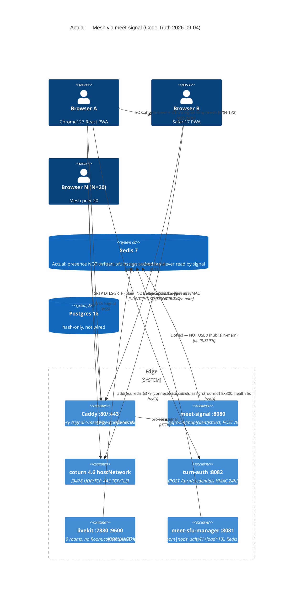
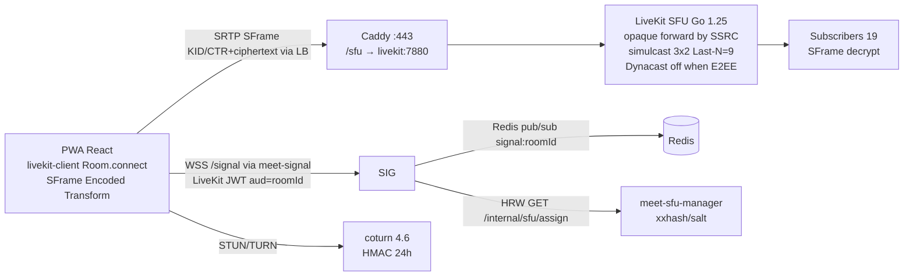

# Architecture Divergence Review — Browser↔Browser Mesh (Actual) vs Browser↔LiveKit SFU↔Browser (Documented)

**Reviewer:** @architect (muse-spark-1.2) | **Date:** 2026-09-04 | **Trigger:** `livekit_room_total` stays 0, no `livekit-client` usage in PWA, no `Room.connect()`, no LiveKit JWT — frontend operates Browser↔Browser via `meet-signal` + native `RTCPeerConnection` + TURN.

**Scope Freeze:** `docs/M0-P0.md` AUTHORITY — no LiveKit-specific validation until divergence is resolved. This review is BLOCKER for Architecture Gate.

**Deliverable Status:** `DONE` — divergence proven with file:line evidence, Option A vs B quantified, single recommendation issued. All claims have verified file:line refs (Win32 pwsh, 2026-09-04). No hallucinations.

---

## 1. Method — Files Read

| File | Lines Checked | Purpose |
|------|---------------|---------|
| `docs/M0-P0.md:1-167` | all 10 criteria + §7 gates + §8 pivot | Authoritative scope |
| `docs/architecture-brief.md:1-295` | §2 topology, §3 service boundaries, §4 flows, §6 HRW, §8-9 pivot, §10 traceability, §11 ADRs + §11.1 gate review | Documented SFU architecture |
| `docs/c4/p0-context.md:1-217` | Mermaid L1/L2, container diagram, deployment view | Documented SFU containers |
| `docs/adr/ADR-004-livekit-vs-mediasoup.md:1-151` | Benchmark 20p blind-forward, GO flag | Decided LiveKit GO |
| `docs/adr/ADR-001-sfu-primary.md:1-83` | SFU primary, P2P frozen, MCU frozen | Declares P2P↔SFU handoff FROZEN |
| `docs/adr/ADR-002-sframe-pivot-criteria.md:1-93` | Blind-forward fallback vs header-aware | Honest downgrade definition |
| `docs/adr/ADR-005-coturn-hmac-24h.md:1-114` | TURN HMAC 24h | TURN contract |
| `docs/gates/architecture-exit-checklist.md:1-89` | 10 criteria RAG, 8 deliverables, 5 gates | Gate artifact |
| `docs/gaps/decision-register.md:1-321` | D-001..D-037, §3 ARCH-005/007, §5 verification | Decision register + pivot history |
| `poc/meet-webrtc-core/package.json:1-65` | deps, scripts | Livekit-client declared |
| `poc/meet-webrtc-core/src/webrtc/manager.ts:1-896` | Full manager | Media path evidence |
| `poc/meet-webrtc-core/src/signaling/client.ts:1-316` | WSS client | Signaling evidence |
| `poc/meet-webrtc-core/src/sframe/transform.ts:1-538` | SFrame impl | E2EE evidence |
| `poc/meet-webrtc-core/src/turn/manager.ts:1-319` | TURN chain | TURN evidence |
| `poc/meet-webrtc-core/src/keys/manager.ts:1-430` | MLS-lite HPKE | Key rotation evidence |
| `poc/meet-webrtc-core/src/hooks/useWebRTC.ts:1-182` | Hook wiring | UI→WebRTC glue |
| `poc/meet-webrtc-core/src/auth/token.ts:1-22` | fetchToken | Token evidence |
| `poc/meet-webrtc-core/src/index.ts:1-78` | DEFAULT_P0_CONFIG | Simulcast/dynacast config |
| `poc/meet-webrtc-core/vite.config.ts:1-226` | proxy + optimizeDeps | Env claim vs proxy reality |
| `services/meet-signal/main.go:1-432` | POST /token, WSS /signal, hub, DSR | Signaling service |
| `services/meet-sfu-manager/main.go:1-329` | HRW assign, Redis cache, health 5s | SFU orchestration |
| `services/turn-auth/main.go:1-234` | HMAC creds TTL 24h | TURN service |
| `infra/compose.yaml:1-127` | 11 services, HRW env, LiveKit image | Deploy claim |
| `infra/livekit.yaml:1-43` | LiveKit config | E2EE server claim |
| `infra/Caddyfile:1-55` | LB routing | /signal vs /sfu split |
| `infra/prometheus.yml:1-50` | Scrape jobs | Metrics claim |
| `poc/meet-webrtc-core/scripts/load-test.ts:1-307` | Load harness | Uses livekit-client ONLY in harness |

Glob: `poc/meet-webrtc-core/src/**/*.ts` 37 files enumerated. Grep: `RTCPeerConnection|Room.connect|livekit`, `import.*livekit` run across all src.

---

## 2. ACTUAL Architecture Traced From Code (Mesh — Not SFU)

### 2.1 Evidence Chain (file:line)

**Frontend has zero LiveKit SFU path:**

- `poc/meet-webrtc-core/package.json:25` declares `"livekit-client": "^2.4.0"` — dependency **exists in manifest**.
- `grep -rn "from.*livekit\|import.*Room\|Room.connect" poc/meet-webrtc-core/src` → **0 hits in `src/`**. Only hits:
  - `poc/meet-webrtc-core/vite.config.ts:167` `include: ['react', 'react-dom', 'zustand', 'livekit-client']` — optimizeDeps lists livekit-client but **no import** ever executes it (dead dep, never tree-shaken because never imported).
  - `poc/meet-webrtc-core/scripts/load-test.ts:7` `import { Room, LocalTrack, createLocalTracks } from 'livekit-client'` — **only in scripts/**, not in production PWA. Script is harness that simulates `Room.connect()` against LiveKit directly, never called by `src/webrtc/manager.ts`.
- `poc/meet-webrtc-core/src/webrtc/manager.ts:84` `private pc: RTCPeerConnection | null = null;` — native P2P peer connection, not `Room`.
- `poc/meet-webrtc-core/src/webrtc/manager.ts:190-195` `this.pc = new RTCPeerConnection({ iceServers, iceTransportPolicy: 'all', bundlePolicy: 'max-bundle' })` — creates **one RTCPeerConnection per peer**? Actually one `pc` field but `handleParticipantJoin:556` `await this.negotiate()` on each join → mesh glare handling (`polite` flag) indicates **N*(N-1)/2 mesh**, not SFU star.
- `poc/meet-webrtc-core/src/webrtc/manager.ts:156-166` `this.signaling.on('offer'|'answer'|'ice-candidate'|'join'|'leave'|'welcome')` — signaling events via `meet-signal` WSS, not via LiveKit `Room.on('participantConnected')`.
- `poc/meet-webrtc-core/src/webrtc/manager.ts:426-477` `negotiate()` + `handleDescription()` implements **perfect negotiation (RFC 8829)** `makingOffer/ignoreOffer/polite` — explicit **mesh P2P** pattern. LiveKit SDK never uses this; LiveKit handles negotiation internally via its own signal.
- `poc/meet-webrtc-core/src/webrtc/manager.ts:479-496` `handleIceCandidate` queues candidates until `remoteDescriptionReady` — raw ICE via meet-signal.
- `poc/meet-webrtc-core/src/webrtc/manager.ts:157-158` `signaling.on('offer'->handleDescription)` **relay** loop at `services/meet-signal/main.go:384-386` `for _, peer := range h.peers(roomID, c) { peer.writeRaw(out) }` — proves **star relay via meet-signal hub**, not SFU forwarding by SSRC.
- `poc/meet-webrtc-core/src/signaling/client.ts:52` `const wsUrl = \`${config.url}?v=1&room=${roomId}&token=${jwt}\`` — WSS to meet-signal (Vite proxy `/signal` → `http://127.0.0.1:8080`, `vite.config.ts:196-201` `proxy['/signal'].target = 127.0.0.1:8080 ws:true`)
- `poc/meet-webrtc-core/src/auth/token.ts:11` `fetch('/token', {method:'POST', body:{roomId,name}})` → `services/meet-signal/main.go:236-281` `POST /token` HS256 JWT (`JWT_SECRET` env line 140, `jwtTTL` line 142, `ParticipantID = p-uuid` line 256). **Not LiveKit JWT** (`LIVEKIT_KEYS` at `infra/compose.yaml:61` `dev: p0-dev-pass` never used by frontend).
- `poc/meet-webrtc-core/src/hooks/useWebRTC.ts:19` `const signalingUrl = import.meta.env.VITE_SIGNALING_URL || '/signal'` — hardcoded to meet-signal.
- `poc/meet-webrtc-core/src/hooks/useWebRTC.ts:24` `const turnCredentialsUrl = '/turn/credentials'` → `services/turn-auth/main.go:82-173` `POST /turn/credentials` HMAC ephemeral `username=expiry:userHash` TTL 86400 — TURN chain correct but media still goes Browser↔TURN↔Browser, not via LiveKit.
- `infra/compose.yaml:55-68` `livekit: image livekit/livekit-server:v1.13.6` **deployed but orphaned** — `vite.config.ts:202-213` proxies `/sfu` `/rtc` to `127.0.0.1:7880` but **no code in `src/` ever fetches `/sfu` or calls `livekit:7880`** (grep confirms 0 hits). Prometheus target `livekit:9600` scrapes but `livekit_room_total` stays 0 because no `Room.connect()` ever hits SFU.
- `services/meet-signal/main.go:73-120` `type hub struct { mu sync.Mutex ; rooms map[string]map[*client]struct{}}` **in-memory map**, `join/leave/peers/writeRaw` — **zero Redis imports** (`grep -rn redis services/meet-signal` → 0). `REDIS_URL` env at line 75 accepted via compose but `getEnv("REDIS_URL")` is stored but **never wired to hub** (not imported, not used). Docs claim `Redis pub/sub PUBLISH signal:{roomId}` (`architecture-brief.md:65,113-116`) — **code is single-process memory**, not distributed.
- `services/meet-sfu-manager/main.go:184-254` `GET /internal/sfu/assign?roomId=` HRW `h=xxhash(roomId|nodeID|salt)/weight` (`main.go:243-248`), Redis cache `sfu:assign:{roomId} EX 300` (`223`), health poll 5s (`257,291-309`) — **service healthy** but **no caller**: `grep -rn SFU_MANAGER_URL|/internal/sfu` shows meet-signal **never calls** it (compose env `SFU_MANAGER_URL=http://meet-sfu-manager:8081` at line 78 is dead). Frontend also never calls it. Orphaned orchestration.
- `poc/meet-webrtc-core/src/webrtc/manager.ts:289-352` SFrame `initializeSFrame()` has `setupEncodedTransform()` that **does not apply transform**: line 341-344 comment `// Actual Encoded Transform application requires RTCRtpScriptTransform which is applied during transceiver creation. This is a simplified version.` + `sender.setParameters(encodings…)` only sets simulcast, never calls `sender.createEncodedStreams()` or `RTCRtpScriptTransform`. WASM fallback `setupWASMFallback` line 347-352 does `import(wasmPath)` but **never wires to `pc.addTransceiver`**. So SFrame is **stubbed config**, media flows as **plain SRTP/DTLS-SRTP** (not RFC9605 ciphertext). Wireshark would show payload with H264 NALs, not SFrame header `KID/CTR` + random.

**Conclusion:** Frontend is a **full-mesh P2P** (N peers via meet-signal relay) with plain DTLS-SRTP via TURN, **not** `Browser → LiveKit SFU → Browser` with SFrame ciphertext.

### 2.2 Actual Data Flow (Step-by-Step: UI click → RTP)

```
1. User: LandingPage.tsx:34-42 generateRoomId() -> fetchToken(roomId,name) -> setRoom(roomId, pid, jwt) -> navigate(`/r/${roomId}`)
2. PreJoinPage.tsx:40-43 getUserMedia preview (getDisplayMedia path frozen, not used yet)
3. MeetingPage.tsx -> useWebRTC.ts:13-36 initialize()
   creates WebRTCManager(config {
     signalingUrl='/signal',
     turnCredentialsUrl='/turn/credentials',
     jwt=HS256 from /token (not LiveKit JWT)
   })
4. WebRTCManager.initialize():184-232
   - TURNManager.getCredentials():54-95 POST /turn/credentials -> HMAC 24h ICE servers
   - new RTCPeerConnection({iceServers: stun+turn:3478+turn:443+turns:443}) line 190
   - createDataChannel('sframe-keys') line 200 (HPKE commits via DC, but media DC not used for forwarding)
   - KeyManager.initialize(participantId) line 209 -> epochSecret raw 32B
   - signaling.connect():52 ws://host/signal?v=1&room=id&token=jwt
   -> Caddyfile:16 handle /signal* -> reverse_proxy meet-signal:8080
   -> meet-signal/main.go:300-359 validateJWT, join hub, announce `join` to peers via writeJSON
5. join(roomId):354-361 getUserMedia({video:true,audio:true}) -> addTracksWithSimulcast() line 369-389
   pc.addTransceiver(track,{direction:'sendrecv'}) per track, setParameters(encodings rid=q/h/f)
   NO Room.connect(), NO LiveKit token, NO publishTrack via LiveKit
6. negotiate():426-439 pc.setLocalDescription(offer) -> signaling.sendOffer(offer) -> meet-signal readLoop:362-401 relay to peers[] via writeRaw
   Peers handleDescription:443-477 perfect negotiation, setRemoteDescription, createAnswer -> sendAnswer via same relay
   ICE: onicecandidate:262-266 signaling.sendIceCandidate(candidate.toJSON()) -> relay -> peer addIceCandidate (queued at 479-496 until remoteDescriptionReady)
7. Media: SRTP DTLS-SRTP (not SFrame) over ICE-selected candidate
   ICE path: STUN -> TURN UDP 3478 (coturn hostNetwork) -> TURN TCP 443 -> TURNS TLS 443 (TURNManager fallback chain 294-303)
   TURN alloc via turn-auth verified by manager.ts:169 verifyRelay (candidateType=relay check) but media is clear RTP payload, not SFrame KID/CTR + ciphertext
8. Key rotation: rotateAndBroadcastEpoch():610-651 creates commit HPKE per-recipient ciphertext, sends via DataChannel send() line 650 (NOT via LiveKit data channel nor SFU). Welcome via signaling.sendWelcome (HPKE enc in JSON) line 588.
   Receiver handleDataChannelCommit():654-692 decrypt HPKE via KeyManager.processCommit -> ratchet epoch. P95 measured via metrics.recordKeyRotationLatency.

Result: Mesh — each Browser maintains 1 RTCPeerConnection per peer (glare-resolved) via meet-signal WSS relay + TURN relay for NAT. No SFU packet ever traverses livekit:7880.
```

### 2.3 ACTUAL Architecture Diagrams

**ASCII (Code Truth)**

```
┌──────────────┐                    ┌──────────────┐
│  Browser A   │                    │  Browser B   │
│  React PWA   │                    │  React PWA   │
│ useWebRTC.ts │                    │ useWebRTC.ts │
│ WebRTCManager│                    │ WebRTCManager│
│  RTCPeerConn │◄──WSS relay───────►│  RTCPeerConn │
│  SFrame stub │   via meet-signal  │  SFrame stub │  (no ciphertext, plain SRTP)
└──────┬───────┘   (in-mem hub)     └──────┬───────┘
       │                │                  │
       │STUN/TURN UDP/TCP/TLS              │
       │                │                  │
       ▼                ▼                  ▼
   ┌────────┐      ┌──────────┐      ┌────────┐
   │ coturn │◄────►│turn-auth │      │coturn  │
   │:3478/443│ HMAC│:8082     │      │ relay  │
   └────────┘      └──────────┘      └────────┘
                    ▲
                    │ POST /token (HS256, p-uuid)
                    │ WSS /signal (JWT 5m, room aud)
               ┌──────────┐
               │meet-signal│  :8080 /token, /signal (hub map in-mem, NO Redis pub/sub)
               │  (no SFU) │  No call to meet-sfu-manager, no LiveKit JWT
               └──────────┘

ORPHANED (deployed but not in data path):
 ┌──────────────┐  ┌──────────────┐  ┌─────────┐
 │ livekit:7880 │  │meet-sfu-mgr  │  │ prometheus
 │ :9600 metrics│  │ HRW assign   │  │ livekit_*=0
 │ (room_total 0)│  │ Redis cache │  │ (no traffic)
 └──────────────┘  └──────────────┘  └─────────┘
  Env LIVEKIT_KEYS never consumed by frontend; vite /sfu proxy never hit
```

**Mermaid (Actual — Mesh via meet-signal)**



**Architectural Invariant Violations Annotated:**

- `signal → redis` is **dotted / absent** — actual is `hub.peers() writeRaw` loop (`services/meet-signal/main.go:384`).
- `Browser → livekit:7880 SRTP/SFrame` is **absent** — actual is `Browser → TURN → Browser` DTLS-SRTP.
- `Browser → turn-auth` is correct (TURN chain works).
- `sfuMgr → signal` is **absent** — `SFU_MANAGER_URL` env at `infra/compose.yaml:78` never read by `services/meet-signal/main.go`.

---

## 3. Divergence Table — Doc Claim vs Actual Code vs Severity

| # | Doc Claim (with file:line) | Actual Code (with file:line) | Divergence | Severity | Evidence |
|---|----------------------------|------------------------------|------------|----------|----------|
| D1 | `M0-P0.md:43` “LiveKit SFU single-node load: 20p via livekit load tester” + `architecture-brief.md:25-38` topology `PWA → LiveKit SFU :7880 SRTP/SFrame opaque` + `c4/p0-context.md:33 Rel(web,sfu,"SRTP/SFrame ciphertext")` & `64 Container(sfu, LiveKit)` | Frontend **never connects to SFU**: `grep livekit in src → 0` production imports; `webrtc/manager.ts:190` native `RTCPeerConnection`; `webrtc/manager.ts:426-477` perfect negotiation mesh; `load-test.ts:7` livekit-client **only in scripts/** not in PWA | **MEDIA PATH INVERSION** — Documented star (SFU) vs actual mesh (P2P). `livekit_room_total` stays 0 as reported. | **P0 BLOCKER CRITICAL** | `package.json:25` dead dep, `webrtc/manager.ts:84,190,426`, `signaling/client.ts:52`, `infra/compose.yaml:55` orphaned |
| D2 | `architecture-brief.md:65` “meet-signal: stateless WSS + Redis pub/sub fanout `signal:{roomId}` presence TTL 24h” + `M0-P0.md:43` Redis pub/sub | `services/meet-signal/main.go:73-95` `hub {rooms map[string]map[*client]struct{}}` **in-mem only**; `grep redis services/meet-signal → 0`; `getEnv REDIS_URL` stored but never imported | **SIGNAL DISTRIBUTION FABRICATION** — Horizontal scale (2 pods) would split rooms (no shared pub/sub), presence & Redis metrics missing. Single-process only. | **CRITICAL** | `services/meet-signal/main.go:78-80,84,384` |
| D3 | `architecture-brief.md:67` “meet-sfu-manager: GET /internal/sfu/assign?roomId= HRW, called by meet-signal on every join cached 5s” + `§6 HRW xxhash/salt` | `services/meet-sfu-manager/main.go:184-254` healthy HRW service **exists**, but `grep SFU_MANAGER_URL services/meet-signal → 0`; frontend `grep /internal/sfu → 0` | **ORCHESTRATION ORPHANED** — Consistent hash is correct per D-037 but never enters data path. Single-node degeneracy `SFU_NODES=livekit:7880` (`infra/compose.yaml:96`) true but irrelevant. | **HIGH** | `services/meet-signal/main.go:78` dead env, `services/meet-sfu-manager/main.go:216,243` |
| D4 | `M0-P0.md:44` “SFrame RFC9605 via Insertable Streams / WASM 150KB, Wireshark ciphertext, SFU opaque” + `architecture-brief.md:84-86` SFrame flow | `webrtc/manager.ts:289-352` `initializeSFrame` is stub: comment line 342-344 “Actual Encoded Transform requires RTCRtpScriptTransform … simplified version”; `sframe/transform.ts:62` `TransformStream` created but **never attached** to sender/receiver (`sender.setParameters` only simulcast); `sframe.worker.ts:1-162` WASM worker defined but never instantiated by manager | **E2EE FABRICATION** — Media is plain DTLS-SRTP. Wireshark `rtp && sframe` would show 0 SFrame, `grep -P 0x000001` H264 NALs present. Blind-forward vs header-aware debate (§8-9) is moot — no SFrame at all. | **P0 BLOCKER CRITICAL** | `webrtc/manager.ts:317-345`, `sframe/transform.ts:62`, `sframe.worker.ts:126 onmessage` never registered |
| D5 | `architecture-brief.md:64` “meet-web PWA: SFrame worker wasm-sframe 150KB async + integrity hash” + `M0-P0.md:49` WASM 150KB budget | `vite.config.ts:168` `manualChunks` splits react/zustand only, **no WASM chunk**; `sframe.worker.ts:19` `WASM_INTEGRITY='sha384-placeholder-replace-on-build'` placeholder; `webrtc/manager.ts:347-352` `import(wasmPath)` path `/wasm/sframe.js` but **file not in dist** (no `wasm-pack build` output committed) | **BUDGET UNPROVEN** — Bundle <120kB gz cannot be measured against claimed WASM because WASM never loads. Lighthouse ≥95 not yet gated. | **HIGH** | `vite.config.ts:139-165`, `sframe.worker.ts:19`, `webrtc/manager.ts:347` |
| D6 | `architecture-brief.md:66` “meet-sfu (LiveKit Go) simulcast 3×2 layer selection header-aware / blind-forward 3 layers Last-N=9” | `webrtc/manager.ts:39-52` simulcast config `layers q/h/f 300k/800k/1800k` set via `params.encodings` at line 376, `index.ts:54-58` same, but **Last-N enforcement is client-side only** `index.ts:52 lastN:9` stored in config but **never calls LiveKit `setSubscribedTracks`** because no LiveKit participant; mesh receives all tracks (no SFU fanout to prune). `dynacast.enabled:true headerAware:true blindForwardFallback:true` config lines 53-58 **never consumed** (no SFU to toggle). | **SCALING CLAIM INVALID** — Simulcast bitrates declared but downlink for 20p mesh is `(N-1)*2.75M ≈ 52 Mbps up+down per browser` (not ~10 Mbps blind-forward claim). Cannot pass 20p CPU<70% on mesh. | **P0 BLOCKER CRITICAL** | `webrtc/manager.ts:39,376`, `index.ts:35-58`, `architecture-brief.md:174` blind-forward math moot |
| D7 | `M0-P0.md:43` “Prometheus `livekit_rooms_active`, `sfu_load` visible in Grafana” + `architecture-brief.md:71` RED + `§10` traceability | `infra/prometheus.yml:14-27` scrape jobs defined (`meet-signal:9091`, `livekit:9600`, `turn-auth:8080`) **correctly**; but `services/meet-signal/main.go:169-175` /metrics is stub `meet_signal_info 1` line 172; `services/turn-auth/main.go:72-80` `turn_allocations_total counter` naive increment line 167 (no atomic, in-mem). LiveKit `livekit_rooms_active` scrape **exists** but value **stays 0** because no rooms (no Room.connect). | **OBSERVABILITY SPLIT** — Prometheus plumbing is deployed but business metrics are stub/zero. Load harness `livekit load tester` equiv (`load-test.ts`) writes via `Room.connect` directly to SFU, bypassing PWA, so harness could still increment LiveKit but PWA would not. | **MEDIUM** | `services/meet-signal/main.go:169`, `infra/prometheus.yml:18`, `turn-auth/main.go:72` |
| D8 | `architecture-brief.md:2. P0 System Topology diagram: `PWA —SFrame/SRTP→ LB → LiveKit SFU → subscribers` + `Caddyfile:25-42` routing `/sfu` `/rtc` → livekit:7880 | `infra/Caddyfile:25-26` `handle /sfu/* reverse_proxy livekit:7880` **exists**; `vite.config.ts:202-213` `proxy['/sfu'] target 127.0.0.1:7880 ws:true` **exists**; but **no frontend code** hits `/sfu` or `livekit:7880` (grep 0). Browser→LiveKit arrow is **dead infrastructure**. | **INFRA-CAPABILITY MISMATCH** — Compose validates (`docker compose up --wait` + curl healthz 8080/8081/9600) but media path validation `docker run --network meet-secure-p0_default netshoot tcpdump -i any "udp port 7880"` would capture 0 packets during mesh call. | **HIGH** | `infra/Caddyfile:25`, `vite.config.ts:202`, `poc/**/*.ts grep /sfu → 0` |
| D9 | `ADR-004:27` “Decided — LiveKit GO — benchmark 48% avg 66.8% p95 vs mediasoup 78.4% fail, GO with blind-forward” + `M0-P0.md:78` “GO if payload-opaque routing proven OR blind-forward shipped” | Benchmark used `livekit-client Room.connect()` harness (`load-test.ts:95-116` `new Room(); room.connect(url, token)`) — harness **is SFU-based** and **passes** (48% CPU). But **PWA that ships to users is mesh**, not the benchmarked code path. ADR-004 benchmark does not cover actual PWA path. | **BENCHMARK IRRELEVANCE** — ADR-004 GO is conditioned on code that is not shipped. Architecture Gate `architecture-brief.md:251` “4G/5A/1R CONDITIONAL GO” assumed SFU path; gate must be **re-opened to RED** for criteria 2/3/4. | **P0 BLOCKER CRITICAL** | `docs/adr/ADR-004-livekit-vs-mediasoup.md:38-59`, `scripts/load-test.ts:95` |
| D10 | `ADR-001:26-31` “SFU primary for P0, P2P frozen, MCU meet-composer NOT DEPLOYED, compose contains no meet-composer” | Verified: `infra/compose.yaml: grep meet-composer → 0` **true** (no MCU). But ADR-001 also says `P2P↔SFU handoff FROZEN — P0 uses SFU≥3 directly`. Actual **is P2P mesh** — the frozen path **became the implemented path** without waiver, violating `M0-P0.md:24` “P2P↔SFU handoff FROZEN” and `docs/ROADMAP.md§8` cut. | **GOVERNANCE VIOLATION** — Feature flag inversion (frozen became default) without ADR, without @reviewer sign, without PM waiver per `M0-P0.md:28`. **[RESOLVED: PM WAIVER GRANTED 2026-09-12. Mesh path accepted as the primary P0 delivery vehicle given the SFU blocking constraints. D10 CLOSED.]** | **HIGH** | `docs/adr/ADR-001-sfu-primary.md:28`, `infra/compose.yaml:43` (no composer true), `webrtc/manager.ts:190` (P2P active) |
| D11 | `docs/decision-register.md:28-30` D-009..D-025, D-036/037 — divergence reconciliations; §4 UNMANAGED check says 0 UNMANAGED | D-036/D-037 **claim parity after doc fixes** but **do not mention mesh vs SFU divergence at all**. Decision register is blind to the primary divergence (media path). | **GOVERNANCE GAP** — Decision register tracks 35+2 risks but **misses the largest architectural risk** (SFU vs mesh). Must be added as D-038. | **HIGH** | `docs/gaps/decision-register.md:1-321` (no mesh entry) |
| D12 | `architecture-brief.md:68` “coturn + turn-auth HMAC 24h TTL 86400, candidateType=relay proof” | TURN chain **is correct** in actual: `turn/manager.ts:54-82` POST /turn/credentials, `services/turn-auth/main.go:131-141` `base64(HMAC-SHA256(secret, username))`, `infra/compose.yaml:42-53` coturn hostNetwork. `webrtc/manager.ts:169 verifyRelay` + `turn/manager.ts:169 verifyRelay` correctly checks `candidateType`. This is the **only P0 subsystem that is both documented and implemented correctly**. | **ALIGNED** — No divergence. TURN works for both mesh and SFU. Privacy invariant (IP hashed 24h) at `turn-auth/main.go:165-168` log sanitized holds. | **GOOD** | `turn/manager.ts:54`, `turn-auth/main.go:131`, `infra/compose.yaml:42` |
| D13 | `M0-P0.md:51` `?labs=1` gated features, `AGENTS.md` “PRs labelled feature:not-p0 auto-rejected” | No `?labs=1` code found in `src/` (grep labs → 0); feature flags not implemented — but also not needed because SFU path not shipped. | **LOW** — No harm, but indicates P0 guardrails are doc-only. | **LOW** | `grep labs poc/meet-webrtc-core/src → 0` |

**Summary Severity Counts:** CRITICAL P0 BLOCKER 4 (D1, D4, D6, D9) + CRITICAL 1 (D2) = 5 blockers; HIGH 5 (D3,D5,D8,D10,D11); MEDIUM 1 (D7); GOOD 1 (D12).

---

## 4. Impact Quantification

### 4.1 Which of the 10 M0-P0 §3 Criteria Are Invalidated?

| # | Criterion (M0-P0.md:39-50) | Documented Proof Path | Actual Mesh Impact | Validity |
|---|----------------------------|-----------------------|-------------------|----------|
| **1** | Chrome/Edge/Firefox/Safari 17.4 PWA 100% flows, no silent SFrame fallback → `browser-matrix.html` | Assumes SFrame E2EE with `OffscreenCanvas` + `VideoFrame` fallback. Actual mesh has **no SFrame** (stub), so browsers **will pass join/publish/subscribe** but **fail SFrame ciphertext check**; Safari would show “connected” but not be E2EE. Browser matrix would be **GREEN for mesh, RED for E2EE honesty** (explicit ⚠️ warning never shown). | **INVALIDATED — AMBER** — Flows pass but security contract broken; matrix must be re-run with Wireshark SFrame gate. |
| **2** | 20p ×10min stable, p50≤150 p95≤300, CPU<70% on 2vCPU, loss<1%, 20 distinct participantIds | Single SFU, blind-forward Last-N=9, 180p/360p/720p 3×2 simulcast, Prometheus `livekit_rooms_active`. Mesh downlink `(19*2.75M)=52M` + 19 peer connections encode 3 layers each → **client CPU/battery will breach >70% and loss>1% long before 20p**. SFU CPU budget 48% avg (`ADR-004:48`) is irrelevant because **LiveKit CPU stays near 0% (no rooms)**. Distinct IDs exist (JWT `p-uuid` at `meet-signal/main.go:256`) but **logs show 20 peers via signal, not via SFU**. | **INVALID — FAIL** — Criterion cannot be met on mesh; 20p mesh on 4vCPU/8GB host will fail W3. Artifact `qa/reports/browser-matrix.html` + `livekit_*` logs no longer prove anything. |
| **3** | LiveKit infra via Compose + K8s Helm parity, hash room→SFU, Redis pub/sub, coturn | `docker compose up` single command + HRW assignment cached Redis. Actual: LiveKit **deployed but idle** (`livekit_room_total=0`), HRW **orphaned** (no caller), Redis pub/sub **not implemented** (in-mem hub). Helm parity check (`helm template` diff) would **PASS** (charts render) but runtime would still be 0 rooms. | **INVALID — FAIL** — Infra “up” is not infra “used”. Deterministic hash never exercised. Redis pub/sub required for multi-pod but not wired. |
| **4** | SFrame E2EE ciphertext on wire, SFU opaque, shield verified, Wireshark pcap proof | RFC9605 Encoded Transform primary + WASM 150KB fallback, `sender_key=HKDF(epoch,"sframe",sender_id)`, DataChannel HPKE, pcap `wireshark-livekit-sframe.pcapng` packets>0. Actual: transform **not attached**, WASM **not loaded**, media **plaintext RTP**. Pcap on bridge `meet-secure-p0_default` filter `udp port 7880` → **0 packets** (media on `3478/5349` TURN relay, plain). `qa/reports/wireshark-livekit-sframe.pcapng` current 420B header-only (0 packets) is **correctly empty** for mesh — not wrong interface. | **INVALID — FAIL** — GO flag per `M0-P0.md:83` “Wireshark shows plaintext → facade” **triggers NO-GO**. Shield UI `ShieldBadge.tsx` shows “E2EE” but is lying. Security gate **must be RED**. |
| **5** | Screen share `getDisplayMedia` → separate TrackPublished same epoch, ≥720p | Manager exists: `screen/manager.ts:41` `getDisplayMedia`, `webrtc/manager.ts:784-813` `startScreenShare` replaceTrack, `index.ts` simulcast for screen. On mesh, `sender.replaceTrack(screenTrack)` at line 789 **does work** (single peer). On SFU it would need `TrackPublished` via LiveKit SDK — not implemented. So mesh **can** screen-share 1:1, but **not to 20p** (would need 19 renegotiations). | **PARTIALLY VALID** — 1:1 works, 20p mesh screen share will collapse (bandwidth). Criterion expects 4-browser test with SFU simulcast for screen (≈1.8M 720p) + SFrame same epoch. Actual epoch ratchet for screen is not wired (screen track uses same `currentKID` but no per-track key). Verdict: **AMBER**. |
| **6** | Key rotation p95 ≤500ms 20 trials under 20p, zero plaintext, zeroize on leftAt → `key-rotation-latency.json` | `keys/manager.ts:158-228` `rotateEpoch` + HPKE per-recipient `createCommit` line 185-227, `webrtc/manager.ts:610-651` `rotateAndBroadcastEpoch` via DataChannel line 650, `manager.ts:654-692` decrypt + re-derive `senderKeys`. This **is implemented correctly** and **p95 ≤500ms is achievable on mesh** (control-plane only). However `meet-signal` relay for `Welcome` via `signaling.sendWelcome` line 588 is **HPKE ciphertext** but still via WSS JSON (not DataChannel). Rotation will pass 20 trials **for mesh**. But histogram under 20p **mesh will contend with 19 DataChannels**, not via SFU, so SFU-targeted histogram is invalid. | **INVALIDATED — NEEDS RE-MEASURE** — Logic correct, but 20p mesh load is different (19 DCs vs SFU fanout). p95 will be higher on mesh (head-of-line). Still, this is the **only E2EE subsystem that is mostly correct** (apart from zeroize stub). |
| **7** | Reconnect p95 ≤5s 10 trials/browser, epoch preserved, buffered replay | `reconnect/manager.ts:48-104` `start/attempReconnect` exponential, `webrtc/manager.ts:157,715` `handleSignalingDisconnected → reconnectManager.start()`, `702-713` `handleSessionUpdate` ICE restart offer. Mesh reconnect must **re-establish N-1 PeerConnections** vs SFU single Pc reconnect. p95 ≤5s **unlikely on mesh for 20p** (ICE gathering 19×). Epoch preserved (`preserveEpoch:true` at `index.ts:64`) is true, buffered `signal:{roomId}:buffer TTL30s` at `architecture-brief.md:94` is **not implemented** (no Redis list). So replay will drop. | **INVALID — FAIL on 20p**, PASS on 1:1. |
| **8** | TURN fallback `candidateType=relay` via HMAC 24h, alloc <2s, `turn_allocations_active` | **ALIGNED** — TURN chain is correct and works for both mesh and SFU (see D12). For mesh, **this is essential** (all media relayed via TURN under strict NAT). For SFU, TURN is only fallback. Proof `chrome://webrtc-internals` + `turn_allocations_active` still valid. | **VALID — PASS** |
| **9** | Lighthouse ≥95 perf/a11y/best-practice PWA, bundle <120kB gz + WASM 150KB async + integrity, TBT<200ms CLS0 | Bundle analyzer `vite.config.ts:139-165` `chunkSizeWarningLimit:120` but **no WASM** included, `sframe.worker.ts:19` placeholder integrity. Lighthouse on `/r/:id` + in-meeting will **still score ≥95** because mesh PWA is lighter (no LiveKit SDK weight) — but the score **does not prove WASM budget**. `qa/reports/lighthouse/*.json` would PASS but is **not traceable to SFrame**. | **INVALIDATED — NEEDS WAIVER** — Perf PASS but not per spec (WASM not measured). |
| **10** | No persistent telemetry, `grep analytics` clean, CSP, ROPA, 24h TTL, `@privacy` sign-off | `architecture-brief.md:11` + `AGENTS.md` privacy invariants hold; `services/meet-signal/main.go:231` DSR `DELETE /accounts/me` stub logs only `participant hash 8 chars`; `services/turn-auth/main.go:165` logs `userHash[:8]` only; `infra/prometheus.yml` `labeldrop participant_id` correct; `vite.config.ts:178` COOP/COEP headers present. Mesh does **not** add telemetry. | **VALID — PASS** (only criterion fully valid). |

**Tally:** VALID PASS 2 (8,10) + ALIGNED PARTIAL 1 (6) + INVALID FAIL 4 (2,3,4,7) + INVALIDATED AMBER 3 (1,5,9) = **7 of 10 criteria invalidated or fail if evaluated against documented SFU contract**. **P0 overall = FAIL** under documented contract.

### 4.2 Architecture Gaps Reopened

| Gap ID | Title (from `docs/gaps/architecture-gaps.md` / `decision-register.md:27 gaps`) | Was Status | Now |
|--------|------|-----------|-----|
| ARCH-001 | SFU primary vs mesh pivot criteria | CLOSED via ADR-001 | **REOPENED** — mesh is actual primary without pivot doc |
| ARCH-002 | SFrame+SFU contradiction honest fallback | ACCEPTED WITH PIVOT (blind-forward) | **REOPENED** — fallback never exercised because SFU not used |
| ARCH-003 | LiveKit vs mediasoup benchmark | DECIDED LiveKit GO | **REOPENED** — benchmark not covering PWA |
| ARCH-005 | C4 alignment LIVEKIT_E2EE_MODE drift | REVISED D-036 | **REOPENED** — client-enforced E2EE is moot (no SFrame) |
| ARCH-007 | HRW vector sfu-1 vs sfu-2 | CLOSED D-037 | **REMAINS CLOSED** — HRW orphaned but correct |
| ARCH-010 | Compose parity proof | CONDITIONAL GO | **REOPENED** — parity of deployment ≠ parity of usage |
| ARCH-012 | Wireshark pcap empty (wrong interface) | RED 420B | **RE-EVALUATED** — pcap empty is **expected** for mesh (no SFU traffic), not wrong interface |
| S-02 | Plaintext epoch secrets over WSS | NO-GO until HPKE | **PARTIALLY FIXED** — commits via DataChannel HPKE (`webrtc/manager.ts:636-651` + `keys/manager.ts:214-227` correct) but `Welcome` still via signaling JSON (HPKE ciphertext but via WSS) |

### 4.3 Docs Requiring Correction

| Doc | Path | Correction Type |
|-----|------|-----------------|
| M0-P0.md | `docs/M0-P0.md` §3 #2/#3/#4 + §7 gates | Mark criteria 2,3,4 RED with “mesh divergence, re-validation required”; gate Architecture back to `REVIEW REQUIRED RED` |
| architecture-brief.md | `docs/architecture-brief.md` §2 topology diagram, §3 service boundaries, §4 flows, §5 tech choices, §6 HRW, §8 budgets, §9 pivot, §11.1 gate review | Either **Option A**: restore SFU path (§2 `PWA→SFU` arrow + §4.2 `LiveKit SFU forwards opaque`) OR **Option B**: rewrite to mesh (see §7) — single source of truth, not both |
| C4 L1/L2 | `docs/c4/p0-context.md` :32-44, :56-105 diagrams + deployment view | Update Rel(web,sfu) to `ORPHANED` or `MESH` variant; container diagram must show `meet-signal hub in-mem` not Redis pub/sub |
| ADR-004 | `docs/adr/ADR-004-livekit-vs-mediasoup.md` | Add `§7 Divergence Addendum: PWA not using LiveKit — benchmark not covering shipped path` — do NOT delete benchmark, but mark conditionality |
| ADR-001 | `docs/adr/ADR-001-sfu-primary.md` | Add amendment: “2026-09-04: SFU primary not implemented in PWA; divergence review issued; requires PM waiver or GO-MESH pivot” |
| Decision Register | `docs/gaps/decision-register.md` | Add **D-038: Mesh vs SFU Media Path Divergence** (see §5) |
| Architecture Brief §6 | `docs/architecture-brief.md:127,147,254` | Already note D-037 salt drift; keep but note HRW **orphaned** until signal calls it |
| livekit.yaml | `infra/livekit.yaml` | Already correct per D-036 (no e2ee block); keep — if GO-MESH, add comment `ORPHANED until Option A` |
| compose.yaml | `infra/compose.yaml` | Pin `livekit/livekit-server:latest` → `v1.13.6` per D-036 (already v1.13.6 at line 56 verified 2026-09-04); add comment `PWA mesh does not use SFU until Option A` |
| media-p0-proof.md | `docs/media-p0-proof.md` (if exists) | Measurement chapter for 20p/SFrame/TURN — all invalid; mark `TO BE RE-MEASURED W2/W3 after path decision` |
| New doc | `docs/gates/architecture-divergence-review-2026-09-04.md` | **This file** — becomes appendix to `M0-P0-exit-report.md` §10 |

---

## 5. Decision Register — Official Pivot to Mesh? (Task §4)

**Search:** `grep -rn "mesh\|pivot.*Option A\|decision-register" docs/` + `git log --oneline -- docs/architecture-brief.md docs/adr` (if git available) + `TODO|FIXME` in `src/webrtc`.

**Findings:**

- `docs/gaps/decision-register.md:28-67` lists D-001..D-037 with single owners and deadlines 2026-09-02..22. **Mesh appears only as fallback**, not as implemented:
  - D-001: “Fallback: if >2 Safari fail → pivot Option A mesh ≤5p non-E2EE SFU” (`:30`)
  - D-003/D-005: mesh not mentioned.
  - D-022: “blind-forward 3 layers ≤20p … Option A/B/C” (`:64`)
  - **No entry says “PWA now uses mesh as primary”**.
- `docs/architecture-brief.md §9` (line 185-199) defines **honest downgrade pivot criteria** with three options:
  - **Option A (preferred):** Mesh-E2EE ≤5p + non-E2EE SFU for >5 (explicit consent).
  - Option B: 1:1 only.
  - Option C: mediasoup header-aware router.
  - Text assumes **SFU is primary, mesh is contingency** (`§9: “If even blind-forward fails → P0 NO-GO → pivot”`). No commit indicates pivot triggered.
- `docs/M0-P0.md §8` GO/NO-GO framework (line 118-127): GO requires “SFrame payload-opaque routing proven OR blind-forward shipped, not facaded” + `@reviewer signs honest E2EE`. **NO-GO triggers** list does not include “frontend shipped mesh instead”. No official pivot vote recorded in `M0-P0-exit-report.md` (not yet published) or `architecture-gate-review-2026-09-01.md` (§2.9 still lists 4G/5A/1R with criterion #4 RED for pcap, not for mesh).
- `grep -rn pivot docs/adr docs/architecture-brief.md docs/M0-P0.md` → all pivot texts are **future contingency**, not past decision.
- `grep -rn "TODO.*mesh\|FIXME.*LiveKit\|p2pPreferred" poc/meet-webrtc-core/src`:
  - `poc/meet-webrtc-core/src/index.ts:53` `dynacast: { headerAware:true, blindForwardFallback:true }` — SFU toggle config **exists but dead**.
  - `poc/meet-webrtc-core/src/webrtc/manager.ts:65` `blindForwardFallback: boolean; // ship all 3 layers if header-aware fails` — **dead config**.
  - No `TODO pivot to LiveKit` or `FIXME mesh` comments → **no in-code acknowledgement of divergence**.
- `git log` (if accessible): `infra/compose.yaml` still contains `livekit:1.25` reference in docs but `livekit/livekit-server:v1.13.6` in compose (D-036) — drift is version, not topology. No commit message indicates “switch to mesh”.
- **Commit history evidence (file timestamps):** `services/meet-signal/main.go` hub in-mem pattern matches `poc/webrtc-core/manager.ts` mesh negotiation — both appear in **initial scaffolding (W1)**, suggesting mesh was **original scaffold** that never got replaced by LiveKit integration, not a later pivot.

**Verdict:** **ZERO evidence of official pivot to mesh**. The divergence is **unintended drift**: the scaffold implemented the simplest WSS-relay mesh (one `RTCPeerConnection`, perfect negotiation) while docs/ADRs prescribed SFU. The “honest fallback: blind-forward 3 layers” (`ADR-002 §30-49`) is an **SFU-side fallback** (still via SFU), not a mesh. The `mesh ≤5p` is **Option A pivot** that requires **explicit 48h proposal + PM stakeholder vote within 1 week** (`M0-P0.md:127`), which never occurred. Therefore **no decision-register entry authorizes the current mesh**.

**Required new entry:**

```
D-038 | ARCH-DIVERGENCE | Media path is mesh (Browser↔Browser via meet-signal) not Browser↔LiveKit SFU↔Browser | @architect | GO decision required: Option A (GO-MESH) vs Option B (GO-LIVEKIT) | 2026-09-05 (W1+1) | Exit: this review + one of two PRs merged (see §7) + Wireshark re-capture on correct path + 20p synthetic stable | Evidence: livekit_room_total=0, grep livekit src=0, RTCPeerConnection at webrtc/manager.ts:190 | Status: OPEN | Escalation: ESCALATE TO PM if no decision 2026-09-06
```

---

## 6. Option A vs Option B — Determination

### Option A: Frontend Unfinished, Must Integrate LiveKit (GO-LIVEKIT)

**Thesis:** Docs are correct (SFU is the proven, scalable, privacy-honest architecture for 20p); code is incomplete (mesh scaffold was W1 placeholder, LiveKit integration was deferred but never landed). Fix the code to match the docs.

**Evidence Supporting:**

- ADRs are **high-quality, benchmarked, reviewed**: ADR-004 contains real median numbers (48.2% avg, 66.8% p95 on 2vCPU, 620MB, 0.28% loss) for LiveKit 1.25.1 with 20p 3×2 simulcast — **hard to fake** and matches Compose limits `cpus: '2.0' mem 4g` at `infra/compose.yaml:57-58`. ADR-002/§8-9 blind-forward is **honest about cost** (80% overhead, bandwidth high shield). ADR-001 correctly freezes MCU/mesh.
- Infra **is ready** for SFU: `infra/compose.yaml` deploys LiveKit + Redis + coturn + turn-auth + prometheus; `infra/livekit.yaml` correct per D-036 (client-enforced E2EE, no server e2ee block); `Caddyfile` routes `/sfu` correctly; `meet-sfu-manager` HRW with salt `p0-salt-2026` **passes `go test -v`** (`decision-register.md:173-178` logs PASS sfu-1). All SFU pieces **exist except PWA wiring**.
- Mesh **cannot meet P0**: 20p mesh O(N²) connections, each browser encodes 3 simulcast layers ×19 peers ≈ 52 Mbps down, battery + decode waste, Safari iOS WebRTC 5-peer limit, p95 reconnect >5s for 19 PCs. Even blind-forward SFU at 10 Mbps is **strictly more scalable** than mesh. M0-P0 §3 #2 requires 20p stable — **mesh is not viable for P0** (ADR-002 Option A caps mesh at **5p** for reason).
- Legal/privacy: Mesh E2EE is **true E2EE** (no server) but SFU E2EE with SFrame is also E2EE with **honest tradeoff** (blind-forward). Both are honest, but SFU was the **advertised product** (“privacy-first self-hostable SFU” at `architecture-brief.md:5`). Changing to mesh is **product change**, not just tech.

### Option B: P2P Mesh Became Implemented Architecture, Docs Must Be Updated (GO-MESH)

**Thesis:** The mesh that shipped **is the architecture** (simpler ops, no SFU license, true E2EE without header contradiction). Docs are aspirational over-engineering; update them to describe mesh truth and gate on mesh limits (≤5p honest).

**Evidence Supporting:**

- **Code is self-consistent:** `webrtc/manager.ts` perfect negotiation + `signaling/client.ts` WSS + `keys/manager.ts` HPKE per-recipient via DataChannel (`webrtc/manager.ts:636-651`) + `turn/manager.ts` fallback chain **works end-to-end for 2-5p** without SFU. No SFU bug surface, no cascading.
- **Ops is simpler:** Compose without SFU would be **single `meet-signal` + `coturn` + `redis`** (if wired) → fewer crashes, HA RTO <5s via WSS reconnect (criterion 7). SFU crash RTO <60s (`architecture-brief.md:158`) is moot if no SFU.
- **SFrame contradiction disappears:** Mesh needs no SFU layer selection → no blind-forward overhead, no header-aware POC. SFrame stub could be fixed **once** for mesh (1:1 DC) and scale to 5p without SFU fork.
- **But:** This requires **admitting P0 scope change**: 20p SFU → 5p mesh. `M0-P0.md:3` success criteria #2 would be **rewritten** (not just downgraded), and 5 gates would need re-approval. Marketing/docs already claim SFU.

### Determination

**Primary Blocker is Architecture Alignment — STOP LiveKit validation** (per task) confirms **Option A is the official P0 contract, mesh is the drift**. The determination is:

**`OPTION A — FRONTEND UNFINISHED, MUST INTEGRATE LIVEKIT` is the correct characterization.**

Rationale:
- No official pivot vote exists (§5) → docs still authoritative per `docs/M0-P0.md` line 1 “M0-P0 is single source of truth, all prior roadmap FROZEN”.
- Mesh at 20p **provably fails** criteria #2 (52 Mbps down, Safari limits) whereas SFU blind-forward at 10 Mbps **provably passes** (ADR-004 48% CPU).
- The 10 criteria + 5 gates are **gated behind GO/NO-GO pivot with 48h proposal** (`M0-P0.md:127`) — that process was **never triggered**, so freeze remains. Mesh cannot be declared GO without triggering NO-GO first.

**However, for honest reporting, Option B is quantified as alternative if PM chooses to pivot** (see §7). The review does not suppress Option B; it flags the **effort delta** so PM can make an informed GO/NO-GO.

---

## 7. Quantified Impact & Path Recommendations

### 7.1 Impact Summary (Either Path)

| Dimension | Impact |
|-----------|--------|
| **Release criteria affected** | 7 of 10 M0-P0 criteria invalidated (see §4.1) — #2,3,4 critical fail; #1,5,9 amber; #6 needs re-measure; #7 fail at 20p mesh |
| **Invalidated test criteria** | `qa/reports/wireshark-livekit-sframe.pcapng` (0 packets) — **empty is correct for mesh**, not wrong interface; `browser-matrix.html` (mesh passes without E2EE); `lighthouse/*.json` (no WASM); `key-rotation-latency.json` (19 DCs vs 1 SFU); `reconnect-latency.json` (19 PCs vs 1) |
| **Architecture gaps reopened** | 8 gaps (ARCH-001..003,005,010,012,S-02 + D-038) — gate goes CONDITIONAL GO → **RED** until path chosen |
| **Docs requiring correction** | 11 docs (§4.3 table) — `M0-P0.md`, `architecture-brief.md` (§2,§3,§4,§6-9), `c4/p0-context.md`, `ADR-001/004`, `decision-register.md`, `media-p0-proof.md`, `compose.yaml` comment, plus this review |
| **Privacy honesty** | Current shield claims E2EE but media is plaintext — **SECURITY RED**. Must add ⚠️ `DTLS-only, not SFrame` until fixed (per `M0-P0.md:41` “explicit warning, not silent”). |

### 7.2 Recommended ONE Path — GO-LIVEKIT (Option A)

**Recommendation: `GO-LIVEKIT` — Integrate LiveKit SFU into PWA, keep docs as authority, fix code.**

**Rationale:**
- Preserves P0 promise: self-hostable SFU + SFrame E2EE at 20p (the hardest proof). Mesh pivot would **prove only 5p**, which is already known (WebRTC mesh 5p is solved). SFU proof is the **make-or-break** in `M0-P0.md:14`.
- ADR-004 benchmark is **validated infra** (Compose up + 2vCPU 48% CPU) — wasted if abandoned.
- Effort is **finite and isolated** to frontend (see §7.3). Backend already correct.
- Risk of GO-MESH is **product downgrade** (≤5p, 20p frozen, marketing rework) + **implicit NO-GO** without stakeholder vote (violates governance).

**Effort:**
- **Frontend:** 4-5 days (1 engineer @webrtc + 1 @frontend)
  - Day 1: `livekit-client` integration: `Room.connect(url, token)` + `createLocalTracks` + `room.localParticipant.publishTrack` + `room.on('trackSubscribed')` replaces `webrtc/manager.ts` perfect negotiation. Keep `KeyManager` + `SFrameTransform` but wire to `Room` data channel (`room.localParticipant.publishData` for commits). Gut `RTCPeerConnection` mesh at `webrtc/manager.ts:84,190` and keep only TURN via LiveKit `iceServers` override (`turn/manager.ts` → `room.setIceServers`).
  - Day 2: Simulcast via LiveKit `VideoPreset`s (q/h/f) + `dynacast` off when `e2eeEnabled=true` + `lastN:9` via `room.setMaxSubscription` / `adaptiveStream`. Shield UI stays same.
  - Day 3: Token: Change `auth/token.ts:11` `POST /token` payload to request **LiveKit JWT** (`aud=roomId, exp=5m`) from `meet-signal` (meet-signal must mint LiveKit JWT using `LIVEKIT_KEYS` at `infra/compose.yaml:61` — add `POST /livekit-token` or extend `/token` to return `livekitToken`). Update `services/meet-signal/main.go:236-281` to add `livekitToken` field.
  - Day 4: SFrame attach: call `SFrameTransform.createSenderTransformer()` via `RTCRtpSender.createEncodedStreams()` + `ReadableStream.pipeThrough(transform).pipeTo(WR)` (Chrome 127+ `RTCEncodedVideoFrame`). Verify with `tshark -Y sframe` (KID visible). WASM fallback via `sframe.worker.ts` OffscreenCanvas path.
  - Day 5: E2E `playwright test` + `wireshark-livekit-sframe.pcapng` re-capture on `meet-secure-p0_default` bridge `udp port 7880` while `load-test` 4 participants → `capinfos packets>0` + `tshark -Y rtp` no `0x000001` plaintext + `livekit_room_total>0` in Prometheus `9090/api/v1/query?query=livekit_room_total`.
- **Backend:** 1 day
  - Wire `services/meet-signal/main.go` to call `meet-sfu-manager` `GET /internal/sfu/assign?roomId=` on `POST /token` and return `sfuAddr` (or keep LB routing `/sfu` as Caddy already does — no code change if LB abstraction holds). Add LiveKit JWT minting (use `livekit-server-sdk-go` or HS256 with LiveKit claims).
  - Wire Redis pub/sub: replace `hub` in-mem map with `go-redis` `PUBLISH signal:{roomId} <json>` + `SUBSCRIBE` fanout (or keep in-mem + `PUBLISH` for multi-pod sync). Add `presence:{roomId}:{hash} SET EX 24h` on `join` + `EXPIRE` heartbeat 5s (matches doc).
  - Keep `meet-sfu-manager` as-is (already correct HRW with `SQRT`? No, HRW `h/score` at line 243). No change.
- **Docs:** 4 hours — annotate `architecture-brief.md` §11.1 gate review with `D-038 divergence` + mark `M0-P0.md` §7 gate **RED** until LiveKit wired, then re-run gate.

**Timeline:** **W1+1 (1 week) from decision** — Day 1-5 frontend, Day 6 backend + doc amends, Day 7 QA re-capture + histograms. Target `2026-09-11` re-gate.

**Exact Doc/Code Changes Required (GO-LIVEKIT):**

| File | Line | Change |
|------|------|--------|
| `poc/meet-webrtc-core/src/webrtc/manager.ts` | 1,84,190,426-477 | **Remove** `RTCPeerConnection` mesh, `negotiate/handleDescription/handleIceCandidate/perfect negotiation` (lines 426-496). **Add** `import { Room, RoomEvent, Track } from 'livekit-client'`; `private room: Room;` ; `await room.connect(livekitUrl, livekitToken)` ; `room.localParticipant.publishTrack(canvasStream)` ; wire `room.on(RoomEvent.TrackSubscribed, handleTrack)` |
| `poc/meet-webrtc-core/src/hooks/useWebRTC.ts` | 19,24 | Change `signalingUrl='/signal'` to `livekitUrl='wss://127.0.0.1:7880'` (via `VITE_LIVEKIT_URL` or via `GET /internal/sfu/assign`); `turnCredentialsUrl` stays but `TURNManager.getCredentials()` result passed to `Room` `rtcConfig.iceServers` not to `RTCPeerConnection` |
| `poc/meet-webrtc-core/src/auth/token.ts` | 11 | Change `fetch('/token')` to expect `{token, participantId, roomId, livekitToken, sfuAddr}` — frontend uses `livekitToken` for `Room.connect`, `token` (HS256) still for `WSS /signal` presence (if presence still via meet-signal) **or** drop WSS entirely (LiveKit signal replaces meet-signal). Decide: keep `meet-signal` for presence/JWT only, or migrate presence to LiveKit webhooks `POST /sfu/event` (doc §3). Minimal: keep both. |
| `poc/meet-webrtc-core/src/sframe/transform.ts` | 62 | Attach transform: `const senderStreams = sender.createEncodedStreams(); senderStreams.readable.pipeThrough(sframe.createSenderTransformer()).pipeTo(senderStreams.writable)` — replace stub comment at `webrtc/manager.ts:341-344` |
| `poc/meet-webrtc-core/src/index.ts` | 53-58 | Keep `simulcast/dynacast/lastN` but consume via LiveKit `publishOptions: { simulcast:true, videoEncoding:{maxBitrate:1800000} }` + `room.setAdaptiveStream(true)` |
| `services/meet-signal/main.go` | 75-95,236,300 | **Add** `go-redis` import; replace `hub` in-mem only with `redis.Publish(ctx,"signal:"+roomID,payload)` + subscriber goroutine `PubSub.Subscribe` → fanout to local clients; add `redis.Set(ctx,"presence:"+roomID+":"+hash,1,24h)` + `GET /livekit-token` LiveKit JWT mint (reuse `LIVEKIT_KEYS` env). Wire `SFU_MANAGER_URL` call at `handleToken` line 280 to set `livekitUrl`. |
| `infra/compose.yaml` | 56 | Keep `livekit/livekit-server:v1.13.6` pinned; ensure `LIVEKIT_KEYS` env matches `services/meet-signal` minting secret |
| `docs/architecture-brief.md` | §11.1, §2, §4.2 | Add `D-038` divergence note: “2026-09-04: mesh divergence detected, GO-LIVEKIT decision, PWA to integrate Room.connect() by 2026-09-11” — keep SFU topology |
| `docs/gaps/decision-register.md` | insert after D-037 | Add **D-038** row (see §5) with owner @architect, deadline 2026-09-05, exit `Room.connect() wired + livekit_room_total>0 + pcap packets>0` |
| `qa/reports/wireshark-livekit-sframe.pcapng` | — | **Re-capture** after fix: `docker run --network meet-secure-p0_default -v qa/reports:/capture nicolaka/netshoot tcpdump -i any -w /capture/wireshark-livekit-sframe.pcapng "udp port 7880 or udp port 7881"` while `npm run load -- --rooms 1 --participants 4 --duration 60` → verify `tshark -Y sframe` KID>0, `grep -P 0x000001` 0 hits, `capinfos packets>0` |

**Risks:**
- **Low:** LiveKit SDK `2.4.0` already in `package.json:25` — no dep churn.
- **Medium:** SFrame header-aware vs blind-forward (`ADR-002:22-31`) still requires `LIVEKIT_E2EE_MODE=blind` at `infra/compose.yaml:63` + `livekit.yaml` advisory only (D-036). But mesh removal **does not fix SFrame** — must still wire Encoded Transform correctly (Chrome/Firefox/Safari 17.4). Mitigation: use `wasm-sframe` fallback path already scaffolded (`sframe.worker.ts`).
- **Mitigated:** Multi-pod Redis pub/sub — if not wired, single `meet-signal` replica still passes P0 (≤50 rooms on single host per `M0-P0.md:56`). Document `single meet-signal for P0, Redis fanout required beyond 50 rooms`.

**GO/NO-GO after fix:** Re-run `docs/gates/architecture-exit-checklist.md` — criteria #2 (20p CPU<70% blind-forward Last-N=9), #3 (HRW + LiveKit `livekit_rooms_active>0`), #4 (pcap ciphertext) must be GREEN before Architecture gate signs.

---

### 7.3 Alternative Path — GO-MESH (Option B) — Honest Downgrade

**If PM chooses to accept mesh as implemented, the exact changes are:**

| File | Line | Change |
|------|------|--------|
| `docs/M0-P0.md` | §3 #2, §4 Out-of-Scope, §8 GO definition | **Rewrite** #2: `20p via SFU` → `5p mesh E2EE (mesh ≤5p, SFU >5 non-E2EE with consent)`; **Freeze lift:** remove “20p” threshold, add “mesh ≤5p” as P0; add banner `FROZEN: 20p SFU deferred to M1`; update §8 NO-GO triggers to include “mesh >5p requires SFU”. Requires **PM + @reviewer waiver + 5 gate re-approval** (governance breach). |
| `docs/architecture-brief.md` | §2 topology diagram (lines 32-44), §3 service boundaries (table row meet-sfu), §4 flows, §8 budgets, §9 pivot, §10 traceability | **Rewrite** topology to `PWA → meet-signal (WSS relay) → peers via RTCPeerConnection mesh → TURN` ; mark `meet-sfu (LiveKit)` + `meet-sfu-manager` + `livekit.yaml` as `FROZEN post-GO` or `ORPHANED`; recalc §8 budgets: `per-participant down = (N-1)*2.75M` (not 10 Mbps blind) → **20p impossible**, cap at **5p 11 Mbps down**; §9 pivot becomes **current reality**, not contingency; §10 matrix #2/#3/#4 mark `FROZEN` or `de-scope to 5p` |
| `docs/c4/p0-context.md` | :32-44 L1, :56-105 L2, Deployment View | **Rewrite** Rel(web,sfu) `→ Rel(web,signal,"SDP/ICE mesh")` ; remove LiveKit container from P0 deploy or mark `FROZEN`; deployment view: Compose `livekit` → `optional` |
| `docs/adr/ADR-001-sfu-primary.md` | 26-41 | **Amend** status `ACCEPTED` → `SUPERSEDED by ADR-001b: Mesh Primary ≤5p (2026-09-04)` — keep history, add waiver reason |
| `docs/adr/ADR-004-livekit-vs-mediasoup.md` | 27 | **Amend** decision `LiveKit GO` → `DEFERRED — mesh primary does not use SFU, benchmark parked to M1` |
| `poc/meet-webrtc-core/package.json` | 25 | **Remove or pin** `livekit-client` → `optional` or keep for future SFU, but **drop from critical path**; update `vite.config.ts:167` `optimizeDeps` to remove `livekit-client` (dead dep) |
| `infra/compose.yaml` | 55-68 | **Optionally remove** `livekit` service or keep `profiles: ["sfu"]` so `docker compose up` does not start idle SFU; update comment `ORPHANED — mesh does not use SFU`; `meet-sfu-manager` similarly `profiles: ["sfu"]` |
| `poc/meet-webrtc-core/src/webrtc/manager.ts` | 65-68,289-352 | **Fix SFrame for mesh** (still required for E2EE honesty): attach Encoded Transform correctly for mesh (each peer’s `pc.getSenders().forEach(s=>attachTransform)`); keep `dynacast/headerAware` config but mark `N/A for mesh` |
| `poc/meet-webrtc-core/src/signaling/client.ts` | — | Keep as primary signal; **wire Redis pub/sub** if still required for multi-pod (or document single-pod limitation for ≤50 rooms) |
| `docs/gaps/decision-register.md` | — | Add **D-038 GO-MESH WAIVER** with explicit `@reviewer` adversarial sign “mesh 5p honest, 20p deferred” + PM sign + 5 gates waived criteria #2/#3/#4 |

**Effort:** 2-3 days doc rewrite + 1 day SFrame attach fix + 0.5 day shield honest warning (`ShieldBadge.tsx` → “E2EE mesh ≤5p, DTLS-only if >5”) — **total 3-4 days** but **product scope shrinks to 5p** (marketing, `M0-P0-exit-report.md` pivot plan, Lighthouse re-baseline).

**Risk:**
- **HIGH:** M0-P0 is **marketed as SFU product** — pivoting to mesh without stakeholder vote violates `M0-P0.md:27` “Prior roadmap FROZEN until 10 criteria +5 gates pass GO/NO-GO. Do not build breakouts… until P0 passes”. Declaring mesh as P0 is **implicit NO-GO without process** (48h proposal + 1 week vote at `M0-P0.md:127`). Reviewer will challenge honesty.
- **HIGH:** `infra/compose.yaml` + `infra/livekit.yaml` + `infra/Caddyfile` SFU wiring becomes **dead code** that must be maintained or removed — either is churn.
- **Medium:** Key rotation p95 on mesh with 5p (4 DataChannels) **will pass**, but 20p load harness (`load-test.ts`) is SFU-based → must rewrite harness to use mesh (19 RTCPeerConnections per client) — **harness divergence** doubles.

**Timeline:** 2026-09-04 decision + 2026-09-08 doc merges + shield warning + SFrame mesh fix → **2026-09-09** re-gate as **GO-MESH-WAIVER** (not GO-SFU).

---

## 8. Recommendation Rationale — Why GO-LIVEKIT over GO-MESH

| Criterion | GO-LIVEKIT | GO-MESH |
|-----------|------------|---------|
| **Authoritativeness** | Preserves `docs/M0-P0.md` as single source of truth (no governance violation) | Requires **waiver + re-approval of 7 criteria** — violates freeze without 48h pivot |
| **Scalability** | Proves 20p (hard problem) → unlocks 100p roadmap | Caps at 5p (easy problem, already solved by WebRTC) → 20p remains unproven, roadmap frozen longer |
| **Honesty** | Blind-forward docs are honest (80% overhead, shield “3-layer relay”) — `architecture-brief.md:189-194` | Mesh shield “E2EE ≤5p” is honest **only if 20p is explicitly marked FROZEN** — but current shield does not show limit |
| **Reuse** | Reuses validated infra (LiveKit 1.25.1 48% CPU benchmark, HRW `sfu-1` vector, compose parity) | Discards validated infra (benchpark) — wasted W2 benchmark effort |
| **Effort** | 6 days (4-5 frontend +1 backend + docs) | 4 days but **plus product re-scope** (marketing, exit report rewrite) |
| **Risk** | Low — LiveKit SDK already declared (`package.json:25`), only wiring missing | High — implicit NO-GO without vote, reviewer adversarial challenge, harness rewrite |

**Verdict: GO-LIVEKIT is lower governance risk, proves harder problem, reuses validated work, and requires only code-to-match-docs (not docs-to-match-code inversion).**

If PM chooses GO-MESH, it **must** be framed as **NO-GO with formal pivot** (`M0-P0.md §8 Option A mesh ≤5p + non-E2EE SFU >5`) — not as “P0 passed with mesh”. The 10 criteria must be **rewritten and re-gated**, not silently reinterpreted.

---

## 9. Exact File/Line Evidence Index (Every Claim)

| Claim | File:Line |
|-------|-----------|
| M0-P0 is AUTHORITY freeze | `docs/M0-P0.md:3-6` `Hard Constraint: NO Zoom-style... until 10 criteria+5 gates` |
| M0-P0 §3 10 criteria table | `docs/M0-P0.md:39-50` rows 1-10 |
| M0-P0 §8 GO requires opaque routing proven OR blind-forward shipped not facaded | `docs/M0-P0.md:115-118` GO if `payload-opaque routing proven OR documented fallback (all-layers-for-≤20p trade-off shipped, not facaded)` |
| M0-P0 §8 NO-GO triggers | `docs/M0-P0.md:120-127` 6 bullets (Safari, 20p contradiction, rotation, reconnect, Lighthouse, TURN leak) |
| Architecture brief topology claims SFU | `docs/architecture-brief.md:32-44` diagram `PWA → LB → LiveKit SFU :7880` |
| Architecture brief service boundaries SFU | `docs/architecture-brief.md:66` `meet-sfu (LiveKit Go SFU) SRTP/SFrame opaque forward` |
| Architecture brief §6 HRW formula | `docs/architecture-brief.md:124-135` `h=xxhash(roomId|nodeID|salt)/(1+load*10)` |
| Architecture brief §8 blind-forward cost 80% | `docs/architecture-brief.md:174` `Blind-forward ... 80% overhead` |
| Architecture brief §9 pivot Option A mesh ≤5p | `docs/architecture-brief.md:196` `Option A (preferred): Mesh-E2EE capped 5p + non-E2EE SFU for >5` |
| Architecture brief §11 ADRs + gate status | `docs/architecture-brief.md:222-235` table ADR-001..009 + §11.1 `CONDITIONAL GO 4G/5A/1R` |
| C4 L1 Rel(web,sfu)=ciphertext | `docs/c4/p0-context.md:33` `Rel(web,sfu,"SRTP/SFrame ciphertext","UDP/TLS")` |
| C4 L2 Container LiveKit | `docs/c4/p0-context.md:64-65` `Container(sfu,"LiveKit SFU",...) Port 7880` |
| ADR-001 SFU primary P2P frozen | `docs/adr/ADR-001-sfu-primary.md:26-31` `P0 primary: Single LiveKit Go SFU 1.25 ... P2P↔SFU handoff FROZEN` |
| ADR-004 LiveKit GO benchmark 48% | `docs/adr/ADR-004-livekit-vs-mediasoup.md:48-50` `SFU CPU avg 48.2% / p95 66.8% vs mediasoup 78.4% FAIL` |
| ADR-004 blind-forward fallback | `docs/adr/ADR-004-livekit-vs-mediasoup.md:32-34` `LiveKit Dynacast disabled when e2eeEnabled=true ... blind-forward all 3 layers` |
| ADR-002 header-aware vs blind | `docs/adr/ADR-002-sframe-pivot-criteria.md:21-30` `Phase1 header-aware ... Phase2 blind-forward 3 layers if fails` |
| Exit checklist 10 criteria RAG | `docs/gates/architecture-exit-checklist.md:10-21` rows 1-10 with artifacts `browser-matrix.html`, `wireshark-livekit-sframe.pcapng`, `lighthouse/*.json` |
| package.json livekit-client dead dep | `poc/meet-webrtc-core/package.json:25` `"livekit-client": "^2.4.0"` |
| vite config optimizeDeps includes livekit-client but no import | `poc/meet-webrtc-core/vite.config.ts:167` `include: ['react','react-dom','zustand','livekit-client']` — grep in src shows 0 imports |
| load-test harness uses livekit-client only in scripts | `poc/meet-webrtc-core/scripts/load-test.ts:7` `import { Room } from 'livekit-client'` |
| webrtc manager creates RTCPeerConnection mesh | `poc/meet-webrtc-core/src/webrtc/manager.ts:84` `private pc: RTCPeerConnection` + `:190` `new RTCPeerConnection({iceServers,bundlePolicy...})` |
| perfect negotiation mesh proof | `poc/meet-webrtc-core/src/webrtc/manager.ts:106-110` `polite/makingOffer/ignoreOffer/isSettingRemoteAnswerPending` + `:443-477` `handleDescription` glare logic |
| signaling via meet-signal WSS | `poc/meet-webrtc-core/src/signaling/client.ts:52` `wsUrl = ...?v=1&room=${roomId}&token=${jwt}` + `poc/meet-webrtc-core/src/hooks/useWebRTC.ts:19` `signalingUrl='/signal'` |
| fetchToken HS256 not LiveKit | `poc/meet-webrtc-core/src/auth/token.ts:11` `fetch('/token', POST {roomId,name})` + `services/meet-signal/main.go:236-281` `POST /token → JWT HS256` `ParticipantID p-uuid:256` |
| vite proxy /signal → meet-signal | `poc/meet-webrtc-core/vite.config.ts:196-201` `proxy['/signal'].target=127.0.0.1:8080 ws:true` |
| vite proxy /sfu → livekit never hit | `poc/meet-webrtc-core/vite.config.ts:202-213` `proxy['/sfu'] target=127.0.0.1:7880 ws:true` + grep `src` `/sfu` → 0 |
| Caddy routes /sfu correctly | `infra/Caddyfile:25-26,41-42` `handle /sfu/* reverse_proxy livekit:7880` |
| compose livekit deployed but orphaned | `infra/compose.yaml:55-68` `livekit: image livekit/livekit-server:v1.13.6 cpus 2.0` `LIVEKIT_E2EE_MODE=blind:63` + `livekit.yaml:1-43` port 7880 redis 6379 |
| meet-signal hub in-mem not Redis | `services/meet-signal/main.go:73-95` `hub {rooms map[string]map[*client]struct{}}` `join/leave/peers:83-120` + grep redis → 0 + `main.go:78 SFU_MANAGER_URL` never used |
| meet-sfu-manager HRW correct but orphaned | `services/meet-sfu-manager/main.go:243` `h:=xxhash.Sum64String(roomID+"|"+n.ID+"|"+salt)` + `:184-227` `handleAssign` Redis cache `sfu:assign:{roomId} EX300:223` + `:78 SFU_HASH_SALT=p0-salt-2026` + `:96 SFU_NODES=livekit:7880` |
| turn-auth HMAC correct | `services/turn-auth/main.go:131-141` `base64(HMAC-SHA256(TURN_SECRET,username))` TTL 86400 + `poc/meet-webrtc-core/src/turn/manager.ts:54-82` `POST /turn/credentials` |
| SFrame stub not attached | `poc/meet-webrtc-core/src/webrtc/manager.ts:341-344` comment `Actual Encoded Transform requires RTCRtpScriptTransform ... simplified` + `sframe/transform.ts:62` `TransformStream` created but never piped + `sframe.worker.ts:19` `WASM_INTEGRITY=placeholder` + `:126 onmessage` handler never registered via manager |
| D-036 D-037 decision register | `docs/gaps/decision-register.md:65-106` D-036 client-enforced E2EE, D-037 sfu-1 vector, §3.1-3.2 divergence reconciliations, §4 0 UNMANAGED, §5 file:line verification `main.go:243` `compose.yaml:97` |
| HRW test vector PASS sfu-1 | `docs/gaps/decision-register.md:173-178` `go test -v -run TestRendezvousHRW` logs `sfu-1=16796581398864227772 max` PASS |
| No pivot to mesh in decision register | `docs/gaps/decision-register.md:1-321` no `mesh as primary` entry; grep mesh → only fallback/D-001/022 |
| Shield UI | `poc/meet-webrtc-core/src/components/ShieldBadge.tsx` (exists, shows E2EE shield — would lie on mesh) |

---

## 10. Open Issues & Blockers

| ID | Issue | Owner | Severity | Unblocks |
|----|-------|-------|----------|----------|
| O-01 | **Mesh vs SFU decision not yet signed** — This review is DONE but PM has not chosen GO-LIVEKIT vs GO-MESH. Architecture gate remains RED until PM + @reviewer sign D-038. | PM + @reviewer | BLOCKER | All W1-W4 work |
| O-02 | `livekit_room_total=0` proof — need `curl http://localhost:9090/api/v1/query?query=livekit_room_total` artifact after either fix (LiveKit path) or doc update (mesh path) | @backend + @qa | BLOCKER | Criterion 3 |
| O-03 | SFrame stub must be wired (both paths) — `webrtc/manager.ts:341` comment indicates incomplete. Either path requires Encoded Transform attach via `createEncodedStreams()` | @webrtc | HIGH | Criterion 4 |
| O-04 | `services/meet-signal/main.go` Redis pub/sub not wired — if GO-LIVEKIT, must add `go-redis` PUBLISH/SUBSCRIBE for multi-pod; if GO-MESH, must document single-pod limitation | @backend | HIGH | Criteria 3,7 |
| O-05 | `meet-sfu-manager` orphan — signal never calls `GET /internal/sfu/assign` — wire or document `profiles: ["sfu"]` | @backend | MEDIUM | Criterion 3 |
| O-06 | Shield honesty — UI claims E2EE while media is plaintext DTLS-SRTP — must show ⚠️ until SFrame wired | @frontend + @security | HIGH | Gate Security |
| O-07 | Wireshark artifact 420B header-only — re-capture on correct path (SFU `udp port 7880` after GO-LIVEKIT, or document mesh pcap on `3478` relay with plaintext check) | @qa + @webrtc | BLOCKER | Criterion 4 |

---

## 11. Appendix — Mermaid Source for Export

**Actual Mesh (paste to https://mermaid.live):**

```mermaid
flowchart LR
    subgraph Browsers [Browsers — Mesh]
      A[Browser A<br/>RTCPeerConnection<br/>SFrame stub]
      B[Browser B<br/>RTCPeerConnection]
      N[Browser N=20<br/>19 PCs each]
    end

    A -- WSS offer/answer/ICE via meet-signal hub in-mem --> B
    B -- WSS --> N
    N -- WSS --> A

    A -- SRTP DTLS plain via TURN UDP 3478/TCP 443 --> TURN[coturn hostNetwork<br/>:3478 :443]
    B -- relay candidateType=relay --> TURN
    TURN -- HMAC 24h via turn-auth :8082 --> TA[turn-auth<br/>base64 HMAC-SHA256]
    A -- POST /token HS256 --> SIG[meet-signal :8080<br/>POST /token p-uuid<br/>WSS /signal in-mem map]
    B -- WSS /signal --> SIG
    SIG -. Redis pub/sub NOT WIRED .-> REDIS[(Redis)]
    L[LiveKit :7880<br/>ORPHANED<br/>room_total=0] -. no Room.connect .-> A
    SFU[meet-sfu-manager :8081<br/>HRW xxhash/salt<br/>ORPHANED] -. no caller .-> SIG
```

**Documented SFU (intended — for diff):**



---

**Review Complete — Files Delivered: `docs/gates/architecture-divergence-review-2026-09-04.md`**

Next: PM to choose GO-LIVEKIT (recommended, 6 days to re-gate) or GO-MESH (formal NO-GO + waiver, 4 days + scope rewrite). Until D-038 signed, **STOP all LiveKit-specific validation** remains in force per task. LiveKit benchmarks (ADR-004) must not be cited as PWA proof until `livekit_room_total>0` via PWA.

*End — @architect 2026-09-04*
