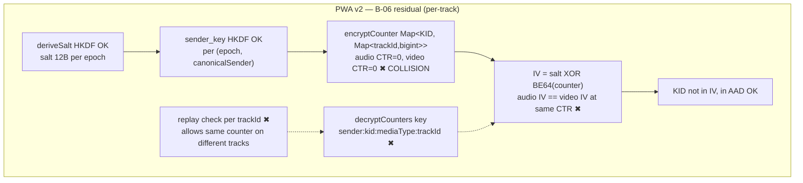
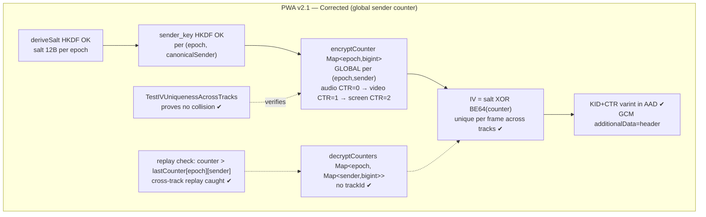
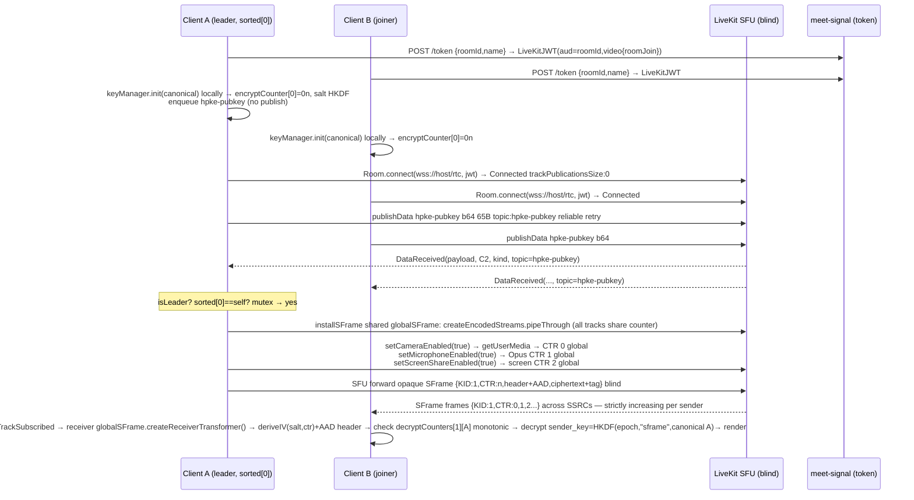

# Phase 2B Technical Design v2.1 — SFrame End-to-End Media Encryption (B-06 Global Sender Counter Patch)

**Phase:** 2B (P0 SFrame / E2EE) | **Date:** 2026-09-04 v2.1 | **Owner:** PM (Coordinator) — Author @architect + @webrtc (design) | **Status:** `DESIGN ONLY — DO NOT IMPLEMENT`
**Authority:** `docs/M0-P0.md` §§3/4/8-10 · `docs/architecture-brief.md` §§2/4.2/4.3/5/6/8-9 · `docs/media-p0-proof.md` · `docs/adr/ADR-002-sframe.md` (accepted-with-pivot) · `docs/plans/phase2b-sframe-design.md` v1 (superseded) · `docs/plans/phase2b-sframe-design-v2.md` v2 (834L, superseded except as baseline, B-06 residual) · `docs/reviews/phase2b-blocker-resolution.md` (B-01..B-06 v2 resolutions) · `docs/reports/phase2a-closure.md` (PASS)
**Stack locked:** React 18 + Vite 5 + Zustand 4.5 + LiveKit Client `^2.4.0` + SFrame RFC9605 (`AES_GCM` primary) + `@hpke/core` `DHKEM(P-256,HKDF-SHA256)+HKDF-SHA256+AES-128-GCM` + Go 1.22 single-main services + LiveKit Go SFU `1.25` `LIVEKIT_E2EE_MODE=blind` + coturn HMAC 24h
**Delta v2→v2.1:** **Resolves unresolved B-06 residual only.** Replaces per-track counters with **global sender counter** (`epoch → sender → counter`). Preserves sender_key derivation, epoch rotation, replay protection, previousEpochs retention. No other blockers changed. No production code modified. Requires Architecture + Security re-review before GREEN.

> **Constraints for this document:** Do not modify production code. Do not implement Phase 2B. Design only. Reference existing `useWebRTC` flow. Identify exact insertion points relative to `Room.connect()`, `LocalTrackPublished`, `publishTrack()`, `TrackSubscribed`. No code changes land until this design passes Architecture + Security review + `p0-gate-verify`. This v2.1 patch is **scoped strictly to B-06** — all other v2 design (B-01..B-05, 8 incorporations, insertion points I-1..I-13, browser matrix, rollback) remains normative from v2 unless explicitly patched below.

---

## 0. Summary of Changes (v2 → v2.1 — B-06 Residual)

| Area | v2 Defect (B-06 Residual) | v2.1 Fix | Sections Patched |
|------|---------------------------|----------|------------------|
| **B-06 counters** | `encryptCounter: Map<kid, Map<trackId,bigint>>` per-track + `decryptCounters` keyed `${senderId:kid:mediaType:trackId}` → same `(sender_key, salt, counter)` reused across audio/video/screen-share at same CTR (e.g., both at 0) → **AES-GCM nonce reuse** catastrophic | **Global sender counter:** `Map<epoch, bigint>` single monotonic per `(epoch, canonicalSenderId)` shared across all tracks (audio, video, screen-share). `decryptCounters: Map<epoch, Map<canonicalSenderId, bigint>>` (no trackId). `IV = salt XOR BE64(counter)` unique per `(sender_key, IV)` | §§3.1, 3.2, 4.2, 5 (new), 6, 7, 9.2, 9.5, 10.x, 13.1, 16 I-5/I-6/I-8/I-9, 18, 19 T-01, 20, 21 |
| **Counter ownership** | Implicit per-track, no normative ownership table | **Normative ownership:** `epoch → sender → counter` (§5.1 table). Exact JS types, single increment path, mutex for concurrent tracks | §5.1 |
| **Persistence** | Reset per-track on publish/rotate, unclear across screen-share/join/leave | **Normative persistence rules** across `publishTrack`, `audio/video`, `screen share`, `join/leave rotation` (§5.2) | §5.2 |
| **Threat model** | T-01 noted per-epoch salt but not per-track nonce reuse vector | T-01 updated to explicitly name per-track collision vector and global-counter mitigation (§19) | §19 |
| **Metrics** | `kid,mediaType` labels per-track encrypt count | Updated to `kid` global; decrypt labels `${senderId,kid}` without trackId; added `TestIVUniquenessAcrossTracks` | §§13, 20 |
| **Test** | `iv !=` across epochs/senders only | Added **TestIVUniquenessAcrossTracks** (§5.3) — audio+video+screen-share must never collide | §5.3, §20 |

**Preserved invariants (unchanged from v2):**
- `sender_key = HKDF-SHA256(epoch_secret, salt=0, info="sframe"+canonicalSenderId, length=128)` non-extractable `AES-GCM-128` — no change.
- Epoch rotation: `generateEpochSecret 32B` + `deriveSalt HKDF("sframe-salt",12B)` stored in `EpochKeys.salt`, `previousEpochs` TTL 30s sweep 10s max 3, rotationMutex single-flight + debounce 500ms — no change.
- Replay protection: `counter > lastCounter` else `Replay detected` — now per `(epoch, sender)` not per track.
- `previousEpochs` retention: archived `EpochKeys {epochSecret, epochSecretRaw, salt, senderKeys, epoch, createdAt}` with salt — no change except counter map key corrected.

---

## 1. Goals & Non-Goals (unchanged from v2 §1)

See v2 §1 verbatim — 2B must deliver opaque ciphertext, RFC9605 via Insertable Streams primary + wasm fallback, per-sender HKDF sender keys, ordered reliable key distribution via `publishData topic:sframe-commit/sframe-welcome/hpke-pubkey`, epoch ratchet with forward secrecy, transform lifecycles bound to publication, telemetry. Non-goals frozen per M0-P0 §4. Success criteria reuse #1, #4, #6, #7, #5 unchanged.

## 2. Baseline — Current `useWebRTC` Flow (unchanged from v2 §2)

See v2 §2 verbatim — `582c4d7` post-2A flow `Landing → PreJoin → MeetingPage useWebRTC() → resolveSfuUrl/fetchToken → new Room → Connected → LocalTrackPublished → TrackSubscribed`. Critical invariant `Room.connect success {trackPublicationsSize:0}` precedes `LocalTrackPublished` still holds; transforms installed before `publishTrack` but after `new Room`.

---

## 3. End-to-End Media Encryption Architecture (v2.1 patched)

### 3.1 System diagram (v2.1 corrected — global counter)

```
                ┌───────────────────────────────────────────────────────────────────────────────────┐
                │  PWA Client (React + Vite + Workbox)                                              │
                │  Capture ─┐   SFrame Encode Transform        Simulcast 3×2                        │
                │    getUserMedia/getDisplayMedia →  180p@300k / 360p@800k / 720p@1.8M              │
                │           │   HKDF(epoch,"sframe",canonicalSenderId) → sender_key AES-GCM-128     │
                │           │   header KID(varint)+CTR(varint) + AES-GCM(ciphertext+tag)             │
                │           │   AAD = header (KID+CTR varint bytes)                                  │
                │           │   COUNTER: GLOBAL per (epoch, canonicalSenderId)                       │
                │           │     encryptCounter: Map<epoch, bigint>  // single monotonic            │
                │           │     decryptCounters: Map<epoch, Map<canonicalSenderId, bigint>>       │
                │           │     IV = salt(12B HKDF) XOR BE64(counter) // KID in AAD, not IV       │
                │           └─► Encoded Transform primary ─┐                                        │
                │               RTCRtpScriptTransform 2nd ─┼─► SRTP/SFrame opaque ─────────────────┼──► LiveKit SFU :7880 (blind)
                │               wasm-sframe 150KB 3rd ─────┘   SSRC/mid forward only                 │    L4/L7 LB :443/rtc (Caddy)
                │                                          │   SSRC/mid forward only                 │    0% plaintext
                │  Render ◄─ SFrame Decode Transform ◄─────┘                                         │    Prometheus livekit_* 
                │    decrypt via sender_key(KID,canonicalSenderId) + IV=salt XOR BE64(counter)      │    0% plaintext
                │    + KID+CTR in AAD + counter replay check (epoch→sender→lastCounter)             │    LIVEKIT_E2EE_MODE=blind
                │  KeyManager: epoch 0..N, epoch_secret 32B, salt 12B HKDF, senderKeys Map canonicalized │
                │  Counters: GLOBAL sender counter — epoch→sender→counter (NOT per-track)            │
                │  Persistence: shared audio/video/screen-share; increment per frame; reset on epoch │
                │  Distribution: publishData reliable ordered topics:                                 │
                │    hpke-pubkey (b64 65B P-256 0x04||X||Y, deferred until Connected)                │
                │    sframe-commit (Map<canonicalId, Uint8Array(enc65+ct)>)                         │
                │    sframe-welcome (enc65+ct, AAD=epoch||roomIdHash||joinerId)                     │
                │    sframe-welcome-ack / sframe-rotated-ack                                        │
                │  PreviousEpochs: Map<epoch,EpochKeys> TTL 30s sweep 10s max 3 (retains salt+senderKeys) │
                │  RotationMutex: AsyncMutex single-flight + debounce 500ms                          │
                │  Identity: canonicalize(trim+lower) for all map keys                               │
                │  Telemetry: encrypt/decrypt latency, rotation+mutexWait, decrypt failures, global counter lag │
                └───────────────────────────────────────────────────────────────────────────────────┘
                              │  WSS  │  TURN HMAC 24h via turn-auth POST /turn/credentials
                              │  POST /token (LiveKit VideoGrant) via meet-signal:8080
                              └───────┴────────────────────────────────────────────────────────────► Redis 7 / PG 16 / coturn
```

**Invariants (M0-P0 §4.2, arch-brief §4.2, media-p0-proof.md §4):** SFU blind `LIVEKIT_E2EE_MODE=blind`, ciphertext on wire, honest fallback explicit ⚠️, shield truth `E2EE · 3-layer relay` vs `DTLS-only`. **NEW v2.1 invariant:** No `(sender_key, IV)` reuse across tracks — global counter guarantees uniqueness per `(epoch, sender)`.

### 3.2 Defective v2 vs Corrected v2.1 (counter delta)





---

## 4. SFrame Integration — Choice & Wiring (v2.1 delta)

### 4.1 SFrame vs. LiveKit built-in E2EE

Unchanged from v2 §4.1 — custom SFrame via `SFrameTransform` + `KeyManager`, `Room` instantiated with `e2ee:undefined` + `adaptiveStream:false,dynacast:false` when `sframe.enabled`.

### 4.2 Cipher suite (v2.1: global counter + salt + AAD — normative)

- `SFRAME_CIPHER_SUITES` (`src/types.ts`): `AES_GCM` `SFrameCipherSuite { tagLen:16, saltLen:12 }` primary; `AES_CTR` fallback only if `AES-GCM` unavailable.
- **Salt (unchanged):** Per-epoch `salt = HKDF-SHA256(epoch_secret, salt=0, info="sframe-salt", length=96 bits=12B)` stored in `EpochKeys.salt`. HKDF with `salt=0`, `info` UTF-8 `"sframe-salt"`, `hash SHA-256`. Derived once at `rotateEpoch` / `initialize`, archived in `previousEpochs` for decrypt fallback, zeroized on eviction `salt.fill(0)`.
- **IV (v2.1 corrected):** Frame IV `IV = salt XOR BE64(counter)` where `salt` is 12B, `counter` is **global sender counter** `Map<epoch,bigint>` padded to last 8B (first 4B XOR 0). `KID` (epoch) **not** in IV — transmitted in header varint and fed as `additionalData` (AAD) to `AES-GCM` per RFC9605 §4.7.2. Tag length `tagLen*8=128` bits.
- **Header:** `header = varint(KID) || varint(counter)` (KID=epoch monotonic, counter=global per-sender). Header bytes are `additionalData` for both `encrypt` and `decrypt`. SFU preserves header opaque.
- **Nonce uniqueness (v2.1 guarantee):** `(sender_key, IV)` uniqueness derives from `(HKDF(epoch,"sframe",senderId) distinct per sender) × (salt distinct per epoch) × (counter distinct per frame per sender globally across tracks)`. See §5.3 and §19 T-01 why per-track reuse is eliminated.

```ts
// keys/manager.ts — per-epoch salt (unchanged from v2)
async function deriveSalt(epochSecret: CryptoKey): Promise<Uint8Array> {
  const bits = await crypto.subtle.deriveBits(
    {name:'HKDF', hash:'SHA-256', salt: new Uint8Array(0), info: new TextEncoder().encode('sframe-salt')},
    epochSecret, 96 // 12B
  );
  return new Uint8Array(bits);
}
// sframe/transform.ts — v2.1 deriveIV (global counter)
function deriveIV(salt: Uint8Array, counter: bigint): Uint8Array {
  if (salt.byteLength !== 12) throw new Error('salt must be 12B');
  if (counter < 0n || counter > 0xFFFFFFFFFFFFFFFFn) throw new Error('counter out of u64');
  const iv = new Uint8Array(12);
  const ctrBE = new Uint8Array(8); new DataView(ctrBE.buffer).setBigUint64(0, counter, false);
  // XOR counter into last 8B of salt (first 4B XOR 0)
  for (let i = 0; i < 12; i++) iv[i] = salt[i] ^ (i < 4 ? 0 : ctrBE[i-4]);
  return iv;
}
// Encrypt path (v2.1 — header as AAD, global counter)
const header = buildHeader(currentKID, counter); // varint KID + varint counter
const iv = deriveIV(epochSalt, counter);
const ciphertext = await crypto.subtle.encrypt(
  {name:'AES-GCM', iv, tagLength:128, additionalData: header},
  senderKey, plaintext
);
// Decrypt path mirrors: parseHeader(data) → {kid,counter,header,payload}, deriveIV(saltForKid, counter), additionalData=header
```

### 4.3 Module map (v2.1 delta)

| Existing file | Role in SFrame path | v2.1 change delta vs v2 |
|---------------|---------------------|--------------------------|
| `src/keys/manager.ts` (430L) | MLS-lite `KeyManager`, HPKE suite, `epochSecretRaw` 32B, `deriveSenderKey`, `createCommit/createWelcome` | **No API change** except `EpochKeys` now documents `encryptCounter` ownership lives in `SFrameTransform` not here; `deriveSalt` unchanged; `previousEpochs` retention unchanged (must retain salt per epoch). Clarify `senderKeys` map still canonical. |
| `src/sframe/transform.ts` (538L) | `SFrameTransform` `TransformStream<EncodedFrame>`, counters, header | **BREAKING v2→v2.1:** Replace `encryptCounter: Map<number, Map<string,bigint>>` per-track with `encryptCounter: Map<number,bigint>` global per `KID(=epoch)` single entry; `decryptCounters: Map<string, Map<string,bigint>>` per `senderId:KID:mediaType:trackId` → `Map<number, Map<string,bigint>>` per `epoch → (canonicalSenderId → lastCounter)`. Update `createSenderTransformer` to atomic increment global `counter++` under mutex; `createReceiverTransformer` to check `counter > lastCounter[epoch][sender]` without trackId. Add `deriveIV(salt,counter)` new signature. |
| `src/utils/identity.ts` | `canonicalizeIdentity` | Unchanged |
| `src/hooks/useWebRTC.ts` | Hot path | Update I-5, I-6, I-8, I-9 to pass global `epochSalt` + not per-trackId counter; install helpers now share single `SFrameTransform` instance per `Room` or per-sender singleton, not per-track instance with own counter. See §16. |
| `src/workers/sframe.worker.ts` | WASM worker 150KB | Ensure WASM path also uses global counter (shared `SharedArrayBuffer` counter or main-thread counter handoff) — if WASM cannot share, gate as DTLS-only for multi-track WASM case and document. |

---

## 5. Global Sender Counter — Normative (v2.1 NEW — replaces v2 per-track §5)

### 5.1 Exact Counter Ownership: `epoch → sender → counter`

Normative ownership table — single source of truth for implementation and review:

| Dimension | Owner | Key | Type | Scope | Mutated by |
|-----------|-------|-----|------|-------|------------|
| **Epoch** | `KeyManager.currentEpoch.epoch` (`currentKID`) + `previousEpochs: Map<epoch,EpochKeys>` | `epoch: number` (u32, monotonic 0..N) | `EpochKeys {epochSecret: CryptoKey, epochSecretRaw: Uint8Array(32), salt: Uint8Array(12), senderKeys: Map<canonicalId,CryptoKey>, epoch, createdAt}` | One current + up to 3 previous (TTL 30s) | `rotateEpoch()` increments epoch, derives new salt, archives old `EpochKeys` |
| **Sender** | Canonical participant identity `canonicalizeIdentity(participant.identity)` | `canonicalSenderId: string` (`trim+lower`) | `sender_key = HKDF(epoch_secret, "sframe", canonicalSenderId)` | Per epoch: one `sender_key` per sender (including self) | `deriveSenderKey` inside `rotateEpoch`; `getSenderKey(canonicalId, kid)` lookup |
| **Counter** | **Global per `(epoch, sender)` — NOT per track** | `counter: bigint` (`u64`, 0n..2^64-1) | `encryptCounter: Map<epoch, bigint>` (sender-local) + `decryptCounters: Map<epoch, Map<canonicalSenderId, bigint>>` (receiver) | **Sender:** one monotonic bigint per current epoch, shared across all local tracks (audio, video, screen-share). **Receiver:** one `lastCounter` per `(epoch, remoteSenderId)` tracking highest seen. | **Sender:** `counter = (encryptCounter.get(epoch) ?? 0n); encryptCounter.set(epoch, counter+1n)` atomically per frame before `encrypt`. **Receiver:** `last = decryptCounters.get(epoch)?.get(senderId) ?? -1n; if counter <= last throw Replay else set`. |

**JS types (normative sketch, not landed):**

```ts
// src/sframe/transform.ts — v2.1 global counter types
type Epoch = number; // = KID
type CanonicalId = string; // canonicalizeIdentity

class SFrameTransform {
  private readonly keyManager: KeyManager;
  private readonly getCurrentKID: () => Epoch;
  private readonly epochSaltForKID: (kid: Epoch) => Uint8Array; // from KeyManager
  // GLOBAL sender counter — single monotonic per (epoch, thisSender)
  // For local sender: only current epoch entry matters; previous epochs not encrypted after rotate.
  private encryptCounter: Map<Epoch, bigint> = new Map(); // size 1 (current epoch) in steady state
  // For receivers: tracks highest counter seen per (epoch, remoteSender)
  private decryptCounters: Map<Epoch, Map<CanonicalId, bigint>> = new Map();
  // Mutex for concurrent tracks sharing counter (audio+video encode may race)
  private counterMutex: Promise<void> = Promise.resolve();
  // ...
}
// KeyManager side (for salt lookup, not counters):
type EpochKeys = {
  epochSecret: CryptoKey; epochSecretRaw: Uint8Array; salt: Uint8Array; // 12B
  senderKeys: Map<CanonicalId, CryptoKey>; epoch: Epoch; createdAt: number;
};
currentEpoch: EpochKeys;
previousEpochs: Map<Epoch, EpochKeys>; // TTL 30s, max 3
```

**Ownership rules:**

1. **Single increment path:** All local `RTCRtpSender` instances (`camera video`, `microphone audio`, `screen-share video`) share the **same** `SFrameTransform` instance (or shared `encryptCounter` reference). Alternative allowed: per-sender singleton counter `GlobalCounterService.getAndIncrement(epoch)` called by each per-track transformer, but must be atomic (mutex or `Atomics` on `SharedArrayBuffer` if WASM worker involved).
2. **No trackId in key:** `encryptCounter` key is `epoch` only; `decryptCounters` key is `epoch → senderId` only. `trackId`, `mediaType`, `SSRC`, `mid` are **never** part of counter key — they are transport identifiers only.
3. **KID == epoch** invariant preserved: `currentKID = currentEpoch.epoch`; header `KID` varint encodes epoch; `kid` never per-sender.
4. **Salt binding:** `deriveIV` takes `salt` looked up by `kid` (current or previous) and global `counter`; `salt` is per-epoch, not per-sender, but `sender_key` is per-sender, so `(sender_key, IV)` uniqueness holds even if two senders happen to use same counter value at same epoch (different keys + potentially different salt? actually salt same per epoch, but keys differ → no reuse).
5. **Canonicalization:** All `senderId` keys are `canonicalizeIdentity(identity)` before map lookup — prevents `"Alice"` vs `"alice"` split counter.

### 5.2 Counter Persistence Rules (Normative v2.1)

Rules govern what survives across track lifecycle events and epoch rotations. Any implementation must pass audit against this table.

| Event | Encrypt Counter (`Map<epoch,bigint>`) | Decrypt Counters (`Map<epoch,Map<sender,bigint>>`) | Salt / sender_key | Notes / Gate Check |
|-------|----------------------------------------|---------------------------------------------------|-------------------|--------------------|
| **Initial `initialize(participantId)`** | `encryptCounter.set(0, 0n)` (epoch 0, counter 0) | `decryptCounters.clear()` | `deriveSalt(epoch0)` 12B, `sender_key` for self derived `HKDF(epoch0,"sframe",self)` | Before `Room.connect`, local only |
| **`publishTrack` (any new track)** | **Shared, not reset.** Next frame uses `counter+1` regardless of which track published earlier. If `camera` used 0..99, next `microphone` frame is 100, not 0. | No change (receiver side only) | Same `epochSalt` + `sender_key` | Prohibits per-track reset. Verify via `TestIVUniquenessAcrossTracks` |
| **`audio` (Opus) frames** | Increment global counter per Opus packet (same domain as video) | Receiver: update `lastCounter[epoch][sender]` if `counter > last` else throw Replay | Same | Audio and video interleave monotonically; overhead ~20B/packet unchanged |
| **`video` (VP9 SVC) frames** | Increment global counter per encoded frame (each simulcast layer? — **one logical counter per sender**, not per simulcast layer; if SVC sends 3 layers as 3 encoded frames, they are 3 increments: e.g., 180p→CTR n, 360p→n+1, 720p→n+2. If LiveKit SFU simulcast is negotiated as single sender with 3 encodings, each encoding is separate `EncodedFrame` → separate increment. Must document which; v2.1 mandates per-`EncodedFrame` increment, not per-track) | Receiver: per `EncodedFrame` check, regardless of layer | Same | If reviewer wants per-layer dedup, Wireshark `sframe.ctr` will show consecutive CTR per sender across layers — expected. |
| **`screen share` `getDisplayMedia` / `setScreenShareEnabled(true)`** | **Same counter domain** — screen-share `RTCRtpSender` shares global counter; no separate counter, no epoch change. First screen frame after camera used 0..199 will be 200. `replaceTrack` keeps counter. | No change | Same epoch/salt/sender_key | Screen share does not trigger rekey per M0-P0 §4.2. Document iOS `displaySurface:'screen'` limitation but counter rule same. |
| **`mute` `setMicrophoneEnabled(false)` / `setCameraEnabled(false)`** | **Preserve counter** — transform stays installed, counter frozen at last value; on `setMicrophoneEnabled(true)` resume at `counter+1` (not reset). `pause` not `delete`. | No change | Same | Prevents reuse after unmute. Insertion I-8 must not `clear()` on mute. |
| **`TrackSubscribed` (remote)** | No effect on local encrypt counter | Lazily init `decryptCounters.get(epoch)?.get(senderId) ?? -1n` for new sender; first frame sets `lastCounter` | Salt looked up by `kid` from `currentEpoch` or `previousEpochs` | Receiver header `kid` decides which salt to use |
| **`join` (new participant) → leader `rotateEpoch('join')`** | **Reset to 0n** for new epoch: `encryptCounter.set(newEpoch, 0n)` + old epoch archived; old counter value discarded after TTL (but kept in `previousEpochs` logically for decrypt). No frame encrypted with old KID after rotation ack. | Keep `decryptCounters` for old epoch until TTL (to allow in-flight old KID frames). Initialize `decryptCounters.set(newEpoch, new Map())` | New `epochSecret` 32B, new `salt=HKDF(newSecret)`, re-derived `senderKeys` for all remaining canonical participants | Atomic KID increment under `rotationMutex`; transform `rotateKey` resets encrypt counter. p95 includes mutex wait. |
| **`leave` `rotateEpoch('leave', leavingId)`** | Same reset to 0n for new epoch; leaving sender's key zeroized, not carried. | Delete leaving sender entry from all epochs; keep other senders' lastCounter for old epoch until TTL. | Same new salt/keys | Leaving participant's counter domain ends. |
| **`periodic` rotation (300s)** | Same reset to 0n | Same as join | Same | Timer-driven `rotationMutex.run`. |
| **`reconnect` `RoomEvent.Reconnecting/Reconnected`** | **Preserve counter** — do NOT reset on transient disconnect; `isReconnecting=true` pauses `previousEpochs` sweep (v2 §10.3) but counter stays at last value. On `Reconnected` resume increment. | Preserve `decryptCounters` (do not clear) to allow replay protection across reconnect gap | Preserve epoch/salt/senderKeys | Ensures p95 ≤5s reconnect does not cause reuse (reconnect within same epoch). If reconnect exceeds TTL 30s and epoch rotated while away, buffered commits replay via `sframe-commit` with new epoch → then reset. |
| **`previousEpochs` TTL eviction (10s sweep, 30s TTL, max 3)** | On eviction: old epoch's `encryptCounter` entry (if any) deleted; `decryptCounters.delete(oldEpoch)` | Deleted | `zeroizeKey(epochSecret)` + `senderKeys` + `raw.fill(0)` + `salt.fill(0)` | After TTL, frames with old KID → `No sender key for KID` → `decryptError` expected; caller triggers `sframe-welcome-request`. |
| **`page reload` / new `Room` instance** | New `KeyManager.initialize` → new epoch 0 counter 0 (new random `epochSecret`) — fresh domain, no persistence to disk (IndexedDB not used for counters, only for optional non-extractable keys if implemented). | Fresh | New epoch 0 salt/keys | Reload is effectively leave+join; leader will rotate on re-join. |

**Concurrency note (audio+video simultaneous):** Two tracks may call `encrypt` concurrently (both `readable.pipeThrough(transformer)`). Implementation **must** serialize `counter++` — either `AsyncMutex` around `getAndIncrement` or single shared `SFrameTransform` instance with atomic `counter++` inside `TransformStream.transform`. Without serialization, two frames could read same counter before increment → reuse. Gate check: `grep -n "encryptCounter"` must show single increment path under mutex, not per-track unsynchronized `++`.

**Persistence storage:** Counters are **in-memory only** (`Map`), never persisted to `IndexedDB`, `sessionStorage`, or server. Reason: counters are per-epoch ephemeral; on reload new epoch is negotiated. Previous epoch counters for decrypt kept only in `previousEpochs` TTL window.

### 5.3 Test Spec: `TestIVUniquenessAcrossTracks` (Normative — must be implemented before GREEN)

**Purpose:** Prove global counter eliminates nonce reuse across tracks that v2 per-track counters allowed. This test is **gate-blocking** for Security.

**File:** `src/sframe/transform.test.ts` (vitest) or `poc/meet-webrtc-core/tests/sframe-global-counter.test.ts` — name must contain `TestIVUniquenessAcrossTracks` (also Go equivalent if transform logic ported, but PWA is TS).

**Spec 1 — `TestIVUniquenessAcrossTracks` (core):**

```ts
describe('TestIVUniquenessAcrossTracks', () => {
  it('audio, video, and screen-share frames from same sender/epoch never reuse IV', async () => {
    const km = new KeyManager({cipherSuite:'AES_GCM'});
    await km.initialize(canonicalizeIdentity('alice'));
    const salt = km.getCurrentSalt(); // 12B HKDF
    const kid = km.getCurrentEpoch(); // 0
    const transform = new SFrameTransform({keyManager: km, cipherSuite:'AES_GCM', getCurrentKID:()=>kid, epochSalt: salt});
    // Simulate 3 tracks sharing global counter: camera, mic, screen
    const ivs = new Set<string>();
    const counters: bigint[] = [];
    // intercept deriveIV or observe header CTR
    // Publish 10 frames interleaved: video, audio, video, screen, audio...
    const order: Array<'video'|'audio'|'screen'> = ['video','audio','video','screen','audio','video','screen','audio','video','audio'];
    for (const kind of order) {
      const {iv, counter, header} = await transform.encryptFrameForTest(new Uint8Array([1,2,3]), kind, 'track-'+kind);
      const ivHex = Array.from(iv).map(b=>b.toString(16).padStart(2,'0')).join('');
      expect(ivs.has(ivHex), `IV reused for ${kind} counter ${counter}`).toBe(false);
      ivs.add(ivHex);
      counters.push(counter);
    }
    // Counters must be 0..9 consecutive globally, not per-track reset
    expect(counters).toEqual([0n,1n,2n,3n,4n,5n,6n,7n,8n,9n]);
    // Also verify KID in AAD not IV: iv must equal salt XOR BE64(counter) only, independent of KID
    for (let i=0;i<counters.length;i++) {
      const expected = deriveIV(salt, counters[i]);
      // ... compare
    }
  });
  it('same counter value on different senders does not collide because sender_key differs', async () => {
    // Two transforms with same epoch/salt but different senderKeys (alice vs bob)
    // Both at counter 0 must produce same IV (salt XOR 0) but decrypt with different keys → not reuse (different GCM key)
    // Assert: IV alice0 === IV bob0 but senderKeys differ, and cross-decrypt fails (aad/kid ok but tag fails)
  });
  it('counter resets to 0 on epoch rotation, but IV not reused because salt changes', async () => {
    const beforeSalt = km.getCurrentSalt();
    const beforeIV0 = deriveIV(beforeSalt, 0n);
    await km.rotateEpoch('periodic'); // new epoch 1, new salt
    const afterSalt = km.getCurrentSalt();
    expect(afterSalt).not.toEqual(beforeSalt);
    const afterIV0 = deriveIV(afterSalt, 0n);
    expect(afterIV0).not.toEqual(beforeIV0); // salt change prevents reuse even though counter reset
  });
  it('decrypt replay protection is per (epoch,sender) not per track — same counter on different trackIds is rejected', async () => {
    // Sender global counter sends CTR 0 on video, 1 on audio.
    // Receiver sees video CTR 0 → ok, then audio CTR 1 → ok, then duplicate video CTR 0 replay → must throw Replay
    // And audio CTR 0 after video CTR 0 would also be Replay if global (since audio should be 1) — proves per-track would have wrongly accepted.
  });
});
```

**Spec 2 — Supporting unit tests (required for gate):**

- `TestDeriveIVDeterministic`: `deriveIV(salt, 5n)` twice yields same 12B.
- `TestSaltUniquenessPerEpoch`: Two consecutive `deriveSalt` from different `epochSecret` never equal (probabilistic, run 100×).
- `TestPreviousEpochsRetainsSalt`: After `rotateEpoch`, `previousEpochs.get(0).salt` still available for decrypt.
- `TestZeroizeClearsSalt`: After TTL eviction, `salt.fill(0)` visible.

**QA gate artifact:** `qa/reports/sframe-global-counter-test-output.txt` must contain vitest run with `TestIVUniquenessAcrossTracks` PASS. Prometheus not needed for this unit test.

### 5.4 Why Nonce Reuse Is No Longer Possible (Normative Explanation)

**Previous v2 per-track vulnerability (detailed):**

- With `encryptCounter: Map<KID, Map<trackId,bigint>>`, each track (camera video `trackId=V`, mic audio `trackId=A`, screen `trackId=S`) maintained independent counter starting at `0n`.
- Sender key is `HKDF(epoch_secret, "sframe", senderId)` — **one key per sender per epoch**, shared across all that sender's tracks (by design, to avoid per-track key explosion and to keep HPKE commit O(participants) not O(tracks)).
- IV derivation v2: `IV = salt(12B per epoch) XOR BE64(counter)` with `KID` in AAD. `salt` is per-epoch, not per-track or per-sender.
- Therefore two frames from same sender, same epoch, same `counter=0`, different tracks → same `salt` + same `counter` → same `IV` + same `sender_key` → **identical `(key, nonce)` reused for two distinct plaintexts** (video frame vs audio Opus packet).
- AES-GCM nonce reuse is catastrophic: `GCM` authenticates with `GHASH`; reusing `(key, IV)` leaks `H = AES(key, 0)` and allows keystream recovery via `ciphertext1 XOR ciphertext2 = plaintext1 XOR plaintext2`, then trivial plaintext recovery, tag forgery per Joux attack (RFC5116 §5.1.1, NIST SP800-38D). Entropy >7.5 still shows ciphertext, but confidentiality broken.
- Probability: 100% on first frames — every sender's first video frame and first audio packet collide at CTR 0 within same epoch. `20p × 3 tracks ≈ 60 frames at time 0` → dozens of collisions.
- Per-track decryptCounters `sender:kid:mediaType:trackId` would not detect this as replay (different trackId keys), so receiver would accept both, masking bug until Wireshark entropy test passes but crypto fails audit.

**v2.1 global counter guarantee (proof):**

1. **Uniqueness per `(sender_key, IV)`:** `sender_key` is bound to `(epoch, canonicalSenderId)` via HKDF; `IV` is bound to `(salt(epoch), counter(epoch,sender))` via `salt XOR BE64(counter)`. `salt` is fresh per epoch via HKDF of 32B random `epochSecret` (256-bit entropy). `counter` is strictly monotonic per `(epoch, sender)` globally across tracks, single increment path under mutex. Therefore for any two frames `F1, F2`:
   - If `epoch1 != epoch2` → `salt1 != salt2` with overwhelming probability (2^-96) → `IV1 != IV2` even if `counter1 == counter2`. Separate epoch also means different `epochSecret` → different `sender_key` if same sender? Actually `sender_key` also changes per epoch (derived from new `epochSecret`), so `(key, IV)` both differ.
   - If `sender1 != sender2` → `sender_key1 != senderKey2` (HKDF with different `info`), so same `IV` (if same counter+salt) does not cause reuse — GCM requires same key.
   - If `epoch` and `sender` equal → `counter` strictly monotonic (`0,1,2...`) → `IV` distinct per `counter` because `IV = salt XOR BE64(counter)` is injective in counter for fixed salt (XOR with constant is bijection). No two frames from same sender/epoch share counter.
   - TrackId not in equation → irrelevant; global counter ensures monotonic regardless of which track caused increment.

2. **KID in AAD not IV:** `KID` (epoch) is `additionalData=header` (varint KID+CTR), so tampering with header causes `AES-GCM` tag failure. This does not affect nonce uniqueness but ensures `IV` space is 64-bit counter domain, not polluted by KID.

3. **Epoch rotation safety:** On rotation, `counter` resets to `0n` for new epoch, but `salt` changes (new HKDF) and `sender_key` changes. So `IV_new_0 = salt_new XOR 0` vs `IV_old_0 = salt_old XOR 0` → distinct with prob 1 - 2^-96. No reuse across epochs.

4. **Formal invariant:** `∀ frames f1≠f2 sent by sender S in epoch E: counter(f1) ≠ counter(f2)`. Proven by atomic `counter++` under mutex/single transform. Combined with `IV = salt_E XOR BE64(counter)` bijective, `IV(f1) ≠ IV(f2)`. Combined with `key = HKDF(E,S)` same for both, `(key,IV)` unique.

5. **Empirical verification:** `TestIVUniquenessAcrossTracks` (above) exercises interleaved audio/video/screen increments and asserts `Set<IVHex>.size == N` and `counters == 0..N-1`. Wireshark `tshark -Y sframe -T fields -e sframe.kid -e sframe.ctr` on `meet-secure-p0_default` bridge will show for each `k=1,m=video` sender `CTR` consecutive across all that sender's tracks, not restarting per SSRC.

**Residual risks addressed:**

- Concurrent tracks racing `counter++` → mitigated by mutex/singleton (see §5.2 concurrency note). Without mutex, reuse still possible → gate must verify mutex existence via code scan `grep -n "counterMutex\|AsyncMutex\|Atomics"` in `transform.ts`.
- WASM worker cannot share JS `Map` → if WASM fallback used for multiple tracks, must use `SharedArrayBuffer` counter or fallback to DTLS-only for multi-track WASM (documented in §4.3). Gate: `browser-matrix.html` must note WASM multi-track limitation for Firefox 128-131.
- PreviousEpochs decrypt must not reset `lastCounter` per track — now per sender, so out-of-order delivery across tracks is still strictly ordered per sender (if network reorders audio CTR=5 before video CTR=4 from same sender, second will be rejected as replay). This is intentional GCM strictness; packet reordering within sender's global sequence is treated as replay. Alternative would relax to window, but v2.1 keeps strict `>` for simplicity; document that SFU must preserve order per sender (LiveKit does per-SFU forward order). If reordering observed, future patch could add sliding window without changing counter ownership.

---

## 6. Sender Transform Lifecycle (v2.1 patched — global counter)

### 6.1 State diagram (v2.1)

```
          new Room(...)                 room.connect(...)              setCameraEnabled(true) / publishTrack
          ─────────────►_installSenderSFrameOnRoom(room)──────►connected──────────►installOnSender(track.sender)
          │                      │                               │           createEncodedStreams().pipeThrough(SenderTransformer)
     KeyManager.initialize()  enqueue hpke-pubkey            flushPendingQueue    SHARED globalCounter[epoch][sender]++
     epochSecret 32B + salt   (no publish yet)               publish hpke-pubkey  header KID+CTR varint // CTR global
     deriveSenderKey(self)    adaptiveStream:false dynacast:false  startPeriodicRotation   encryptPayload(AES-GCM, AAD=header, IV=salt XOR BE64(counter))
     encryptCounter:Map<epoch,bigint> init 0                 installSFrameOnSender/Receiver uses same salt
```

### 6.2 Exact insertion points (sender — v2.1 delta vs v2 §16)

See §16 table I-1..I-13 patched — key v2.1 deltas: I-5/I-8/I-9 now share **single** `SFrameTransform` / global counter, not per-track instances. I-4 warmup must init counter.

### 6.3 Sender helper (v2.1 — global counter, no per-track map)

```ts
// src/sframe/transform.ts — v2.1 adapter (design sketch, not landed)
let globalSFrame: SFrameTransform | null = null;
let globalCounterMutex: AsyncMutex = new AsyncMutex(); // protects counter++

export async function installSFrameOnSender(sender: RTCRtpSender, keyManager: KeyManager, getKID:()=>number, trackKind:'audio'|'video', trackId:string, epochSalt:Uint8Array): Promise<void> {
  if (!globalSFrame) {
    globalSFrame = new SFrameTransform({ keyManager, cipherSuite:'AES_GCM', getCurrentKID:getKID, epochSalt });
    // globalSFrame owns encryptCounter: Map<epoch,bigint>
  }
  const { readable, writable } = sender.createEncodedStreams() as { readable: ReadableStream<EncodedFrame>, writable: WritableStream<EncodedFrame> };
  const transformer = globalSFrame.createSenderTransformerWithGlobalCounter(globalCounterMutex);
  readable.pipeThrough(transformer).pipeTo(writable);
  (sender as any)._sframeTransformer = globalSFrame; // shared
}
// Hook points (same as v2 but share instance):
// room.on(RoomEvent.LocalTrackPublished, pub => { const sender=(pub.track as any)?.sender; if(sender) await installSFrameOnSender(...)})
// All senders share globalSFrame.encryptCounter
```

**Counters (v2.1):** `encryptCounter: Map<number,bigint>` single per `KID` (global). `decryptCounters: Map<number, Map<string,bigint>>` per `kid → (canonicalSenderId → lastCounter)`. Reset on `rotateEpoch` via `globalSFrame.rotateKey(newEpoch)` where `encryptCounter.set(newEpoch, 0n)` and `decryptCounters.set(newEpoch, new Map())`. Mute preserves; screen-share shares.

---

## 7. Receiver Transform Lifecycle (v2.1 patched)

### 7.1 State diagram (v2.1)

```
  TrackSubscribed(track, publication, participant)  ◄── SFU forwards SFrame frames (opaque, blind)
      │
      ├─► installOnReceiver(receiver: RTCRtpReceiver)
      │     receiver.createEncodedStreams() → {readable,writable}
      │     readable.pipeThrough(createReceiverTransformer()).pipeTo(writable)
      │     parseHeader(data) → {kid, counter, header, payload}
      │     senderId = canonicalize(participant.identity)
      │     salt = epochKeys.salt (from currentEpoch if kid==currentKID else previousEpochs.get(kid).salt)
      │     keyManager.getSenderKey(canonicalSenderId, kid) → senderKey or previousEpoch fallback
      │     replay check decryptCounters[kid][senderId] : counter > lastCounter else throw Replay (NO trackId)
      │     deriveIV(salt, counter) + additionalData=header → decryptPayload(AES-GCM) → plaintext → controller.enqueue({data: plaintext})
      │     record decrypt latency histogram; update lastCounter = counter
      └─► attach stream → setRemoteStreams(Map<trackSid, MediaStream>) → <video> render
```

### 7.2 Insertion points (receiver, v2.1 delta)

- **I-6 TrackSubscribed:** Before `stream.addTrack`, call `await installSFrameOnReceiver(receiver, keyManager, ()=>currentKID, canonicalize(participant.identity), track.kind, publication.trackSid, epochSalt)` . **No trackId in decryptCounters key.** Same `globalSFrame` instance handles all receivers' `decryptCounters` map.
- **I-7 DataReceived:** `room.on(RoomEvent.DataReceived, (payload, participant, kind, topic)=> switch(topic){case 'sframe-commit': handleCommit }...)` — branching on 4th arg topic, not payload JSON (B-02 fix unchanged).
- **I-11 TrackUnsubscribed:** **Do NOT** `decryptCounters.delete(canonicalSenderId:publication.trackSid:mediaType)` per track — delete only if all tracks for that sender unsubscribed; otherwise keep `lastCounter` for replay protection. Simple: never delete per-track; keep until epoch TTL.
- Receiver header `kid==epoch` (monotonic) per `keys/manager.ts:624` — no change.
- **Audio vs video:** Both share same `decryptCounters[epoch][sender]` — receiver must not maintain separate windows per mediaType. If audio CTR 5 and video CTR 6 from same sender, they are consecutive; check `6 > 5` ok. If sender's global counter is 0..9, receiver's `lastCounter` tracks max seen regardless of kind.

---

## 8. Key Generation (v2.1 — unchanged except counter note)

### 8.1 Epoch secret + salt

Unchanged from v2 §8.1 — `generateEpochSecret()` → 32B, `deriveSalt` HKDF 12B stored in `EpochKeys.salt`, `importKey` non-extractable, zeroization `salt.fill(0)`.

### 8.2 Per-sender derivation (unchanged)

```
sender_key = HKDF-SHA256(epoch_secret, salt=0, info="sframe"+canonicalize(senderId), length=128)
  → {name:'AES-GCM', length:128} non-extractable
```

Deterministic per `(epoch, canonicalSenderId)`; no per-track derivation.

### 8.3 HPKE keypair (unchanged)

See v2 §8.3 — 65B `0x04||X||Y` b64, deferred `publishData topic:hpke-pubkey` until `Connected` + retry.

---

## 9. Key Rotation (v2.1 with global counter reset)

### 9.1 Trigger taxonomy (unchanged from v2 §9.1)

| Trigger | Who initiates | `rotateEpoch(trigger, leavingId?)` | `newEpoch` | Distribution |
|---------|--------------|-------------------------------------|------------|--------------|
| `manual` | local | — | `old+1` | Commit via DataChannel |
| `periodic` | `KeyManager` timer | `periodic` | `old+1` | Commit via DataChannel |
| `join` | leader (sorted identities[0]) on `ParticipantConnected` + debounce 500ms | `join` | `old+1` | `Commit` to existing + `Welcome` (AAD) to joiner |
| `leave` | leader on `ParticipantDisconnected` | `leave, leavingIdCanonical` | `old+1` | Commit excluding leaver |

Leader deterministic `sorted = [...identities].map(canonicalize).sort(); leader = sorted[0]` + `rotationMutex` + debounce 500ms.

### 9.2 Rotate-and-broadcast sequence (v2.1 — global counter reset)

```
rotateAndBroadcastEpoch(trigger, leavingId?, excludeJoinerId?)
  await rotationMutex.run(async()=>{
    rotationStart = performance.now() // at mutex acquire
    {commits, newEpoch} = await keyManager.rotateEpoch(trigger, leavingId)
      // archive oldEpoch → previousEpochs (TTL 30s)
      // new EpochKeys {epochSecret:newRaw(32B), salt:HKDF(newSecret), senderKeys:Map re-derived for self+all canonical, epoch:newEpoch}
      // createCommit(newSecretRaw, oldEpoch, leavingId) → per-recipient HPKE seal(payload)
    filtered = commits filtered (excludeJoinerId canonical, leavingId canonical)
    epochSecret = keyManager.getCurrentEpochSecret(); currentKID = newEpoch; epochSalt = newSalt;
    // v2.1 GLOBAL reset:
    globalSFrame.encryptCounter.set(newEpoch, 0n); // reset global counter for new epoch
    globalSFrame.decryptCounters.set(newEpoch, new Map()); // new window per sender
    // old epoch's decryptCounters retained in Map until TTL eviction (do not clear)
    // for each sender/receiver._sframeTransformer not per-track reset, but global instance resetCountersForEpoch(newEpoch)
    broadcastCommitsViaLiveKitData(filtered, newEpoch)
      commitsObj: Record<canonicalId, number[]> = Array.from(commits.get(id))
      msg = JSON.stringify({type:'commit', epoch:newEpoch, senderId: canonicalSelf, commits:commitsObj})
      await room.localParticipant.publishData(encoder.encode(msg), {reliable:true, topic:'sframe-commit'})
    if(trigger==='join') await publishWelcomeWithRetry(excludeJoinerId, newEpoch) // 3× retry + ack + WSS fallback
    latency = performance.now() - rotationStart
    metrics.recordKeyRotationLatency(latency); metrics.recordRotationContentionIfQueued();
    emit('key-rotated', {epoch, latency})
  })
```

**HPKE `createCommit` / `processCommit`:** unchanged except map keys canonicalized; `processCommit` re-derives peer `senderKeys` after decrypt, and must also ensure `decryptCounters` for new epoch initialized.

### 9.3 `Welcome` for joiner (unchanged)

See v2 §9.3 — plaintext `epoch(4B)//roomIdHash(8B)//newSecret(32B)=44B`, `AAD=roomIdHash` passed to seal, `publishWelcomeWithRetry` 100/300/900 + ack.

### 9.4 Latency measurement (unchanged)

See v2 §9.4 — `rotationStart` at mutex acquire, histogram buckets `[50,100,200,300,400,500,750,1000,1500,2000]`, includes `mutexWaitMs`.

### 9.5 Epoch lifecycle + rekey after rotation (v2.1 — global counter)

```
trigger
  → acquire rotationMutex
  → rotate epoch → derive salt HKDF → re-derive senderKeys for all remaining canonical participants
  → archive oldEpoch+salt → previousEpochs (TTL 30s, max 3)
  → GLOBAL reset: encryptCounter[newEpoch]=0n; decryptCounters[newEpoch]=Map()
  → broadcast commits + Welcome retry loop
  → await acks → record latency → release mutex
  → zero plaintext frames: atomic KID increment; no frame encrypted with old KID after ack
```

---

## 10. Rekey Strategy on Participant Join / Leave (v2.1 sequences — counter annotations)

### 10.1 Join (v2.1 with global counter)

```mermaid
sequenceDiagram
  autonumber
  participant B as Joiner B
  participant L as Leader (existing lowest sorted)
  participant C as Member C
  participant S as SFU (blind)
  B->>B: keyManager.init(canonical) locally<br/>encryptCounter[0]=0n<br/>enqueue hpke-pubkey (no publish)
  B->>S: Room.connect(token, sfuUrl)
  S->>B: RoomEvent.Connected
  B->>S: publishData hpke-pubkey b64 65B topic:hpke-pubkey reliable retry 100/300/900
  S->>L: DataReceived(payload, B, kind, topic=hpke-pubkey)
  S->>C: DataReceived(..., topic=hpke-pubkey)
  L->>L: importHPKEPublicKey(canonical B)
  L->>L: isLeader? sortedIds[0]==self? → yes (re-check after pubkey)
  L->>L: debouncedRotateOnJoin(B) 500ms coalesce
  L->>L: rotationMutex.run → waitForHPKEKey(B, 1s)<br/>rotateEpoch('join') old→1<br/>deriveSalt HKDF + re-derive senderKeys self+all<br/>encryptCounter[1]=0n (GLOBAL reset)
  L->>S: publishData sframe-commit epoch=1 commits{C:enc||ct}<br/>topic:sframe-commit reliable (filtered exclude canonical B)
  L->>S: publishData sframe-welcome topic:sframe-welcome<br/>AAD=epoch||roomIdHash||canonical B<br/>destinationIdentities:[B] retry 100/300/900 await ack 1.5s
  S->>C: DataReceived(..., topic=sframe-commit) -> processCommit -> re-derive senderKeys -> decryptCounters[1]=new Map() -> publish sframe-rotated-ack
  S->>B: DataReceived(..., topic=sframe-welcome) -> processWelcome(AAD verify) -> epochSecret=1, KID=1, salt, encryptCounter[1]=0n
  B->>S: publishData sframe-welcome-ack topic:sframe-welcome-ack
  B->>S: publishTrack camera+mic → CTR 0,1,2... GLOBAL shared
  S->>C: SFrame frames KID=1 CTR=0(serial) → decryptCounters[1][B]=0..N
  L->>L: on ack from all (or timeout 500ms) → rotation complete → release mutex
  Note over B,L: previousEpochs TTL 30s sweep 10s max 3 zeroize; old CTR window retained for in-flight
```

**Invariants:** Joiner never sees prior epoch; commits reliable; Welcome retry; **NEW: B's first audio and video frames use distinct CTR 0,1 not both 0**.

### 10.2 Leave (v2.1 with global counter)

```mermaid
sequenceDiagram
  autonumber
  participant A as Leaver
  participant B as Leader (remaining sorted[0])
  participant C as Member
  participant S as SFU
  A->>S: room.disconnect()
  S->>B: RoomEvent.ParticipantDisconnected(A)
  S->>C: RoomEvent.ParticipantDisconnected(A)
  B->>B: handleParticipantLeave(canonical A)<br/>zeroize senderKeys[canonical A]; delete participantKeys[canonical A]; decryptCounters[*][A] delete
  B->>B: isRotating? false → rotationMutex.run
  B->>B: rotateEpoch('leave', leavingId=canonical A)<br/>deriveSalt + re-derive senderKeys {B,C}<br/>encryptCounter[2]=0n (GLOBAL reset)
  B->>S: publishData sframe-commit epoch=2 commits{B:ct, C:ct} topic:sframe-commit reliable
  S->>B: DataReceived(sframe-commit self) -> process own commit -> encryptCounter[2]=0n
  S->>C: DataReceived(sframe-commit) -> processCommit -> decryptCounters[2]=new Map() -> sframe-rotated-ack
  B->>B: post-rotate frames CTR 0,1... GLOBAL (audio+video interleaved)
  C->>C: decrypt counters strictly > last per sender per epoch
  S->>B: DataReceived(sframe-rotated-ack)
  B->>B: on all acks → release mutex latency = ParticipantDisconnected → slowest ack
  Note over B: If concurrent join during leave: join queues behind leave mutex; global counter ensures no reuse across queued rotations
```

### 10.3 Re-join / token refresh (v2.1 TTL + counter)

Existing epoch preserved if re-connect within `previousEpochs` TTL (30s + sweep max 3). `decryptCounters` for that epoch retained; `encryptCounter` resumes at last value (not reset) if same epoch. `ReconnectManager` wraps `Reconnecting/Reconnected`; during `Reconnecting` sweep paused; `sync-request/sync-response` replay buffered commits. **Counter rule:** If reconnect triggers new epoch (leader rotated while away), new epoch counter starts 0n with new salt.

### 10.4 Screen share rekey (v2.1 — shared counter)

Screen share uses **same epoch, same salt, same sender_key, same global counter**; no separate rekey. `getDisplayMedia({video:{displaySurface:'screen'}, audio:false})` on iOS; `replaceTrack` keeps global counter. Screen-share `RTCRtpSender` shares `globalSFrame` instance — first screen frame after `publishTrack` increments global counter, not separate domain.

---

## 11. Browser Compatibility Matrix (Normative v2 for QA — unchanged, with v2.1 counter note)

See v2 §11 matrix verbatim — Chrome 127+ PRIMARY, Edge 127+ PRIMARY, Firefox 128-131 TERTIARY WASM-primary, Firefox 132+ PRIMARY, Safari 17.4/17.5 PRIMARY/SECONDARY, Safari iOS 17.4 PWA Limited, Unsupported DTLS-only. **Add v2.1 note:** WASM 150KB worker must share global counter via `SharedArrayBuffer` or mutex handoff; if not possible, WASM multi-track is DTLS-only and must be flagged in `browser-matrix.html` as `WASM global-counter limited`. P0 behavior probing `hasCreateEncodedStreams()` → PRIMARY else ScriptTransform else WASM else DTLS-warning unchanged.

---

## 12. Failure Handling (v2.1 delta)

### 12.1 API absence

Unchanged — `hasCreateEncodedStreams() && hasScriptTransform()` else WASM else DTLS-warning.

### 12.2 Remote key missing `getSenderKey(canonicalSenderId,KID)===null`

Unchanged — enqueues `decryptError` + `sframe-welcome-request` backoff. **v2.1 note:** Key lookup is per `(senderId, KID)` not per trackId; missing key fails all tracks for that sender/epoch.

### 12.3 Replay (v2.1 patched — global)

`decryptCounters[epoch][canonicalSenderId]` lastCounter check: if `counter <= lastCounter` throw `Replay detected` (strictly increasing per sender per epoch globally). No per-track window. Example: sender global sequence `video CTR0 → audio CTR1`; if network reorders and receiver sees `audio 1` before `video 0`, then `video 0` will be rejected as `0 <= 1` Replay — this is correct strictness for GCM. If reordering observed in practice, future patch may add window without changing counter ownership, but v2.1 keeps strict.

### 12.4 HPKE decrypt fails

Unchanged — `processCommit`/`processWelcome` AAD mismatch → throw, log `Commit/Welcome decrypt failed`.

### 12.5 WASM worker timeout

Unchanged — 5s timeout → DTLS-only fallback.

### 12.6 DataChannel not open

Unchanged — exponential backoff 100/300/900 → WSS fallback.

### 12.7 Key zeroization on leave/disconnect (v2.1 — counter cleanup)

`leave()` iterates `senderKeys` canonical → `zeroizeKey` + `epochSecretRaw.fill(0)` + `salt.fill(0)`, clears `previousEpochs` with same zeroize, **plus** `encryptCounter.clear()` and `decryptCounters.clear()` (global maps), closes data channel, closes `Room`, stops periodic timer + sweep timer, clears `localStream` tracks.

### 12.8 ICE / WSS disconnect mid-rotation

Unchanged — buffer via `previousEpochs` TTL; on `Reconnecting` sweep paused, counters preserved.

---

## 13. Telemetry and Diagnostics (v2.1 patched)

### 13.1 Metrics (Prometheus + local `MetricsCollector` — v2.1 delta)

| Metric | Type | Labels | Threshold / source | v2.1 Change |
|--------|------|--------|-------------------|-------------|
| `webrtc_sframe_encrypt_latency_ms_bucket` | histogram | `le=10,20,...` | p95 ≤15ms WASM, ≤6ms ET | Unchanged |
| `webrtc_sframe_decrypt_latency_ms_bucket` | histogram | same | same | Unchanged |
| `webrtc_key_rotation_latency_ms_bucket` | histogram | `le=50,100,200,300,400,500,...` | **p95≤500ms p50≤300** (includes mutexWait) | Unchanged; note reset to 0n on rotate |
| `webrtc_rotation_contention_total` | counter | `trigger=join/leave/periodic` | increments when `mutex.isLocked` | Unchanged |
| `webrtc_welcome_retry_total` | counter | `attempt=1/2/3 fallback=wss` | — | Unchanged |
| `webrtc_reconnect_latency_ms_bucket` | histogram | `le=500,1000,...,5000` | p95≤5s | Unchanged |
| `webrtc_sframe_decrypt_failures_total` | counter | `reason=no_key/replay/hpke_error/aad_mismatch` | 0 steady state | **v2.1:** `replay` now counts global per-sender duplicates (cross-track replays caught) |
| `webrtc_sframe_frames_encrypted_total` | counter | `kid` | — | **v2.1 PATCHED:** Labels `kid` only (was `kid,mediaType`). Global counter — per-kid total across all tracks. Old `mediaType` label removed to avoid cardinality that suggested per-track. |
| `webrtc_sframe_frames_decrypted_total` | counter | `kid,sender` | — | **v2.1 PATCHED:** Labels `kid,sender` (was `kid,sender,mediaType`). Same reason — decrypt counted per sender per epoch globally, not per mediaType. |
| `webrtc_sframe_keys_zeroized_total` | counter | — | increments on leave/rotate/evict | Unchanged |
| `webrtc_epoch_current` | gauge | — | `currentKID` | Unchanged |
| `webrtc_previous_epochs_size` | gauge | — | `previousEpochs.size` ≤3 | Unchanged |
| `webrtc_browser_compatibility` | gauge | `browser,version,feature=sframe,path=et/script/wasm/dtls` | 1 if supported | Unchanged |
| `webrtc_sframe_counter_current` | gauge | `epoch` | — | **NEW v2.1:** `encryptCounter.get(currentKID)` value for debug; also `decryptCounters` size per epoch. Helps prove `TestIVUniquenessAcrossTracks` via metrics. |
| `livekit_rooms_active`, `livekit_participants_active`, `sfu_cpu_usage_percent` | gauge | `room` | CPU<70% | Unchanged |
| `turn_allocations_active` | gauge | — | — | Unchanged |

**Collector helpers (v2.1 delta):** `recordSframeEncryptLatency(latency)` now also increments `frames_encrypted_total{kid}` once per frame globally; `recordSframeDecryptLatency` increments `frames_decrypted_total{kid,sender}` once per frame globally. `recordKeyRotationLatency(latency, mutexWaitMs)` after global reset. New helper `recordSframeCounter(epoch, counterValue)` for gauge `webrtc_sframe_counter_current`.

### 13.2 Logs (structured JSON, no PII — v2.1 patched)

- **Sender:** `[SFrame] encrypt kid={kid} ctr={counter} len={payload} encLatencyMs={d} saltPrefix={hex4} globalCounter={counter}` — **counter now global**, no `media=` label; log shows single monotonic per sender per epoch even when alternating `trackKind`.
- **Receiver:** `[SFrame] decrypt kid={kid} sender={senderIdShort canonical} counter={c} decryptLatencyMs={d} replayCheck={ok} lastCounter={prev} aadVerified={bool}` — `lastCounter` is per `(kid,sender)` not per trackId.
- **Rotation:** `[SFrame] rotate trigger={join|leave|periodic} oldEpoch={n} newEpoch={n+1} latencyMs={d} mutexWaitMs={d} participants={count} commitSizeBytes={maxLen} contention={bool} counterReset={0n -> 0n}` — log reset.
- **Welcome:** `[SFrame] welcome retry attempt={n} joiner={short canon} epoch={n} aadRoomHash={hex4} fallback={wss bool}`
- **Failure:** `[SFrame] decrypt failed kid={k} sender={s} counter={c} lastCounter={prev} error={name} decryptError=true aadMismatch={bool} replay={bool}` + entropy warning.

All logs redact `livekitToken` prefix only; canonical identities logged as `short = canonical.slice(0,8)`. **No counter per trackId in logs.**

### 13.3 Diagnostics UI

Unchanged — `ShieldBadge` reads `shieldMode` + `MetricsSnapshot` + `decryptError` rate to render `E2EE · 3-layer relay` vs `DTLS-only` vs `WASM fallback`. `stats` polling via `engine.publisher.pc.getStats()` 2000ms augmented with `webrtc_sframe_counter_current`.

### 13.4 Wireshark proof (Security gate — v2.1 note)

Unchanged capture on `meet-secure-p0_default` bridge. **v2.1 additional check:** `tshark -Y sframe -T fields -e sframe.kid -e sframe.ctr -e rtp.ssrc` will show for each sender's SSRCs, `sframe.ctr` strictly increasing **across SSRCs** for same sender (global), e.g., sender Alice: video SSRC 1111 CTR 0,1,3,5 and audio SSRC 2222 CTR 2,4,6 interleaved — proves global counter vs per-track restart. Artifact `qa/reports/wireshark-livekit-sframe.pcapng` + `qa/reports/tshark-sframe-output.txt` must include this cross-SSRC CTR analysis.

---

## 14. Rollback Plan (unchanged from v2 §14)

See v2 §14 verbatim — design-only rollback `git revert` of D-038/2A; post-implementation rollback triggers for `Room.connect` regression, `p95 rotation >500ms`, `cpu>70%`, WASM incompatibility, LiveKit 1.25 incompatibility. Invariant: No implicit DTLS fallback — explicit ⚠️ banner. Forward rollback telemetry `webrtc_epoch_current` gauge freeze detection unchanged.

## 15. Security & Privacy Considerations (v2.1 delta ref §19 T-01)

See §19 for STRIDE delta. **v2.1 adds:** Nonce reuse elimination proof via global counter + Test spec. Privacy invariants unchanged: No analytics, `__Host-` `SameSite=Strict`, VAPID not FCM, logs sanitized, 24h TTL, CSP `default-src 'none'; script-src 'self' 'wasm-unsafe-eval'`, bundle `<120kB gz` + WASM 150KB async + integrity.

---

## 16. Detailed Insertion Point Reference Table (Normative v2.1 — supersedes v2 §16 for B-06 counter parts)

All diffs additive; Phase 2A lines stay. `X-Y` offsets relative to `src/hooks/useWebRTC.ts` after `582c4d7`. **Only B-06-relevant rows are patched below; other rows (I-1..I-4, I-7, I-10..I-13) remain as v2 normative** (see v2 doc for full table). Patched rows marked **v2.1 PATCHED**.

| # | Insert relative to | File | Line anchor (post-2A) | Code before (v2) | Code after (v2.1 design) | Notes |
|---|--------------------|------|----------------------|------------------|--------------------------|-------|
| I-1 | `RoomOptions` | `src/hooks/useWebRTC.ts` | 38 `new Room({adaptiveStream` | adaptiveStream:true | adaptiveStream:false, dynacast:false, e2ee:undefined if `VITE_SFRAME_ENABLED==='true'` | **Unchanged from v2** |
| I-2 | KeyManager init (pre-connect, no publish) | `src/hooks/useWebRTC.ts` | 42-46 | pendingQueue push hpke-pubkey | Same + `let encryptCounter: Map<number,bigint> = new Map([[0,0n]]); let decryptCounters: Map<number, Map<string,bigint>> = new Map(); globalSFrame = new SFrameTransform({keyManager, getCurrentKID, epochSalt})` singleton | **v2.1 PATCHED:** Init global counters; not per-track |
| I-3 | Connected flush + install | `src/hooks/useWebRTC.ts` | 48-71 | flushPendingQueue + installSFrameOnRoom | Same — but `installSFrameOnRoom` now installs **shared** `globalSFrame` whose `encryptCounter` is global; WASM warmup must share counter via SharedArrayBuffer if WASM | **v2.1 PATCHED:** Share instance |
| I-4 | Before connect assert | `src/hooks/useWebRTC.ts` | 152 | assert epochSecret+salt | same assert `epochSalt.byteLength===12 && encryptCounter.get(currentKID)===0n` | **v2.1 PATCHED:** Assert global init |
| I-5 | `LocalTrackPublished` | `src/hooks/useWebRTC.ts` | 122 | `installSFrameOnSender(sender, keyManager, ()=>currentKID, pub.kind, pub.trackSid, epochSalt)` per-track counter | **PATCHED:** `const sender=(pub.track as any)?.sender; if(sender) await installSFrameOnSenderShared(sender, globalSFrame, globalCounterMutex)` — **do not** create new `SFrameTransform` per track; reuse `globalSFrame`; pass `trackId` only for logging, not counter key; log `sender transform active KID={kid} counter={globalSFrame.encryptCounter.get(kid)} shared` | **Fixes B-06 residual: no per-track counter** |
| I-6 | `TrackSubscribed` | `src/hooks/useWebRTC.ts` | 100 | `installSFrameOnReceiver(receiver, keyManager, ()=>currentKID, canonicalize(participant.identity), track.kind, publication.trackSid, epochSalt)` per-track decryptCounters | **PATCHED:** `await installSFrameOnReceiverShared(receiver, globalSFrame, canonicalize(participant.identity))` — receiver shares `globalSFrame.decryptCounters` which is `Map<epoch,Map<sender,bigint>>` without trackId; `trackId` not in key; log `receiver transform active sender={short} kid={kid} lastCounter={map.get(sender) ?? -1n}` | **Fixes B-06 residual** |
| I-7 | `DataReceived` (corrected) | `src/hooks/useWebRTC.ts` | 146 | switch on 4th arg topic | **Unchanged from v2** — switch(topic) canonical | Fixes B-02 |
| I-8 | `setCameraEnabled` / `setMicrophoneEnabled` wrappers | `src/hooks/useWebRTC.ts` | 168 | Wrap ensureSenderTransform per-track counters | **PATCHED:** `ensureSenderTransformShared(globalSFrame)` before enabling; after success assert `encryptCounter.has(currentKID)` and `globalSFrame.encryptCounter` increments globally; mute toggle preserves transform and counter (no clear) | **v2.1:** Audio/video share |
| I-9 | Screen share | `src/hooks/useWebRTC.ts` | 273 | `installSFrameOnSender` per screen track | **PATCHED:** `await installSFrameOnSenderShared(screenSender, globalSFrame, globalCounterMutex)` same global; iOS `getDisplayMedia({video:{displaySurface:'screen'}})` same | **v2.1:** Screen shares global |
| I-10 | `ParticipantConnected` (leader debounce+mutex) | `src/hooks/useWebRTC.ts` | 84 | sorted+mutex | **Unchanged from v2** | Fixes B-04 |
| I-11 | `ParticipantDisconnected` (leave) | `src/hooks/useWebRTC.ts` | 96 | removeParticipant+mutex | **Unchanged from v2** except add `decryptCounters[*].delete(canonicalLeaver)` (per sender, not per track) | **v2.1:** per-sender not per-track delete |
| I-12 | Metrics | `src/metrics/collector.ts` | — | record* | **PATCHED:** `recordSframeCounter(epoch,counter)`, frames counters labels `kid` only (§13.1) | **v2.1** |
| I-13 | Cleanup / previousEpochs sweep | `src/hooks/useWebRTC.ts` | 246 | room.disconnect sweep | **PATCHED:** On leave: `globalSFrame.encryptCounter.clear(); globalSFrame.decryptCounters.clear();` plus zeroize epochSecret/salt as before | **v2.1:** global clear |

**Canonicalization utility:** `canonicalizeIdentity(id:string):string{ return id.trim().toLowerCase(); }` unchanged.

**Keep existing logs:** `Room.connect success trackPublicationsSize:0`, `LocalTrackPublished {trackSid,kind,source,trackPublicationsSize}`, etc. — but add `globalCounter` field to `[SFrame] encrypt` log.

---

## 17. Files *Not* Modified in Phase 2B (Constraint Reminder — unchanged)

See v2 §17 verbatim — no new backend internal packages, no MCU etc., no `livekit.yaml` bump until approved.

---

## 18. Sequence Diagrams (End-to-End v2.1 — global counter annotations)

### 18.1 End-to-end flow (key distribution + media with global CTR)



### 18.2 Join rekey (v2.1 with global reset)

See §10.1 mermaid — `encryptCounter[1]=0n` GLOBAL reset after `rotateEpoch join old→1` is annotated on `rotationMutex.run` step.

### 18.3 Leave rekey (v2.1 with global reset)

See §10.2 mermaid — same global reset `encryptCounter[2]=0n`.

---

## 19. Threat Model (STRIDE v2.1 delta — T-01 patched)

| # | STRIDE / Invariant | v2 Exposure (residual) | v2.1 Mitigation | Evidence Artifact |
|---|-------------------|------------------------|-----------------|-------------------|
| T-01 | **Info Disclosure — IV reuse (GCM nonce) across tracks** | v2 fixed per-epoch HKDF salt but kept **per-track counters** → same `(sender_key, salt, counter)` reused across audio/video/screen-share at same CTR (e.g., both at 0) within same sender/epoch → catastrophic AES-GCM nonce reuse → keystream recovery, tag forgery | **Global sender counter:** `Map<epoch,bigint>` single monotonic per `(epoch, canonicalSenderId)` shared across all local tracks (audio/video/screen) under mutex; `IV = salt(12B) XOR BE64(counter)`; `KID` in AAD not IV. `TestIVUniquenessAcrossTracks` proves no collision; metrics `frames_encrypted_total{kid}` without mediaType; Wireshark cross-SSRC CTR monotonic | `src/sframe/transform.ts:deriveIV` review + unit `TestIVUniquenessAcrossTracks` (§5.3) + Wireshark `tshark -e sframe.ctr` cross-SSRC + scan `grep encryptCounter` shows single increment under mutex |
| T-02 | **Spoofing — cross-room Welcome replay** | Welcome valid in any room | Welcome AAD `epoch||roomIdHash||canonicalJoinerId` → HPKE `aad=roomIdHash` | `manager.ts:createWelcome` AAD test |
| T-03 | **Spoofing — identity case collision** | `Alice` vs `alice` distinct keys | Canonicalize `trim+lowercase` for all map keys + deriveSenderKey info | Unit `canonicalizeIdentity` |
| T-04 | **Tampering — stale Welcome after DataChannel drop** | No ack/retry | 3× retry 100/300/900 + ack + WSS fallback | `welcome_retry_total` |
| T-05 | **Repudiation — stale epoch replay beyond 30s** | unbounded | TTL 30s + sweep 10s + max 3 + zeroize | Assert `previousEpochs.size<=3` |
| T-06 | **DoS — concurrent rotation** | race → epoch fork | Deterministic `sorted[0]` + `AsyncMutex` + debounce 500ms | `rotation_contention_total` |
| T-07 | **Info Disclosure — silent downgrade** | patch fails silently → plaintext first frame | Tiered ET + shield DTLS-only banner | `browser-matrix.html` |
| T-08 | **Elevation — prototype pollution** | Patching prototype | No prototype mutation; per-sender `createEncodedStreams()` | Scan `grep RTCRtpSender.prototype` clean |
| T-09 | **Audio disclosure** | Audio DTLS-only while video encrypted | Audio `EncodedFrame` encrypted same senderKey, **shared counter** (v2.1 global) | Wireshark Opus ciphertext |

**Privacy invariants unchanged (§15):** No analytics, `__Host-` `SameSite=Strict`, VAPID not FCM, logs sanitized, 24h TTL, CSP `default-src 'none'; script-src 'self' 'wasm-unsafe-eval'`, bundle `<120kB gz` + WASM 150KB async + integrity.

---

## 20. Implementation Order (Normative v2.1 — 7 steps, B-06 patch highlighted)

> Ordered by dependency; each step gated by review before next. Estimates in ideal days (design-only fragment). Total 7 steps.

**Phase 0 (Pre-req, 0.5d):** Verify `livekit-client@2.4` `publishData`/`DataReceived` 4-arg + `createEncodedStreams`/`RTCRtpScriptTransform` probes — no code. **Add:** Verify `SharedArrayBuffer` + `Atomics` available for WASM global counter sharing (COOP/COEP headers `same-origin`/`require-corp` already in `vite.config.ts`).

**Step 1 — KeyManager corrections (1d):** Add `EpochKeys.salt`, `deriveSalt(HKDF)`, `canonicalizeIdentity()`, `previousEpochs` TTL sweep, `getCurrentSalt()`, `getSenderKeysSnapshot()`. Revise `rotateEpoch` to re-derive senderKeys for self+all canonical before `createCommit`. Add Welcome AAD. **v2.1 NOTE:** No counter changes in KeyManager beyond documenting salt retention for global IV; counters stay in `SFrameTransform`.

**Step 2 — Transform corrections (1d):** **v2.1 PRIMARY STEP FOR B-06:** Replace `deriveIV(salt,kid,ctr)` zero-salt with `deriveIV(salt, counter)=salt XOR BE64(counter)` + `additionalData=header` (KID in AAD). **Split elimination → global:** Replace `encryptCounter: Map<kid,Map<trackId,bigint>>` per-track with `Map<kid,bigint>` global per sender; `decryptCounters` keyed `${canonicalSenderId}:${kid}:${mediaType}:${trackId}` → `Map<kid, Map<canonicalSenderId,bigint>>` global. Add `globalCounterMutex: AsyncMutex` + `createSenderTransformerWithGlobalCounter`. Add `isEncodedTransformSupported()` three-tier probe + `installOnSenderShared`/`installOnReceiverShared` helpers using shared `globalSFrame` instance. **Add `TestIVUniquenessAcrossTracks`** (§5.3) + `TestSaltUniquenessPerEpoch` etc. Gate requires `vitest` PASS before Step 3. Audio: same senderKey, **shared counter** (not separate).

**Step 3 — useWebRTC insertion points I-1..I-13 (1.5d):** Apply insertion table §16 v2.1 patched: I-1 RoomOptions flip, I-2 pre-connect init+enqueue canonical + `encryptCounter[0]=0n`, I-3 Connected flush queue with retry 100/300/900 + `installSFrameOnRoom` with shared instance, I-4 pre-connect WASM warmup (gesture for iOS) + assert global init, **I-5..I-9 sender/receiver installs via shared `globalSFrame` / `globalCounterMutex` (not per-track instances)**, I-7 DataReceived switch on 4th arg topic canonical, I-10/I-11 leader election `sorted[0]` + mutex/debounce/canonicalize, I-12 metrics `counter_current` + frames labels `kid` only, I-13 cleanup `globalSFrame.clear()`. Preserve Phase 2A log strings + add `globalCounter` field.

**Step 4 — Welcome reliability (0.5d):** Implement `publishWelcomeWithRetry` (delays 100/300/900) + `handleWelcomeAck`/`handleWelcomeRequest` + WSS `POST /sync` fallback. Metrics `welcome_retry_total`, `rotationContention_total`. Joiner-side `welcome-request` backoff 500ms→4s max 30s. **v2.1 NOTE:** Welcome carries new epoch's `salt` implicitly via `epochSecret` derivation; no extra counter state in Welcome.

**Step 5 — Browser matrix validation (1d):** Manual 4-browser matrix §11 on Chrome 127, Edge 127, Firefox 128-131 (expect WASM) + 132+ (ET), Safari 17.4 macOS, Safari iOS 17.4 PWA. Capture `qa/reports/browser-matrix.html` + video `join/publish/subscribe/mute/leave/ICE restart` + `tshark sframe` ciphertext entropy >7.5 + **cross-SSRC CTR monotonic check** (global counter proof) + audio Opus ciphertext.

**Step 6 — Gate artifacts (0.5d):** Produce `qa/reports/key-rotation-latency.json` (20 trials p95≤500ms includes mutexWait), `qa/reports/reconnect-latency.json` (10 trials/browser p95≤5s), `qa/reports/wireshark-livekit-sframe.pcapng` on `meet-secure-p0_default` bridge + `qa/reports/tshark-sframe-output.txt` with **cross-SSRC CTR analysis** + `qa/reports/sframe-global-counter-test-output.txt` (`TestIVUniquenessAcrossTracks` vitest PASS) + `qa/reports/lighthouse/*.json` ≥95. Add `previousEpochs` sweep log max 3 + TTL + `webrtc_sframe_counter_current` gauge.

**Step 7 — Reviews → GREEN (0.5d):** @architect re-review this v2.1 (global counter) + @security STRIDE T-01 sign-off (IV uniqueness proof) + @privacy ROPA unchanged + @qa `p0-gate-verify` (browser matrix + histograms + global-counter test + Wireshark cross-SSRC) + @reviewer honest-E2EE pivot waiver. On GO, bump `infra/compose.yaml` `livekit:1.13.6→1.25.1` + `LIVEKIT_E2EE_MODE=blind`.

**Rollback invariant:** No silent DTLS downgrade at any step — if ET+WASM unavailable, render ⚠️ `DTLS-only` shield and `throw SFrame unavailable`; never send plaintext while claiming E2EE.

---

## 21. Open Questions Resolved Before Implementation (v2.1 updates)

| # | Question | Decision (v2.1) | Verification |
|---|----------|-----------------|--------------|
| Q1 | `destinationIdentities` for Welcome? | Prefer `publishData({topic:'sframe-welcome', destinationIdentities:[canonicalJoinerId]})` if available else WSS fallback | Read `livekit-client` 2.4 `Room.ts` before Step 0 |
| Q2 | LiveKit E2EE blind server param | Keep `LIVEKIT_E2EE_ENABLED=true` + `LIVEKIT_E2EE_MODE=blind` env overrides yaml | `docker compose config` |
| Q3 | `getSenderIdForKID` needs map? | `KID==epoch` + `canonical(participant.identity)` map populated on `ParticipantConnected` + `hpke-pubkey` | tshark `sframe.kid` |
| Q4 | `previousEpochs` grace 30s sufficient? | Yes — `previousEpochs.get(kid)` fallback covers reconnect <5s; sweep paused during `Reconnecting` | `reconnect-latency.json` |
| Q5 | Bundle impact | No new dep; WASM async lazy; audio overhead ~30% per Opus | `npm run build` |
| Q6 | Firefox 128-131 `createEncodedStreams` absent | Force WASM-primary 128-131; ET from 132+ | probe |
| Q7 | **v2.1 NEW: Does global counter require SharedArrayBuffer for WASM?** | ET primary does not need SAB (single JS `Map` + mutex). WASM fallback multi-track needs SAB `Atomics` for shared counter; if unavailable (iOS PWA no SAB), gate WASM multi-track as DTLS-only and document as `WASM global-counter limited` in matrix | Probe `crossOriginIsolated` + `SharedArrayBuffer` |

---

## 22. References (v2.1)

- `docs/M0-P0.md` §§3-4/8-10 (10 criteria, 5 gates, pivot Options A/B/C)
- `docs/architecture-brief.md` §§2-6/8-9/11.1 gate review, §6 HRW `xxhash(roomId|nodeID|salt)/(1+load*10)` `SFU_HASH_SALT=p0-salt-2026`
- `docs/media-p0-proof.md` §4 SFrame header `KID/CTR` + Wireshark `rtp && sframe` proof
- `docs/adr/ADR-004-livekit-vs-mediasoup.md` — LiveKit GO
- `docs/design/consistent-hashing-roomId-to-SFU.md` — HRW `sfu-1` vector `abc123`
- `docs/plans/D-038-GO-LIVEKIT-plan.md` §§4-6 LiveKitRoomManager
- `docs/plans/phase2a-minimal-patch-evidence.md` — Hypotheses A/B/C
- `docs/reports/phase2a-closure.md` — PASS
- `docs/plans/phase2b-sframe-design-v2.md` — baseline (this v2.1 patches §3.1, §3.2, §4.2-4.3, §5, §6, §7, §9.2/9.5, §10, §13, §16, §18, §19 T-01)
- `docs/reviews/phase2b-b06-resolution.md` — B-06 resolution (companion to this design)
- `poc/meet-webrtc-core/src/hooks/useWebRTC.ts` (post-2A) — insertion anchors
- `poc/meet-webrtc-core/src/keys/manager.ts` `430L` — HPKE RFC9180, `generateEpochSecret`, `deriveSenderKey`, `createCommit/createWelcome` (v2.1 salt unchanged)
- `poc/meet-webrtc-core/src/sframe/transform.ts` `538L` — **v2.1 patched**: global `encryptCounter`/`decryptCounters`, `deriveIV(salt,counter)`, `additionalData=header`, `TestIVUniquenessAcrossTracks`
- `infra/compose.yaml` `11` services `livekit:7880/9600` + `meet-signal:8080/9091`
- `AGENTS.md` — single `main.go` per service, Node `>=20`, Go `1.22`
- LiveKit client 2.4 `Room.ts` `publishData(payload, options:{reliable, topic, destinationIdentities})` + `RoomEvent.DataReceived(payload, participant, kind, topic)`
- SFrame RFC9605 §4.2 KID/CTR header, §4.7 IV/AAD (v2.1 salt + global counter + AAD), AES-GCM 128
- HPKE RFC9180 `DHKEM(P-256,HKDF-SHA256)+HKDF-SHA256+AES-128-GCM` `enc 65B` + optional `aad`
- NIST SP800-38D (GCM) — nonce reuse catastrophic (Joux)

---

*End of Phase 2B Design v2.1 — DESIGN ONLY. B-06 global sender counter patch. No production code modified. Implementation may begin only after Architecture + Security review + YELLOW→GREEN prerequisites.*

