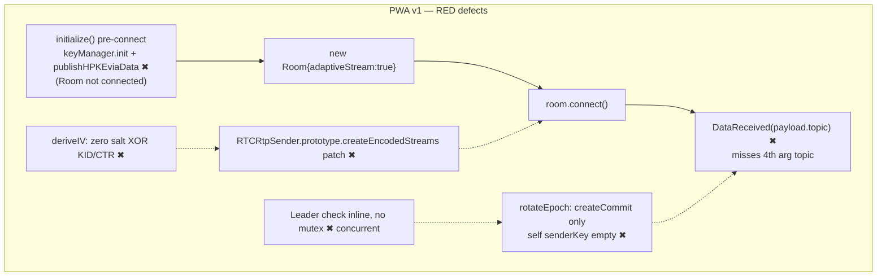
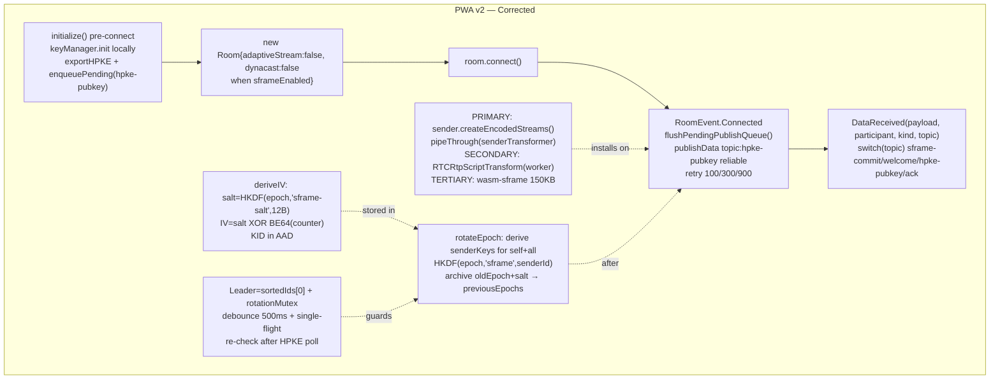
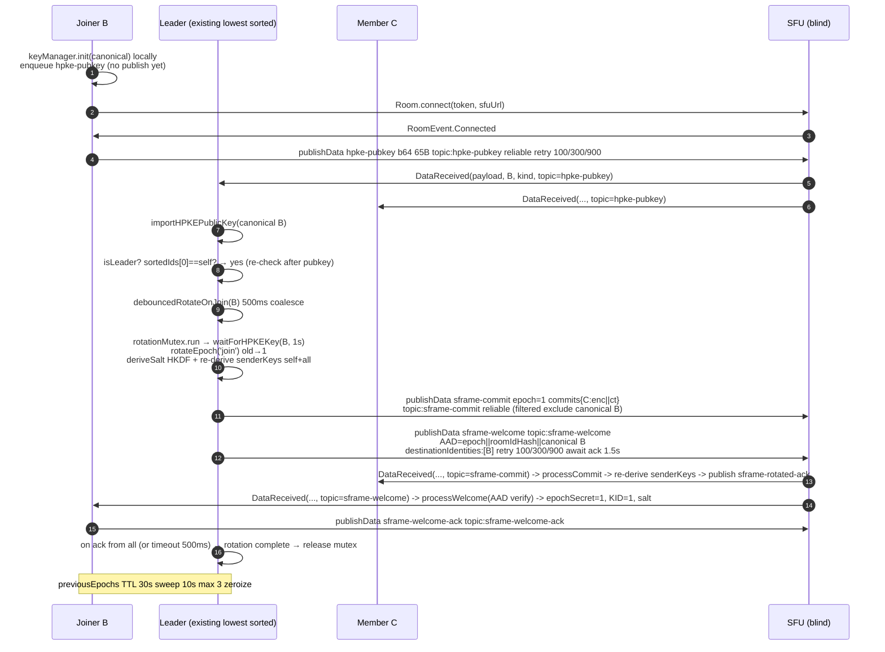
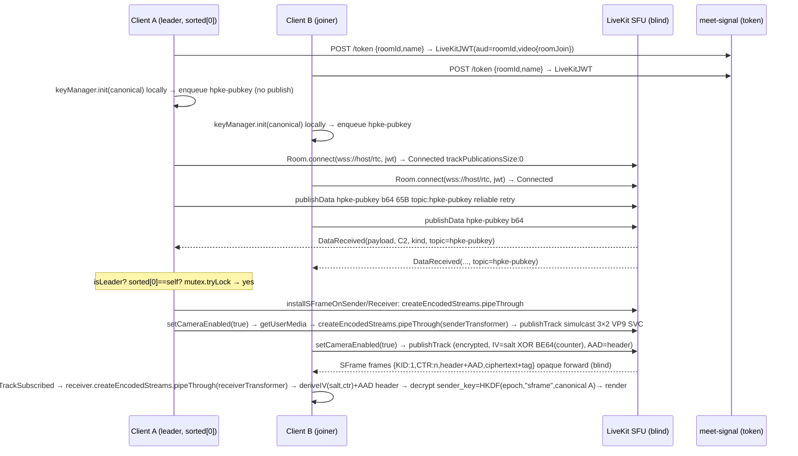
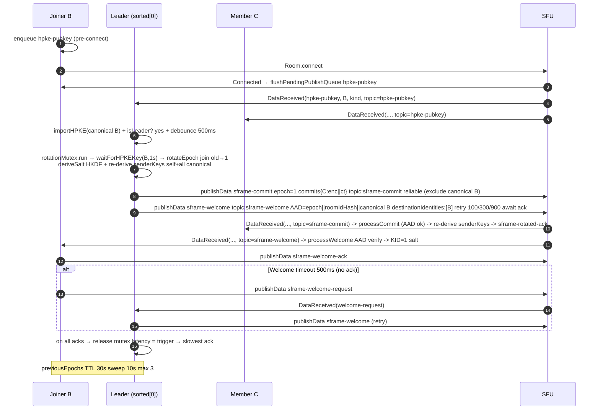

# Phase 2B Technical Design v2 — SFrame End-to-End Media Encryption (RED Blockers Resolved)

**Phase:** 2B (P0 SFrame / E2EE) | **Date:** 2026-09-04 v2 | **Owner:** PM (Coordinator) — Author @architect + @webrtc (design) | **Status:** `DESIGN ONLY — DO NOT IMPLEMENT`
**Authority:** `docs/M0-P0.md` §§3/4/8-10 · `docs/architecture-brief.md` §§2/4.2/4.3/5/6/8-9 · `docs/media-p0-proof.md` · `docs/adr/ADR-002-sframe.md` (accepted-with-pivot) · `docs/plans/phase2b-sframe-design.md` v1 (774L, superseded) · `docs/plans/phase2a-minimal-patch-evidence.md` · `docs/reports/phase2a-closure.md` (PASS)
**Stack locked:** React 18 + Vite 5 + Zustand 4.5 + LiveKit Client `^2.4.0` + SFrame RFC9605 (`AES_GCM` primary) + `@hpke/core` `DHKEM(P-256,HKDF-SHA256)+HKDF-SHA256+AES-128-GCM` + Go 1.22 single-main services + LiveKit Go SFU `1.25` `LIVEKIT_E2EE_MODE=blind` + coturn HMAC 24h
**Delta v1→v2:** Resolves 6 RED blockers B-01..B-06 + 8 mandatory incorporations. No production code modified. Requires Architecture + Security re-review before GREEN.

> **Constraints for this document:** Do not modify production code. Do not implement Phase 2B. Design only. Reference existing `useWebRTC` flow. Identify exact insertion points relative to `Room.connect()`, `LocalTrackPublished`, `publishTrack()`, `TrackSubscribed`. No code changes land until this design passes Architecture + Security review + `p0-gate-verify`.

---

## 0. Summary of Changes (v1 → v2)

| Area | v1 Defect (RED) | v2 Fix |
|------|----------------|--------|
| **B-01** HPKE pubkey publish timing | `publishData` before `Room.connect` (needs authenticated data channel) | Generate keypair pre-connect; defer `publishData topic:hpke-pubkey` until `RoomEvent.Connected` + retry queue (100/300/900ms) |
| **B-02** DataReceived topic handling | Inspected `payload.topic` inside JSON | Branch on 4th arg `topic: string` of `DataReceived(payload, participant, kind, topic)` |
| **B-03** rotateEpoch senderKeys | `createCommit` loops `participantKeys` only; self never re-derived for new epoch | Re-derive `senderKeys` Map for self + all known participants under new `epoch_secret` before `createCommit`; archive old epoch with salt |
| **B-04** leader rotation ownership | `lowest participantId` inline check, no mutex → concurrent rotations | Deterministic `sorted(identities)[0]` + async mutex + 500ms debounce + single-flight + re-check after HPKE poll |
| **B-05** RTCRtpScriptTransform strategy | Monkey-patch `RTCRtpSender.prototype.createEncodedStreams` | Standard ET primary → `RTCRtpScriptTransform` secondary → WASM tertiary; never prototype-patch; use LiveKit `track.sender/receiver` |
| **B-06** IV salt derivation | 12B zero salt `salt ^ KID ^ CTR` static | Per-epoch HKDF-derived salt `HKDF(epoch_secret,"sframe-salt",12B)` stored in `EpochKeys.salt`; `IV = salt XOR BE64(counter)`; KID in AAD |

**Mandatory incorporations (all in v2):** Welcome epoch AAD, Welcome retry strategy, previousEpochs TTL eviction, Firefox 128-131 WASM-primary, Safari 17.4/iOS PWA limitations, Audio transform coverage, Rotation mutex, Identity canonicalization — see §9-11 and checklist §16.

---

## 1. Goals & Non-Goals

### 1.1 Goals (Phase 2B must deliver)

- End-to-end media encryption where SFU forwards **opaque ciphertext** (payload never plaintext, `Wireshark rtp && sframe` shows KID/CTR header + `AES-GCM` ciphertext + 16B tag, entropy >7.5 bits/byte, no NALs).
- SFrame RFC9605 via **Insertable Streams / WebRTC Encoded Transform** primary, `wasm-sframe` 150 KB `OffscreenCanvas` + `VideoFrame` recycle fallback — 4-browser matrix (Chrome 127+, Edge 127+, Firefox 128+, Safari 17.4 macOS + iOS PWA) with explicit ⚠️ `DTLS-only` warning when unavailable, never silent downgrade.
- Per-sender `HKDF(epoch_secret, "sframe", sender_id)` sender keys; ordered, reliable key distribution via LiveKit `publishData` (`topic: sframe-commit / sframe-welcome / hpke-pubkey`); epoch ratchet with forward secrecy (old epoch discarded after rotation, buffered for reconnect replay TTL 30s).
- Key generation + key rotation + rekey on `join`/`leave`/periodic 300s, measured `p95 ≤500ms` (trigger → slow-participant `setEncryptionKey` ack), zero plaintext frames during rotation, keys zeroized on `leftAt`.
- Sender and receiver transform lifecycles bound to LiveKit publication lifecycle (`publishTrack` / `TrackSubscribed`), not to mesh `RTCPeerConnection` setup.
- Telemetry and diagnostics for encrypted-frame counters, decrypt failures, rotation latency histogram, browser capability, and rollback detection.

### 1.2 Non-Goals (explicitly deferred — M0-P0 §4 freeze)

`breakouts`, `polls`, `reactions`, `whiteboard`, `virtual bg`, `captions`, `recording MCU meet-composer`, `webinar 100-1000/HLS`, `anon capability links k#`, `P2P↔SFU handoff`, `WebTransport`, `cascaded SFU mesh`, `FCM` (use `VAPID` only), `analytics`. No UX beyond `landing → /r/:id#k= → pre-join preview → grid Last-N=9 → mute/cam/leave + screen share + shield`.

### 1.3 Success criteria re-use

Phase 2B directly supports M0-P0 criteria #1 (browser), #4 (SFrame ciphertext), #6 (rotation ≤500ms), #7 (reconnect ≤5s, epoch preserved), #5 (screen share same epoch). Blind-forward `Last-N=9` tradeoff (arch-brief §8) stays.

---

## 2. Baseline — Current `useWebRTC` Flow (Post-Phase 2A)

Live path after `582c4d7` (Phase 2A PASS):

```
LandingPage → PreJoinPage (preview getUserMedia, no publish)
  → MeetingPage mounts useWebRTC()
    1. resolveSfuUrl(sfuUrl) / fetchToken(roomId, name) POST /token → {livekitToken, sfuUrl, participantId}
       └─ setCredentials(livekitToken, sfuUrl) → sessionStorage partialize (A fixed)
    2. new Room({ adaptiveStream:true, dynacast:true })  ← 2B must flip to false when E2EE on (I-1)
       roomRef.current = room; (window as any).__LIVEKIT_ROOM__ = room;
       Bind: Connected, Disconnected, Reconnecting/Reconnected,
             ParticipantConnected/Disconnected,
             TrackSubscribed/TrackUnsubscribed,
             LocalTrackPublished, DataReceived
    3. await room.connect(resolvedSfuUrl, token)  // instrumented start/success/failure logs
       → RoomEvent.Connected fires {roomName, state, localIdentity, trackPublicationsSize:0}
    4. await room.localParticipant.setCameraEnabled(true)
         └─ internally: createTrack(getUserMedia) → publishTrack
         └─ emits LocalTrackPublished {trackSid, kind:video, source:camera, trackPublicationsSize:1}
       await room.localParticipant.setMicrophoneEnabled(true) → LocalTrackPublished {audio, size:2}
       // surface NotAllowedError/NotFoundError/NotReadableError → setError role="alert"
    5. TrackSubscribed for remote → new MediaStream(mst) → setRemoteStreams(Map<trackSid, MediaStream>)
       TrackUnsubscribed → delete
    6. toggleAudio/Video via setMicrophoneEnabled/setCameraEnabled
       startScreenShare/stopScreenShare via setScreenShareEnabled(true/false)
       leave via room.disconnect()
```

**Critical invariant proven in Phase 2A:** `Room.connect success {trackPublicationsSize:0}` precedes `LocalTrackPublished`. Media publish is **post-connect**. Therefore SFrame transforms **must** be installed before `publishTrack` but after `new Room` allocation, and receiver transforms on `TrackSubscribed` before first frame.

Reference files/lines:
- `src/hooks/useWebRTC.ts:14-42` `initialize` + `fetchToken` + `setCredentials`
- `src/hooks/useWebRTC.ts:38-41` `new Room({adaptiveStream,dynacast})` (I-1 — flip to false)
- `src/hooks/useWebRTC.ts:47-71` `RoomEvent.Connected` handler (I-3 — flush HPKE queue, install SFrame)
- `src/hooks/useWebRTC.ts:100-119` `TrackSubscribed` handler (I-6 — receiver)
- `src/hooks/useWebRTC.ts:122-144` `LocalTrackPublished` handler (I-5 — local transform ack)
- `src/hooks/useWebRTC.ts:152-164` `room.connect` try/catch (I-4 — epoch init assert)
- `src/hooks/useWebRTC.ts:166-212` `setCameraEnabled/setMicrophoneEnabled` (I-8 — publish wrappers)
- `src/store/appStore.ts:17-20,90-92` `livekitToken/sfuUrl` state + persist
- `src/auth/token.ts:20-55` `resolveSfuUrl` + `fetchToken`
- `src/sframe/transform.ts:30-56` `SFrameTransform` constructor + `useWASM` branch
- `src/keys/manager.ts:66-89` `initialize(participantId)` + `generateEpochSecret` 32B
- `src/webrtc/manager.ts` 896L mesh remnant (reference only — not on hot path post-2A)

---

## 3. End-to-End Media Encryption Architecture

### 3.1 System diagram (v2 corrected)

```
                ┌──────────────────────────────────────────────────────────────────────┐
                │  PWA Client (React + Vite + Workbox)                                 │
                │  Capture ─┐   SFrame Encode Transform        Simulcast 3×2           │
                │    getUserMedia/getDisplayMedia →  180p@300k / 360p@800k / 720p@1.8M │
                │           │   HKDF(epoch,"sframe",senderId) → sender_key AES-GCM-128│
                │           │   header KID(varint)+CTR(varint) + AES-GCM(ciphertext+tag)│
                │           │   AAD = header (KID)                                      │
                │           └─► Encoded Transform primary ─┐                           │
                │               RTCRtpScriptTransform 2nd ─┼─► SRTP/SFrame opaque ────┼──► LiveKit SFU :7880 (blind)
                │               wasm-sframe 150KB 3rd ─────┘   SSRC/mid forward only    │    L4/L7 LB :443/rtc (Caddy)
                │                                          │   SSRC/mid forward only    │    0% plaintext
                │  Render ◄─ SFrame Decode Transform ◄─────┘                            │    Prometheus livekit_* 
                │    decrypt via sender_key(KID,senderId) + IV=salt XOR BE64(counter)  │    0% plaintext
                │    + KID in AAD + counter replay protect                              │    LIVEKIT_E2EE_MODE=blind
                │  KeyManager: epoch 0..N, epoch_secret 32B, salt 12B HKDF, senderKeys Map canonicalized │
                │  Distribution: publishData reliable ordered topics:                    │
                │    hpke-pubkey (b64 65B P-256 0x04||X||Y, deferred until Connected)   │
                │    sframe-commit (Map<participantId, Uint8Array(enc65+ct)>)          │
                │    sframe-welcome (enc65+ct, AAD=epoch||roomIdHash||joinerId)        │
                │    sframe-welcome-ack / sframe-rotated-ack                           │
                │  PreviousEpochs: Map<epoch,EpochKeys> TTL 30s sweep 10s max 3        │
                │  RotationMutex: AsyncMutex single-flight + debounce 500ms            │
                │  Identity: canonicalize(trim+lower) for all map keys                  │
                │  Telemetry: encrypt/decrypt latency, rotation+mutexWait, decrypt failures │
                └──────────────────────────────────────────────────────────────────────┘
                              │  WSS  │  TURN HMAC 24h via turn-auth POST /turn/credentials
                              │  POST /token (LiveKit VideoGrant) via meet-signal:8080
                              └───────┴───────────────────────────────────────────────► Redis 7 / PG 16 / coturn
```

**Invariants (M0-P0 §4.2, arch-brief §4.2, media-p0-proof.md §4):** SFU blind `LIVEKIT_E2EE_MODE=blind`, ciphertext on wire, honest fallback explicit ⚠️, shield truth `E2EE · 3-layer relay` vs `DTLS-only`.

### 3.2 Defective v1 vs Corrected v2 (architecture delta)





---

## 4. SFrame Integration — Choice & Wiring (v2 corrections)

### 4.1 SFrame vs. LiveKit built-in E2EE

**Decision:** Do **NOT** enable LiveKit `RoomOptions.e2ee` (`E2EEManager`). Use **custom SFrame** via `SFrameTransform` + `KeyManager` as source of truth, injected via `RTCRtpSender.createEncodedStreams` / `RTCRtpReceiver.createEncodedStreams` primitives before `publishTrack`. Rationale: preserves `HKDF(epoch_secret,"sframe",sender_id)` ratchet, HPKE per-recipient commits, auditability.

`Room` is instantiated with `e2ee: undefined` and `adaptiveStream:false, dynacast:false` when `sframe.enabled` (§16 I-1).

### 4.2 Cipher suite (v2: salt + AAD fix)

- `SFRAME_CIPHER_SUITES` (`src/types.ts`): `AES_GCM` `SFrameCipherSuite { tagLen:16, saltLen:12 }` primary; `AES_CTR` fallback only if `AES-GCM` unavailable.
- **v2 IV:** Per-epoch salt `salt = HKDF(epoch_secret, "sframe-salt", 96 bits=12B)` stored in `EpochKeys.salt`. Frame IV `IV = salt XOR BE64(counter)` (salt 12B, counter padded to last 8B). Tag length `tagLen*8` bits. **KID not in IV** — KID transmitted in header varint and fed as `additionalData` (AAD) to `AES-GCM` (RFC9605 §4.7.2).
- Auth tag 16 B AES-GCM on every RTP payload; SFU preserves tag.

### 4.3 Module map (no new deps)

| Existing file | Role in SFrame path | 2B change (v2) |
|---------------|---------------------|----------------|
| `src/keys/manager.ts` (430L) | MLS-lite `KeyManager`, HPKE suite, `epochSecretRaw` 32B, `deriveSenderKey`, `createCommit/createWelcome` | Add `EpochKeys.salt`, `deriveSalt()`, `canonicalize()`, TTL sweep, re-derive senderKeys in `rotateEpoch`, Welcome AAD, rotationMutex |
| `src/sframe/transform.ts` (538L) | `SFrameTransform` `TransformStream<EncodedFrame>`, counters, header | Add `installOnSender/installOnReceiver` via `createEncodedStreams` (no prototype patch), `deriveIV(salt, counter)` + `additionalData=header`, per-track counters `video/audio`, `epochSalt` param |
| `src/workers/sframe.worker.ts` | WASM worker 150 KB | Ensure loaded before first publish if ET unavailable; gesture-required on iOS |
| `src/signaling/client.ts` | Welcome fallback | Keep as fallback `POST /sync {type:'welcome'}` for DataChannel retry exhaustion |
| `src/hooks/useWebRTC.ts` | Hot path | Insertion points I-1..I-13 (§16) |
| `src/store/appStore.ts` | `livekitToken/sfuUrl/roomId/participantId` | Add optional `sframeEpoch/sframeKID/sframeEnabled` observability |
| `src/utils/identity.ts` | **NEW** utility | `canonicalizeIdentity(id): lower+trim` for all map keys |

---

## 5. Insertable Streams / Encoded Transform Support (v2 three-tier)

### 5.1 Feature detection (single source, v2)

```ts
function isEncodedTransformSupported(): boolean {
  return 'RTCEncodedVideoFrame' in window
      && typeof TransformStream !== 'undefined'
      && typeof ReadableStream !== 'undefined';
}
function hasCreateEncodedStreams(): boolean {
  return typeof RTCRtpSender !== 'undefined'
      && typeof (RTCRtpSender.prototype as any).createEncodedStreams === 'function'
      && typeof (RTCRtpReceiver.prototype as any).createEncodedStreams === 'function';
}
function hasScriptTransform(): boolean {
  return 'RTCRtpScriptTransform' in window;
}
// Decision chain (v2):
// 1. hasCreateEncodedStreams() → PRIMARY ET
// 2. else if hasScriptTransform() → SECONDARY ScriptTransform worker
// 3. else if config.sframe.wasmFallback → TERTIARY WASM 150KB
// 4. else → throw SFrame unavailable → DTLS-only shield warning
```

**P0 behavior:** audit §11 matrix per browser. Audio always encrypted when SFrame enabled (same senderKey, separate counters per mediaType).

### 5.2 Browser capability tiers

See §11 normative matrix.

---

## 6. Sender Transform Lifecycle (v2)

### 6.1 State diagram

```
          new Room(...)                 room.connect(...)              setCameraEnabled(true) / publishTrack(RemoteVideoTrack)
          ─────────────►_installSenderSFrameOnRoom(room)──────►connected──────────►installOnSender(track.sender)
          │                      │                               │           createEncodedStreams().pipeThrough(SenderTransformer)
     KeyManager.initialize()  enqueue hpke-pubkey            flushPendingQueue    increment encryptCounter[epoch][trackId]
     epochSecret 32B + salt   (no publish yet)               publish hpke-pubkey  buildHeader KID+CTR + encryptPayload(AES-GCM, AAD=header)
     deriveSenderKey(self)    adaptiveStream:false dynacast:false  startPeriodicRotation          → SRTP/SFrame to SFU (opaque)
```

### 6.2 Exact insertion points (sender)

See §16 table I-1..I-13 normative. Key v2 deltas: I-2 enqueues (no publish), I-3 flushes on Connected with retry, I-5/I-8/I-9 use `sender.createEncodedStreams()` per-track (no prototype patch).

### 6.3 Sender helper (v2 — no prototype patch)

```ts
// src/sframe/transform.ts — v2 adapter (design sketch, not landed)
export async function installSFrameOnSender(sender: RTCRtpSender, keyManager: KeyManager, getKID:()=>number, trackKind:'audio'|'video', trackId:string, epochSalt:Uint8Array): Promise<void> {
  const sframe = new SFrameTransform({ keyManager, cipherSuite:'AES_GCM', getCurrentKID:getKID, trackKind, trackId, epochSalt });
  const { readable, writable } = sender.createEncodedStreams() as { readable: ReadableStream<EncodedFrame>, writable: WritableStream<EncodedFrame> };
  const transformer = sframe.createSenderTransformer();
  readable.pipeThrough(transformer).pipeTo(writable);
  (sender as any)._sframeTransformer = sframe; // for rotateKey reset
}
export async function installSFrameOnReceiver(receiver: RTCRtpReceiver, keyManager: KeyManager, getKID:()=>number, senderIdentity:string, trackKind:'audio'|'video', trackId:string, epochSalt:Uint8Array): Promise<void> {
  const sframe = new SFrameTransform({ keyManager, cipherSuite:'AES_GCM', getCurrentKID:getKID, senderIdentity, trackKind, trackId, epochSalt });
  const { readable, writable } = receiver.createEncodedStreams() as { readable: ReadableStream<EncodedFrame>, writable: WritableStream<EncodedFrame> };
  readable.pipeThrough(sframe.createReceiverTransformer()).pipeTo(writable);
  (receiver as any)._sframeTransformer = sframe;
}
// Hook points:
// room.on(RoomEvent.LocalTrackPublished, pub => { const sender=(pub.track as any)?.sender; if(sender) await installSFrameOnSender(...)})
// room.on(RoomEvent.TrackSubscribed, (track, pub, participant) => { const receiver=(track as any)?.receiver; ... })
```

**Counters (v2):** `encryptCounter: Map<number, Map<string, bigint>>` per `KID → (trackId→counter)` split video/audio; `decryptCounters: Map<string, Map<string,bigint>>` per `senderId:KID:mediaType`. Reset on `rotateEpoch` via `rotateKey()` clear. See §5.1 pseudocode.

---

## 7. Receiver Transform Lifecycle (v2)

### 7.1 State diagram

```
  TrackSubscribed(track, publication, participant)  ◄── SFU forwards SFrame frames (opaque, blind)
      │
      ├─► installOnReceiver(receiver: RTCRtpReceiver)
      │     receiver.createEncodedStreams() → {readable,writable}
      │     readable.pipeThrough(createReceiverTransformer()).pipeTo(writable)
      │     parseHeader(data) → {kid, counter, header, payload}
      │     senderId = canonicalize(participant.identity)
      │     salt = epochKeys.salt (from previousEpochs if kid != currentKID)
      │     keyManager.getSenderKey(canonicalSenderId, kid) → senderKey or previousEpoch fallback
      │     replay check decryptCounters["senderId:kid:mediaType"] ; counter > lastCounter else throw Replay
      │     deriveIV(salt, counter) + additionalData=header → decryptPayload(AES-GCM) → plaintext → controller.enqueue({data: plaintext})
      │     record decrypt latency histogram
      └─► attach stream → setRemoteStreams(Map<trackSid, MediaStream>) → <video> render
```

### 7.2 Insertion points (receiver, v2)

- **I-6 TrackSubscribed:** Before `stream.addTrack`, call `await installSFrameOnReceiver(receiver, keyManager, ()=>currentKID, canonicalize(participant.identity), kind, trackId, epochSalt)` . Only for `track.kind==='video'` **and** `'audio'` when SFrame enabled (audio coverage §11).
- **I-7 DataReceived:** `room.on(RoomEvent.DataReceived, (payload, participant, kind, topic)=> switch(topic){case 'sframe-commit': handleCommit }...)` — branching on 4th arg topic, not payload JSON (B-02 fix).
- **I-11 TrackUnsubscribed:** `decryptCounters.delete(canonicalSenderId:publication.trackSid:mediaType)` + metrics.
- Receiver header `kid==epoch` (monotonic) per `keys/manager.ts:624` — simplifies mapping; SSRC/mid → senderId via `canonicalize(participant.identity)` map populated on `ParticipantConnected` + `hpke-pubkey`.

---

## 8. Key Generation (v2 with salt + canonicalization)

### 8.1 Epoch secret + salt

- **Source:** `crypto.getRandomValues(new Uint8Array(32))` → `generateEpochSecret()` returns `{key:CryptoKey(HKDF), raw:Uint8Array(32), salt:Uint8Array(12)}`. 32B entropy; salt derived `HKDF(epoch_secret,"sframe-salt",96bits)` with `salt=0`, `info="sframe-salt"`, `hash SHA-256`.
- **Import:** `importKey('raw', raw, {name:'HKDF'}, false, ['deriveKey','deriveBits'])` non-extractable; `epochSecretRaw` kept for HPKE Welcome/Commit encryption.
- **Storage:** `currentEpoch: EpochKeys {epochSecret, epochSecretRaw, salt: Uint8Array(12), senderKeys:Map<canonicalId,CryptoKey>, epoch:number, createdAt:number}` non-extractable, never to server except as HPKE ciphertext.
- **Zeroization:** `zeroizeKey` + `epochSecretRaw.fill(0)` + `salt.fill(0)` on eviction/leave.

### 8.2 Per-sender derivation (v2 canonicalized)

```
sender_key = HKDF-SHA256(epoch_secret, salt=0, info="sframe"+canonicalize(senderId), length=128)
  → {name:'AES-GCM', length:128} non-extractable
```

Deterministic per `(epoch, canonicalSenderId)`; each participant re-derives peer `sender_key` on receiving same `epoch_secret` via HPKE. `senderKeys: Map<canonicalId,CryptoKey>` for current + `previousEpochs`.

### 8.3 HPKE keypair (per participant, v2 canonicalized)

- One `ECDH P-256` pair per participant in `initialize(canonicalize(participantId))` → `exportHPKEPublicKey()` → 65B `0x04||X||Y` b64.
- **Publish:** deferred until `RoomEvent.Connected` via `publishData` `topic:'hpke-pubkey'` reliable (B-01 fix); if publish fails retries 100/300/900.
- **Import:** `importHPKEPublicKey(b64)` validates 65B + `0x04` then `importKey('raw',...,{name:'ECDH',namedCurve:'P-256'},true,[])` with canonical key `Map.set(canonicalize(participantId), key)`.
- Suite: `DHKEM(P-256,HKDF-SHA256)+HKDF-SHA256+AES-128-GCM` `enc 65B`.

---

## 9. Key Rotation (v2 with mutex + AAD + TTL)

### 9.1 Trigger taxonomy

| Trigger | Who initiates | `rotateEpoch(trigger, leavingId?)` | `newEpoch` | Distribution |
|---------|--------------|-------------------------------------|------------|--------------|
| `manual` | local participant (test/debug) | — | `old+1` | Commit via DataChannel |
| `periodic` | `KeyManager` timer or `useWebRTC` `startPeriodicRotation` | `periodic` | `old+1` | Commit via DataChannel |
| `join` | leader (sorted identities[0]) on `ParticipantConnected` + debounce 500ms | `join` | `old+1` | `Commit` to existing members + `Welcome` (AAD) to joiner |
| `leave` | leader on `ParticipantDisconnected` | `leave, leavingIdCanonical` | `old+1` | Commit via DataChannel (excluding leaver); leaver's `sender_key` zeroized |

**Leader selection (v2):** Deterministic `sorted = [...identities].map(canonicalize).sort(); leader = sorted[0]` re-evaluated after HPKE pubkey arrival; guarded by `rotationMutex` (single-flight promise chain) + debounce 500ms (B-04).

**Timing:** interval 300s; mutex contention metric `webrtc_rotation_contention_total`.

### 9.2 Rotate-and-broadcast sequence (v2)

```
rotateAndBroadcastEpoch(trigger, leavingId?, excludeJoinerId?)
  await rotationMutex.run(async()=>{
    rotationStart = performance.now() // at mutex acquire
    {commits, newEpoch} = await keyManager.rotateEpoch(trigger, leavingId)
      // archive oldEpoch → previousEpochs (TTL 30s)
      // new EpochKeys {epochSecret:newRaw(32B), salt:HKDF(newSecret), senderKeys:Map re-derived for self+all canonical, epoch:newEpoch}
      // createCommit(newSecretRaw, oldEpoch, leavingId) → per-recipient HPKE seal(payload)
      //   payload = epoch(4B BE old) || leavingId(UTF-8 var, 0..128B canonical) || newSecret(32B)   total ≤164B
      //   commits: Map<canonicalId, enc||ct>
    filtered = commits filtered (excludeJoinerId canonical, leavingId canonical)
    epochSecret = keyManager.getCurrentEpochSecret(); currentKID = newEpoch; epochSalt = newSalt;
    // reset per-track transform counters
    for each sender/receiver._sframeTransformer resetCounters()
    broadcastCommitsViaLiveKitData(filtered, newEpoch)
      commitsObj: Record<canonicalId, number[]> = Array.from(commits.get(id))
      msg = JSON.stringify({type:'commit', epoch:newEpoch, senderId: canonicalSelf, commits:commitsObj})
      await room.localParticipant.publishData(encoder.encode(msg), {reliable:true, topic:'sframe-commit'})
    if(trigger==='join') await publishWelcomeWithRetry(excludeJoinerId, newEpoch) // 3× retry + ack + WSS fallback
    latency = performance.now() - rotationStart
    metrics.recordKeyRotationLatency(latency); metrics.recordRotationContentionIfQueued();
    emit('key-rotated', {epoch, latency})
  })
```

**HPKE `createCommit` / `processCommit`:** same F-04 checks as v1 (payload 36..164, leavingIdLen ≤128, UTF-8 fatal, control-char check) but map keys canonicalized. `processCommit` re-derives peer `senderKeys` after decrypt.

### 9.3 `Welcome` for joiner (v2 with AAD + retry)

`Welcome` carries new epoch secret to joiner who missed earlier epochs, bound to room/joiner.

```
sendWelcomeToJoiner(joinerIdCanonical)
  targetPub = keyManager.getParticipantHPKEPublicKey(joinerIdCanonical)  // ensures poll loop satisfied
  welcome = await keyManager.createWelcome(epochSecret, targetPub, newEpoch, roomId)
            // plaintext = epoch(4B) || roomIdHash(8B truncated SHA-256) || newSecret(32B) =44B
            // AAD = roomIdHash (8B) passed to seal(plaintext, aad)
  await publishWelcomeWithRetry(welcome, joinerIdCanonical, newEpoch)
    // attempts: publishData topic:sframe-welcome destinationIdentities:[joinerId] + await sframe-welcome-ack 1.5s
    // retry 100ms, 300ms, 900ms; after 3 fails → POST /sync {type:'welcome', roomId, joinerId, welcome:b64}
```

Joiner `handleWelcome({welcome, epoch})`: `epochSecret = await keyManager.processWelcome(welcome, expectedRoomIdHash)` (HPKE open with AAD verification; fails if roomId/epoch mismatch) → `currentKID=epoch`.

### 9.4 Latency measurement (v2: includes mutex wait)

- `rotationStart` at **mutex acquire**, not at trigger; `rotationEnd` at slowest `sframe-rotated-ack` / `sframe-welcome-ack`.
- Histogram buckets `[50,100,200,300,400,500,750,1000,1500,2000]` in `qa/reports/key-rotation-latency.json` `thresholds p50≤300, p95≤500`.
- After `handleCommit`, receiver sends `publishData` `topic:sframe-rotated-ack` `{epoch}`; initiator `recordKeyRotationLatency(latency)` includes `mutexWaitMs` sub-field.

### 9.5 Epoch lifecycle + rekey after rotation (v2)

```
trigger
  → acquire rotationMutex
  → rotate epoch → derive salt HKDF → re-derive senderKeys for all remaining canonical participants
  → archive oldEpoch+salt → previousEpochs (TTL 30s, max 3)
  → reset per-track encryptCounter/decryptCounters
  → broadcast commits + Welcome retry loop
  → await acks → record latency → release mutex
  → zero plaintext frames: atomic KID increment; no frame encrypted with old KID after distribution ack
```

---

## 10. Rekey Strategy on Participant Join / Leave (v2 sequences)

### 10.1 Join (v2 with AAD + retry + mutex)



**Invariants:** Joiner never sees prior epoch (Welcome contains new epoch only); existing members receive Commit via reliable ordered; Welcome 3× retry + WSS fallback until ack.

### 10.2 Leave (v2 with canonicalize + mutex)

```mermaid
sequenceDiagram
  autonumber
  participant A as Leaver
  participant B as Leader (remaining sorted[0])
  participant C as Member
  participant S as SFU
  A->>S: room.disconnect()
  S->>B: RoomEvent.ParticipantDisconnected(A)
  S->>C: RoomEvent.ParticipantDisconnected(A)
  B->>B: handleParticipantLeave(canonical A)<br/>zeroize senderKeys[canonical A]; delete participantKeys[canonical A]
  B->>B: isRotating? false → rotationMutex.run
  B->>B: rotateEpoch('leave', leavingId=canonical A)<br/>deriveSalt + re-derive senderKeys {B,C}
  B->>S: publishData sframe-commit epoch=2 commits{B:ct, C:ct} topic:sframe-commit reliable
  S->>B: DataReceived(sframe-commit self)
  S->>C: DataReceived(sframe-commit)
  B->>B: process own commit → setEncryptionKey epoch=2
  C->>C: processCommit → setEncryptionKey epoch=2
  B->>S: publishData sframe-rotated-ack
  C->>S: publishData sframe-rotated-ack
  S->>B: DataReceived(sframe-rotated-ack)
  B->>B: on all acks → release mutex latency = ParticipantDisconnected → slowest ack
  Note over B: If concurrent join during leave: join queues behind leave mutex
```

**Leave-before-Welcome race:** If leave fires for joiner who never received Welcome, `rotateOnJoin` poll aborted after 1s timeout + `participantKeys.delete` cancels stale Welcome encrypt attempt.

### 10.3 Re-join / token refresh (v2 TTL)

Existing epoch preserved if re-connect within `previousEpochs` TTL (30s + sweep max 3). `ReconnectManager` wraps `RoomEvent.Reconnecting/Reconnected`; during `Reconnecting` sweep timer paused; `sync-request/sync-response` via DataChannel replay buffered commits.

### 10.4 Screen share rekey

Screen share uses same epoch + salt; no separate rekey. `getDisplayMedia({video:{displaySurface:'screen'}, audio:false})` on iOS; `replaceTrack` keeps encrypt counters per-track.

---

## 11. Browser Compatibility Matrix (Normative v2 for QA)

Replaces v1 §5.2; incorporates Firefox 128-131, Safari 17.4/17.5, iOS PWA.

| Browser | ET API | `createEncodedStreams` | `RTCRtpScriptTransform` | Expected SFrame path | Screen share `getDisplayMedia` | Audio transform | Notes / Gate proof |
|---------|--------|------------------------|-------------------------|----------------------|--------------------------------|-----------------|-------------------|
| **Chrome 127+ / Edge 127+** | ✅ `RTCEncodedVideoFrame` + `TransformStream` | ✅ | ✅ (also) | **PRIMARY ET** `sender.createEncodedStreams().pipeThrough` | ✅ `screen/window/browser` + system audio | ✅ audio frames encrypted same senderKey, separate counters per trackId | Reference `tshark -Y sframe` |
| **Firefox 128–131** | ✅ `RTCEncodedVideoFrame` (gated `media.peerconnection.encoded_transform.enabled`) | ❌ (absent) | ❌ | **TERTIARY WASM-primary** 150KB worker `OffscreenCanvas` + `VideoFrame` recycle. ET not available; do not wait for ET. | ✅ `screen/window` (no `browser` surface), no system audio | ✅ WASM audio (Opus) | QA must enable pref or expect WASM; *Expected WASM* in `browser-matrix.html` |
| **Firefox 132+** | ✅ | ✅ (added 132) | ❌ | **PRIMARY ET** (when pref enabled or shipped) | ✅ same | ✅ | Detect `RTCRtpSender.prototype.createEncodedStreams` existence |
| **Safari 17.4 macOS** | ✅ `RTCEncodedVideoFrame` (since 17.0) | ✅ (17.4) | ❌ (added 17.5) | **PRIMARY ET** via `createEncodedStreams` | ✅ `screen/window`; `displaySurface:'screen'` may be only option; no system audio | ✅ | WASM fallback not primary |
| **Safari 17.5+ macOS** | ✅ | ✅ | ✅ | **PRIMARY ET** preferred; **SECONDARY ScriptTransform** alternative | ✅ same | ✅ | Keep ET primary; ScriptTransform secondary if ET broken |
| **Safari 17.4 iOS PWA (standalone)** | ⚠️ ET partial + `OffscreenCanvas` limited | ⚠️ may lack `createEncodedStreams` in PWA context | ❌ | **PRIMARY ET if available else WASM with gesture** — requires user gesture to instantiate WASM (`click` before `VideoFrame` recycle). Worker `OffscreenCanvas` limited → may need main-thread fallback. | ⚠️ `displaySurface:'browser'` only inside PWA; no system audio; `getDisplayMedia` prompts but returns `NotAllowedError` on some iOS builds → document fallback. | ✅ if ET else WASM audio limited by gesture | Document as *Limited*; explicit shield warning if both fail |
| **Old Safari <17.4 / unsupported** | ❌ | ❌ | ❌ | ❌ → explicit ⚠️ `SFrame unavailable — DTLS-only` | ⚠️ | ❌ | Never silent; `throw SFrame unavailable` + CSP `script-src 'self' 'wasm-unsafe-eval'` |
| **Unsupported (no ET/no WASM)** | ❌ | ❌ | ❌ | ❌ | — | — | Banner `DTLS-only: SFrame unavailable` |

**P0 behavior (v2):**
1. Probe `hasCreateEncodedStreams()` → PRIMARY; else `hasScriptTransform()` → SECONDARY; else WASM flag → TERTIARY; else DTLS-warning.
2. Audio always encrypted when SFrame enabled: same `sender_key`, but counters `encryptCounterVideo` / `encryptCounterAudio` separate `Map<kid→Map<trackId→bigint>>`. Mute `setMicrophoneEnabled(false)` pauses sending but preserves transform binding; unmute resumes counter without reset.
3. Safari/iOS WASM requires user gesture — call `initWASM` inside `MeetingPage` `onClick Join` handler, not lazily on first frame.

**Gate artifact:** `qa/reports/browser-matrix.html` with 4 × `join/publish/subscribe/mute/leave/ICE restart` + synthetic media + real camera, plus explicit SFrame availability column and audio transform verification.

---

## 12. Failure Handling (v2)

### 12.1 API absence

```ts
if (!hasCreateEncodedStreams() && !hasScriptTransform()) {
  if (config.sframe.wasmFallback) { await setupWASMFallback(); emit('sframe-warning', {fallback:'wasm', higherCPU:true}); }
  else { emit('sframe-warning', {fallback:'dtls-only', userVisible:true}); throw new Error('SFrame unavailable'); }
}
```

`ShieldBadge` renders ⚠️; publish proceeds DTLS-only (no fake “E2EE”).

### 12.2 Remote key missing `getSenderKey(canonicalSenderId,KID)===null`

Receiver `createReceiverTransformer` catch enqueues `decryptError: true` instead of dropping frame (metrics can count). Handler triggers `publishData topic:sframe-welcome-request` with exponential backoff; peer replies via Welcome retry path.

### 12.3 Replay

`decryptCounters["canonicalSenderId:kid:mediaType"]` lastCounter check: if `counter <= lastCounter` throw `Replay detected`. No re-enqueue.

### 12.4 HPKE decrypt fails (non-recipient or tamper or AAD mismatch)

`processCommit` / `processWelcome` throw; caller logs `Commit/Welcome decrypt failed (expected for non-recipient or AAD mismatch)` + `emit('key-rotation-failed')`. Non-recipient ciphertext ignored (filtered joiner exclusion proves correctness via `tests/s-02-hpke-per-recipient-commit.test.ts`).

### 12.5 WASM worker timeout

`WASMSFrameWorker.sendMessage` 5s timeout. Falls back to `throw WASM worker timeout → emit sframe-warning → DTLS-only` for that frame batch; periodic retry after 30s.

### 12.6 DataChannel not open

`broadcastCommitsViaLiveKitData` checks `room.state === 'connected'` else queue; `publishData` throws if room not connected — catch and retry exponential backoff 100ms→300ms→900ms → fallback `POST /sync {type:'welcome'}` via WSS.

### 12.7 Key zeroization on leave/disconnect

`leave()` iterates `senderKeys` canonical → `zeroizeKey` + `epochSecretRaw.fill(0)` + `salt.fill(0)`, clears `previousEpochs` with same zeroize, closes data channel, closes `Room`, stops periodic timer + sweep timer, clears `localStream` tracks.

### 12.8 ICE / WSS disconnect mid-rotation

Rotation `performance.now()` latency includes buffered commits (`previousEpochs` 30s TTL + `publishWelcomeWithRetry`). On `RoomEvent.Reconnecting`, set `isReconnecting=true`, pause sweep, preserve `epochSecret`/`currentKID`/`salt`; on `Reconnected` resume sweep + replay commits via `sframe-commit`.

---

## 13. Telemetry and Diagnostics (v2)

### 13.1 Metrics (Prometheus + local `MetricsCollector`)

| Metric | Type | Labels | Threshold / source | File |
|--------|------|--------|-------------------|------|
| `webrtc_sframe_encrypt_latency_ms_bucket` | histogram | `le=10,20,...` | p95 ≤15ms WASM, ≤6ms ET | `metrics/collector.ts` |
| `webrtc_sframe_decrypt_latency_ms_bucket` | histogram | same | same | same |
| `webrtc_key_rotation_latency_ms_bucket` | histogram | `le=50,100,200,300,400,500,...` | **p95≤500ms p50≤300** (includes mutexWait) | `metrics/collector.ts` `recordKeyRotationLatency` |
| `webrtc_rotation_contention_total` | counter | `trigger=join/leave/periodic` | increments when `mutex.isLocked` | `metrics/collector.ts` |
| `webrtc_welcome_retry_total` | counter | `attempt=1/2/3 fallback=wss` | — | same |
| `webrtc_reconnect_latency_ms_bucket` | histogram | `le=500,1000,...,5000` | p95≤5s | `reconnect/manager.ts` |
| `webrtc_sframe_decrypt_failures_total` | counter | `reason=no_key/replay/hpke_error/aad_mismatch` | 0 expected steady state | `transform.ts` catch |
| `webrtc_sframe_frames_encrypted_total` | counter | `kid,mediaType` | — | `transform.ts` |
| `webrtc_sframe_frames_decrypted_total` | counter | `kid,sender,mediaType` | — | `decryptFrame` |
| `webrtc_sframe_keys_zeroized_total` | counter | — | increments on leave/rotate/evict | `keys/manager.ts` |
| `webrtc_epoch_current` | gauge | — | `currentKID` | `KeyManager.getCurrentEpoch()` |
| `webrtc_previous_epochs_size` | gauge | — | `previousEpochs.size` ≤3 | same |
| `webrtc_browser_compatibility` | gauge | `browser,version,feature=sframe,path=et/script/wasm/dtls` | 1 if supported | `manager.ts` |
| `livekit_rooms_active`, `livekit_participants_active`, `sfu_cpu_usage_percent` | gauge | `room` | CPU<70% on 2 vCPU | LiveKit `livekit:9600` |
| `turn_allocations_active` | gauge | — | — | `turn-auth` 8082 |

**Collector helpers:** `recordKeyRotationLatency(latency, mutexWaitMs)`, `recordRotationContention()`, `recordWelcomeRetry(attempt)`, `recordSframeEncrypt/DecryptLatency`.

### 13.2 Logs (structured JSON, no PII)

- **Sender:** `[SFrame] encrypt kid={kid} ctr={counter} media={kind} len={payload} encLatencyMs={d} saltPrefix={hex4}`
- **Receiver:** `[SFrame] decrypt kid={kid} sender={senderIdShort canonical} counter={c} decryptLatencyMs={d} replayCheck={ok} aadVerified={bool}`
- **Rotation:** `[SFrame] rotate trigger={join|leave|periodic} oldEpoch={n} newEpoch={n+1} latencyMs={d} mutexWaitMs={d} participants={count} commitSizeBytes={maxLen} contention={bool}`
- **Welcome:** `[SFrame] welcome retry attempt={n} joiner={short canon} epoch={n} aadRoomHash={hex4} fallback={wss bool}`
- **Failure:** `[SFrame] decrypt failed kid={k} sender={s} error={name} decryptError=true aadMismatch={bool}` + entropy warning.

All logs redact `livekitToken` prefix only; canonical identities logged as `short = canonical.slice(0,8)`.

### 13.3 Diagnostics UI

- `ShieldBadge` reads `useAppStore.shieldMode` + `MetricsSnapshot` + `decryptError` rate to render `E2EE · 3-layer relay` vs `DTLS-only` vs `WASM fallback`.
- `stats` polling (`useWebRTC.ts:214-226` 2000ms via `engine.publisher.pc.getStats()` LiveKit) remains; augmented with decrypt failure counters.
- Manual: `window.__LIVEKIT_ROOM__` + `window.__SFRAME_METRICS__` via `getMetrics()`.

### 13.4 Wireshark proof (Security gate)

- Capture on `meet-secure-p0_default` bridge `172.18.0.0/16` (livekit `172.18.0.9`, signal `172.18.0.11`) — not host adapter.
- Filter `rtp && sframe` plus `udp port 7880 or port 3478` reference.
- Expected: RTP header + `SFrame Header(KID varint/CTR varint)` + `ciphertext` + `tag 16B` — no plaintext VP9/H264 NAL units; audio Opus also ciphertext.
- Artifact: `qa/reports/wireshark-livekit-sframe.pcapng` + `qa/reports/tshark-sframe-output.txt` + histogram `qa/reports/key-rotation-latency.json` per M0-P0 §3 row 4/6.

---

## 14. Rollback Plan

### 14.1 Design-only rollback guarantee (this phase)

No code has been modified; rollback is `git revert` of D-038/2A commits only. Dual-path `issueLegacyToken` vs `issueLiveKitToken` branch on `LIVEKIT_API_SECRET` presence preserves legacy path for `<1h` restoration via `LIVEKIT_API_SECRET=""`.

### 14.2 Post-implementation rollback (when Phase 2B lands)

| Failure | Rollback trigger | Action | Time |
|---------|-----------------|--------|------|
| `Room.connect` regresses or `LocalTrackPublished` stops firing after SFrame install | `livekit_room_total` stays 0 OR `trackPublications.size===0` despite grant | Revert `src/hooks/useWebRTC.ts` to `582c4d7` (no SFrame install), `RoomOptions adaptiveStream/dynacast` back to true; `VITE_USE_LIVEKIT=false` fallback if kept; `docker build` + `compose up --build --wait` | <1h |
| `p95 rotation >500ms` or `decryptFailures_total` spikes or `aad_mismatch` | `qa/reports/key-rotation-latency.json` p95 breach 3+ trials or decrypt error >1% | Disable periodic rotation (`keyRotationIntervalMs=0`), keep only join/leave rotation; if persists disable SFrame entirely (DTLS-only with banner) until root cause; inspect `rotation_contention_total` | <30 min config |
| `cpu>70%` or `p95>300ms` or `loss>1%` on 20p blind-forward | Prometheus `sfu_cpu_usage_percent>70` sustained or loss>1% 5m | Trigger arch-brief §9 pivot **Option A** `mesh-E2EE ≤5p + non-E2EE SFU >5` (48h proposal), explicit consent banner `E2EE up to 5` | 48h proposal window |
| WASM `OffscreenCanvas` incompatibility | `qa/reports/browser-matrix.html` shows Safari DTLS-only unexpected | Fallback to ET-only (Chrome/Edge/Firefox 132+) + document Safari limitation; keep `wasmFallback=false` for Safari 17+ flag | <2h |
| LiveKit `1.25` incompatibility | `tsc --noEmit` fails on `publishDefaults` + `createLocalVideoTrack` | Pin `livekit-client ^2.4.0` unchanged; keep `livekit:1.25.1` server; adapter shim for `VideoPresets` | <2h |

**Invariant:** No implicit DTLS fallback — every rollback to non-E2EE shows ⚠️ banner `DTLS-only: SFrame E2EE unavailable (rolled back for stability)` + `docs/M0-P0-exit-report.md` NO-GO pivot entry.

**Forward rollback telemetry:** `webrtc_epoch_current` gauge freeze + `ShieldBadge` → DTLS-only detection catches silent rollback attempts at `Security` gate.

---

## 15. Security & Privacy Considerations (v2 delta)

- **Threat model (STRIDE) updated:** See §19 — SFrame prevents SFU eavesdrop, HPKE per-recipient + AAD prevents cross-room replay, canonicalization prevents impersonation, KID/CTR replay protect + GCM tag + AAD prevents Tampering, rotation on leave + TTL eviction provides forward secrecy. HPKE auth fail → reject per F-04 max-size + UTF-8 + AAD.
- **Zero plaintext during rotation:** Atomic `currentKID` increment under `rotationMutex`; frames queued after rotation use new KID+salt; old KID frames still decryptable via `previousEpochs` until TTL 30s then discarded.
- **Keys zeroized on `leftAt` + eviction:** `manager.ts:destroy` iterates `senderKeys` + `epochSecret` + `salt.fill(0)` + `previousEpochs` + `HPKE pair` + `localStream tracks.stop()`.
- **Server blindness proof:** Wire ciphertext + SFU config `LIVEKIT_E2EE_MODE=blind` + livekit.yaml `e2ee.enabled:true` (blind disables dynacast server-side).
- **Privacy invariants:** No analytics SDK, no cookies beyond `__Host-` `SameSite=Strict` (sessionStorage 24h TTL), `VAPID` not `FCM`, logs sanitized, `DELETE /accounts/me` DSR, `CSP default-src 'none'; script-src 'self' 'wasm-unsafe-eval'`, bundle `<120kB gz` + WASM 150 KB async + `integrity`.

---

## 16. Detailed Insertion Point Reference Table (Normative v2 — supersedes v1 §16)

All diffs are **additive**; Phase 2A lines stay. `X-Y` offsets relative to `src/hooks/useWebRTC.ts` after `582c4d7`.

| # | Insert relative to | File | Line anchor (post-2A) | Code before | Code after (v2 design) | Notes |
|---|--------------------|------|----------------------|-------------|---------------------|-------|
| I-1 | `RoomOptions` | `src/hooks/useWebRTC.ts` | 38 `new Room({adaptiveStream` | `adaptiveStream:true, dynacast:true` | `adaptiveStream:false, dynacast:false, e2ee:undefined, publishDefaults:{simulcast:true, videoEncoding:{maxBitrate:1800000}}` if `VITE_SFRAME_ENABLED==='true'` | Must precede connect; arch-brief §8 blind-forward |
| I-2 | KeyManager init (pre-connect, no publish) | `src/hooks/useWebRTC.ts` | 42-46 after `__LIVEKIT_ROOM__=room` | — | `const keyManager = new KeyManager({cipherSuite:'AES_GCM', keyRotationIntervalMs:300000}); const canonicalSelf = canonicalizeIdentity(participantId); await keyManager.initialize(canonicalSelf); let epochSecret=keyManager.getCurrentEpochSecret(); let currentKID=keyManager.getCurrentEpoch(); let epochSalt=keyManager.getCurrentSalt(); const pendingQueue: Array<{topic:string,payload:Uint8Array,reliable:boolean}> = []; const pubkeyB64= await keyManager.exportHPKEPublicKey(); pendingQueue.push({topic:'hpke-pubkey', payload: new TextEncoder().encode(pubkeyB64), reliable:true});` | **No** `publishData` here — fixes B-01 |
| I-3 | Connected flush (deferred publish) + install | `src/hooks/useWebRTC.ts` | 48-71 `RoomEvent.Connected` | `setConnected(true); setShieldMode(true);` | After `setConnected`, add `await flushPendingPublishQueue(room, pendingQueue)` (loops queue, `await room.localParticipant.publishData(payload,{reliable:true,topic})` with retry 100/300/900, fallback `/sync`); also `await installSFrameOnRoom(room, keyManager, ()=>currentKID)` (three-tier ET/Script/WASM selection) + `startPeriodicRotation()` + `startPreviousEpochsSweep()` | On Connected; retries on `DataChannel not open` |
| I-4 | Before connect assert | `src/hooks/useWebRTC.ts` | 152 `Room.connect start` | `await room.connect(resolvedSfuUrl, token)` | same — but assert `keyManager.getCurrentEpochSecret()!==null && keyManager.getHPKEKeyPair()!==null && epochSalt.byteLength===12` before connect; if ET unavailable ensure `await initWASM(wasmPath)` before connect (prevent plaintext first frame; iOS gesture required call from Join click) | Immediately before connect |
| I-5 | `LocalTrackPublished` | `src/hooks/useWebRTC.ts` | 122 | `setLocalStream` | After `setLocalStream`, defensively `if(hasCreateEncodedStreams() \|\| hasScriptTransform()) { const sender=(pub.track as any)?.sender; if(sender) await installSFrameOnSender(sender, keyManager, ()=>currentKID, pub.kind, pub.trackSid, epochSalt); }` + log `sender transform active KID={kid} media={kind} trackId={sid}` | Safety if I-8 raced |
| I-6 | `TrackSubscribed` | `src/hooks/useWebRTC.ts` | 100 | `stream.addTrack(mst)` | **Before** addTrack: `const receiver=(track as any)?.receiver; if(receiver){ await installSFrameOnReceiver(receiver, keyManager, ()=>currentKID, canonicalizeIdentity(participant.identity), track.kind, publication.trackSid, epochSalt); }` Separate `decryptCounters` keyed `${canonicalSenderId}:${kid}:${mediaType}:${trackId}` | Receiver attach; audio+video both |
| I-7 | `DataReceived` (corrected) | `src/hooks/useWebRTC.ts` | 146 | `console.log Data received` | Replace with `room.on(RoomEvent.DataReceived, (payload:Uint8Array, participant: RemoteParticipant|undefined, kind: DataPacket_Kind|undefined, topic?: string)=>{ switch(canonicalTopic(topic)){case 'hpke-pubkey': handleHPKE(payload, participant); break; case 'sframe-commit': handleCommit(payload, participant); break; case 'sframe-welcome': handleWelcome(payload, participant); break; case 'sframe-welcome-ack': handleWelcomeAck(payload, participant); break; case 'sframe-welcome-request': handleWelcomeRequest(payload, participant); break; case 'sframe-rotated-ack': handleRotatedAck(payload, participant); break; default: console.debug('[LiveKit] unknown DataReceived topic', topic);} })` Payload decoded per topic; `topic` is 4th arg | **Fixes B-02** |
| I-8 | `setCameraEnabled` / `setMicrophoneEnabled` wrappers | `src/hooks/useWebRTC.ts` | 168 | `await setCameraEnabled(true)` | Wrap: `ensureSenderTransform(room, epochSalt)` before enabling; after success assert `encryptCounter.has(currentKID)`; mute toggle `setMicrophoneEnabled` preserves transform (no re-pipe on mute; audio counter continues) | Around `publishTrack` |
| I-9 | Screen share | `src/hooks/useWebRTC.ts` | 273 | `setScreenShareEnabled(true)` | `const sender=(screenPub.track as any)?.sender; if(sender) await installSFrameOnSender(sender, keyManager, ()=>currentKID, 'video', screenPub.trackSid, epochSalt);` same epoch; iOS `getDisplayMedia({video:{displaySurface:'screen'}, audio:false})` + `NotAllowedError` handling | Same epoch |
| I-10 | `RoomEvent.ParticipantConnected` (leader debounce + mutex) | `src/hooks/useWebRTC.ts` | 84 | `addParticipant` | `const canonicalJoiner=canonicalizeIdentity(participant.identity); addParticipant(...); importHPKEIfQueued(canonicalJoiner); if(!isLeader(sortedIdentities())) return; debouncedRotateOnJoin(canonicalJoiner)` — debounce 500ms, mutex single-flight, re-check leader after HPKE poll 10×100ms; if leadership lost abort | Rekey trigger; fixes B-04 |
| I-11 | `ParticipantDisconnected` (leave rotation) | `src/hooks/useWebRTC.ts` | 96 | `removeParticipant` | `const canonicalLeaver=canonicalizeIdentity(participant.identity); removeParticipantHPKEPublicKey(canonicalLeaver); const k=senderKeys.get(canonicalLeaver); if(k) await zeroizeKey(k); senderKeys.delete(canonicalLeaver); if(isLeader(sortedIdentities())) await rotationMutex.run(()=>rotateAndBroadcastEpoch('leave', canonicalLeaver));` | Leave rotation |
| I-12 | Metrics | `src/metrics/collector.ts` / `manager.ts` | — | `getStats` | Extend `MetricsSnapshot {keyRotationLatency, sframeEncryptLatency, sframeDecryptLatency, rotationContentionCount, welcomeRetryCount, previousEpochsSize}` + `recordRotationContention()`, `recordWelcomeRetry()` | Telemetry |
| I-13 | Cleanup / previousEpochs sweep | `src/hooks/useWebRTC.ts` | 246 `useEffect cleanup` | `room.disconnect()` | On leave: `stopRotationTimer(); clearInterval(sweepTimer); for each epoch in previousEpochs { for(k of senderKeys) zeroize; zeroize(epochSecret); epochSecretRaw.fill(0); salt.fill(0); } previousEpochs.clear(); destroy WASM worker;` | On disconnect/leave |

**Canonicalization utility:** `function canonicalizeIdentity(id:string):string{ return id.trim().toLowerCase(); }` in `src/utils/identity.ts`. All HPKE maps (`participantKeys`, `senderKeys`) keyed by `canonicalizeIdentity`. LiveKit `participant.identity` (JWT `sub`) is canonical vs pre-connect `participantId`.

**Keep existing logs:** `Room.connect start/success/failure`, `setCameraEnabled start/success/failure`, `LocalTrackPublished {trackSid,kind,source,trackPublicationsSize}`, `trackPublications.size` — baseline assertions under encryption (decrypt still 2 tracks).

---

## 17. Files *Not* Modified in Phase 2B (Constraint Reminder)

Per `M0-P0.md` §4 and this document's constraints:

- No new backend internal packages (`services/*/main.go` single file rule — only PWA transport-topic change).
- No `meet-composer` MCU, `whiteboard`, `reactions`, `breakouts`, `virtual bg`, `recording`, `webinar HLS` — frozen.
- `infra/livekit.yaml`, `infra/compose.yaml` livekit image `1.25.1` bump and `LIVEKIT_E2EE_MODE=blind` adjustment occur **only** when design is approved and implemented; not in this design phase.
- No `store/appStore.ts` schema migration beyond optional `sframeEpoch` observability (no persistent telemetry).
- New utility `src/utils/identity.ts` is the only additive file; all else modifies existing modules in place.

---

## 18. Sequence Diagrams (End-to-End v2)

### 18.1 End-to-end flow (key distribution + media)



### 18.2 Join rekey (v2 with AAD + retry + mutex)



### 18.3 Leave rekey (v2 with mutex + canonicalize)

```mermaid
sequenceDiagram
  autonumber
  participant A as Leaver
  participant B as Leader
  participant C as Member
  participant S as SFU
  A->>S: room.disconnect()
  S->>B: ParticipantDisconnected(A canonical)
  S->>C: ParticipantDisconnected(A)
  B->>B: zeroize senderKeys[canonical A]; delete participantKeys[canonical A]
  B->>B: rotationMutex.run → rotateEpoch leave leavingId=canonical A<br/>deriveSalt + senderKeys {B,C}
  B->>S: publishData sframe-commit epoch=2 commits{B:ct,C:ct} topic:sframe-commit
  S->>C: DataReceived(sframe-commit) -> processCommit -> sframe-rotated-ack
  B->>B: process own commit -> setEncryptionKey epoch=2
  S->>B: sframe-rotated-ack from C
  B->>B: release mutex latency = ParticipantDisconnected → slowest ack
  Note over B: Concurrent join queues behind leave mutex
```

---

## 19. Threat Model (STRIDE v2 delta)

| # | STRIDE / Invariant | v1 Exposure | v2 Mitigation | Evidence Artifact |
|---|-------------------|-------------|---------------|-------------------|
| T-01 | **Info Disclosure — IV reuse (GCM nonce)** | Zero static salt → same IV across senders/epochs → nonce reuse if same KID/CTR | Per-epoch HKDF salt 12B `HKDF(epoch_secret,"sframe-salt")` + per-track counter `IV=salt XOR BE64(counter)`; KID in AAD not IV | `transform.ts:deriveIV` review + unit `iv !=` across epochs/senders |
| T-02 | **Spoofing — cross-room Welcome replay** | Welcome valid in any room (no binding) — replay room A Welcome into room B | Welcome AAD binds `epoch||roomIdHash(8B)||canonicalJoinerId` to HPKE seal `aad=roomIdHash`; decrypt fails if roomId/epoch mismatch | `manager.ts:createWelcome` AAD test `wrong roomId -> open fails` |
| T-03 | **Spoofing — identity case collision** | `ParticipantId "Alice"` vs `"alice"` distinct keys → lookalike registers | Canonicalize `trim+lowercase` for all map keys + `deriveSenderKey` info | Unit `canonicalizeIdentity` + S-02 non-recipient test |
| T-04 | **Tampering — stale Welcome after DataChannel drop** | No ack/retry — joiner never gets Welcome, stays old epoch, decrypt fails silently | 3× retry 100/300/900 + `sframe-welcome-ack` + WSS `POST /sync` fallback; metrics `welcome_retry_total` | `qa/reports/key-rotation-latency.json` retry latency |
| T-05 | **Repudiation — stale epoch replay beyond 30s** | `previousEpochs` unbounded, never evicted → old epoch usable indefinitely | TTL 30s + sweep 10s + max 3 + zeroize `raw.fill(0)`+`salt.fill(0)` on eviction | Assert `previousEpochs.size<=3` + TTL log |
| T-06 | **DoS — concurrent rotation** | Multiple leaders race → epoch fork, participants diverge, room splits | Deterministic `sorted[0]` + `AsyncMutex` single-flight + debounce 500ms + re-check after HPKE poll | Metric `webrtc_rotation_contention_total` |
| T-07 | **Info Disclosure — silent downgrade** | Monkey-patch could fail silently → plaintext first frame | Tiered ET path with explicit fallback chain + shield `DTLS-only` banner + `throw SFrame unavailable` if all tiers fail | `browser-matrix.html` path per browser + Wireshark entropy >7.5 |
| T-08 | **Elevation — prototype pollution** | Patching `RTCRtpSender.prototype.createEncodedStreams` globally affects all rooms + breaks LiveKit internal | No prototype mutation; per-sender `sender.createEncodedStreams()` instance call | Scan `grep RTCRtpSender.prototype` clean |
| T-09 | **Audio disclosure** | Audio assumed DTLS-only while video encrypted → audio plaintext leak | Audio `EncodedFrame` encrypted same senderKey, separate counters per `(trackId, KID)` | Wireshark `rtp payloadType opus` ciphertext check |

**Privacy invariants unchanged (§15):** No analytics, `__Host-` `SameSite=Strict`, VAPID not FCM, logs sanitized, 24h TTL, CSP `default-src 'none'; script-src 'self' 'wasm-unsafe-eval'`, bundle `<120kB gz` + WASM 150KB async + integrity hash.

---

## 20. Implementation Order (Normative v2 — 7 steps)

> Ordered by dependency; each step gated by review before next. Estimates in ideal days (design-only fragment). Total 7 steps.

**Phase 0 (Pre-req, 0.5d):** Verify `livekit-client@2.4` `publishData(payload, {reliable, topic, destinationIdentities})` overload and `DataReceived` 4-arg signature via `node_modules/livekit-client/dist/room.d.ts`. Probe `RTCRtpSender.prototype.createEncodedStreams` / `RTCRtpScriptTransform` on target browsers (manual console probe). No code.

**Step 1 — KeyManager corrections (1d):** Add `EpochKeys.salt: Uint8Array(12)`, `deriveSalt(HKDF)`, `canonicalizeIdentity()` helper, `previousEpochs` TTL sweep (interval 10s, TTL 30s, max 3, zeroize), `getCurrentSalt()`, `getSenderKeysSnapshot()`. Revise `rotateEpoch` to re-derive `senderKeys` for `self+all canonical` before `createCommit`. Add Welcome AAD param `(epoch, roomId)` → plaintext `epoch||roomIdHash||newSecret` + `aad=roomIdHash`. Unit tests: `TestDeriveSaltUniqueness`, `TestRotateDerivesSelf`, `TestCanonicalize`, `TestPreviousEpochsEviction`, `TestWelcomeAADMismatch`.

**Step 2 — Transform corrections (1d):** Replace `deriveIV` zero-salt with `deriveIV(salt, counter)=salt XOR BE64(counter)` + `additionalData=header` (KID in AAD). Split `encryptCounter` → `Map<kid, Map<trackId,bigint>>` per mediaType; `decryptCounters` keyed `${canonicalSenderId}:${kid}:${mediaType}:${trackId}`. Add `isEncodedTransformSupported()` three-tier probe (`createEncodedStreams` → `RTCRtpScriptTransform` → WASM). Add `installOnSender(sender, keyManager, getKID, kind, trackId, salt)` / `installOnReceiver(receiver, ...)` helpers using LiveKit track accessors. Never prototype-patch. Audio: same senderKey, separate counters.

**Step 3 — useWebRTC insertion points I-1..I-13 (1.5d):** Apply insertion table §16: I-1 RoomOptions flip, I-2 pre-connect init+enqueue canonical, I-3 Connected flush queue with retry 100/300/900 + installSFrameOnRoom, I-4 pre-connect WASM warmup (gesture for iOS), I-5..I-9 sender/receiver installs via per-track `createEncodedStreams`, I-7 DataReceived switch on 4th arg topic canonical, I-10/I-11 leader election `sorted[0]` + mutex/debounce/canonicalize, I-12 metrics contention, I-13 cleanup sweep+zeroize. Preserve all Phase 2A log strings (`Room.connect success trackPublicationsSize:0`, `LocalTrackPublished {kind,source}`, etc.) for QA regression.

**Step 4 — Welcome reliability (0.5d):** Implement `publishWelcomeWithRetry` (delays 100/300/900) + `handleWelcomeAck` / `handleWelcomeRequest` handlers + WSS `POST /sync {type:'welcome', roomId, joinerId, welcome:b64}` fallback. Metrics `welcome_retry_total`, `rotationContention_total`. Joiner-side `welcome-request` exponential backoff 500ms→1s→2s→4s max 30s.

**Step 5 — Browser matrix validation (1d):** Manual 4-browser matrix §11 on Chrome 127, Edge 127, Firefox 128-131 (expect WASM) + 132+ (ET), Safari 17.4 macOS, Safari iOS 17.4 PWA. Capture `qa/reports/browser-matrix.html` + video `join/publish/subscribe/mute/leave/ICE restart` + `chrome://webrtc-internals candidateType=relay` + `tshark sframe` ciphertext entropy >7.5, audio Opus ciphertext verification.

**Step 6 — Gate artifacts (0.5d):** Produce `qa/reports/key-rotation-latency.json` (20 trials p95≤500ms includes mutexWait, histogram buckets, `welcomeRetryCount`), `qa/reports/reconnect-latency.json` (10 trials/browser p95≤5s, previousEpochs replay), `qa/reports/wireshark-livekit-sframe.pcapng` on `meet-secure-p0_default` bridge (not host adapter), `qa/reports/lighthouse/*.json` ≥95. Add `previousEpochs` sweep log proving max 3 + TTL.

**Step 7 — Reviews → GREEN (0.5d):** @architect re-review this v2 + @security STRIDE delta sign-off (IV salt, Welcome AAD, canonicalize) + @privacy ROPA unchanged + @qa `p0-gate-verify` (browser matrix + histograms) + @reviewer honest-E2EE pivot waiver. On GO, bump `infra/compose.yaml` `livekit:1.13.6→1.25.1` + `LIVEKIT_E2EE_MODE=blind` and `docker compose up --build --wait` healthz `9600`.

**Rollback invariant:** No silent DTLS downgrade at any step — if ET+WASM unavailable, render ⚠️ `DTLS-only` shield and `throw SFrame unavailable`; never send plaintext while claiming E2EE.

---

## 21. Open Questions Resolved Before Implementation (v2 updates)

| # | Question | Decision (v2) | Verification |
|---|----------|----------------|--------------|
| Q1 | `livekit-client` 2.4.0 supports `destinationIdentities` for per-participant Welcome? | Prefer `publishData({topic:'sframe-welcome', destinationIdentities:[canonicalJoinerId]})` if `Room.localParticipant.publishData.length>=3`; fallback to WSS `/sync` after 3× retry. Keep signaling stub one commit for fallback (I-3). | Read `livekit-client` 2.4 `Room.ts` `publishData` overload before Step 0 |
| Q2 | LiveKit E2EE blind server param | Keep both: `compose.yaml` `LIVEKIT_E2EE_ENABLED=true` + `LIVEKIT_E2EE_MODE=blind` env overrides `infra/livekit.yaml` `e2ee.enabled:true` placeholder; verify `docker compose config` shows `livekit:7880` with blind flag. | Check `livekit` 1.25 changelog for `e2ee.enabled` vs env priority |
| Q3 | `getSenderIdForKID` needs sender map | **Revised:** `KID==epoch` (monotonic) + `canonicalize(participant.identity)` map populated on `ParticipantConnected` + `hpke-pubkey`; no per-frame lookup beyond canonical. Validate `tshark -e sframe.kid` shows epoch increments. | Add test `S-02` variant for LiveKit KID mapping |
| Q4 | `previousEpochs` grace 30s sufficient for reconnect p95≤5s? | Yes — `previousEpochs.get(kid)` fallback covers reconnect <5s; TTL 30s sweep 10s max 3 replaces Redis `signal:{roomId}:buffer`. Sweep paused during `Reconnecting`. | Produce `qa/reports/reconnect-latency.json` bridging LiveKit reconnect + SFrame replay |
| Q5 | Bundle impact of `@hpke/core` + `wasm-sframe` 150KB | Already in `package.json`; `vite build` 753 KiB precache includes WASM async lazy; no new dep. Audio overhead ~30% per Opus packet (~20B). | `npm --prefix poc/meet-webrtc-core run build` before gate |
| Q6 | Firefox 128-131 `createEncodedStreams` absent | **Resolved:** Force WASM-primary for 128-131; ET only from 132+ or pref enabled. Document as expected in matrix. | Manual probe `typeof RTCRtpSender.prototype.createEncodedStreams` on FF 128 vs 132 |

---

## 22. References

- `docs/M0-P0.md` §§3-4/8-10 (10 criteria, 5 gates, pivot Options A/B/C)
- `docs/architecture-brief.md` §§2-6/8-9/11.1 gate review, §6 HRW `xxhash(roomId|nodeID|salt)/(1+load*10)` `SFU_HASH_SALT=p0-salt-2026`
- `docs/media-p0-proof.md` §4 SFrame header `KID/CTR` + Wireshark `rtp && sframe` proof
- `docs/adr/ADR-004-livekit-vs-mediasoup.md` — LiveKit GO (20p benchmark 48% avg 2vCPU vs 78.4% FAIL mediasoup)
- `docs/design/consistent-hashing-roomId-to-SFU.md` — HRW `sfu-1` vector `abc123` test truth `services/meet-sfu-manager/main_test.go:52`
- `docs/plans/D-038-GO-LIVEKIT-plan.md` §§4-6 LiveKitRoomManager token design + `publishDefaults.simulcast`
- `docs/plans/phase2a-minimal-patch-evidence.md` — Hypotheses A/B/C + 5 log families verbatim strings §3A/3B
- `docs/reports/phase2a-closure.md` — PASS evidence summary 5/5 granted
- `poc/meet-webrtc-core/src/hooks/useWebRTC.ts` (post-2A) — insertion anchors
- `poc/meet-webrtc-core/src/keys/manager.ts` `430L` — HPKE RFC9180, `generateEpochSecret 32B`, `deriveSenderKey`, `createCommit/createWelcome/processCommit/processWelcome` (v1 defects annotated in this v2)
- `poc/meet-webrtc-core/src/sframe/transform.ts` `538L` — `encryptCounter/decryptCounters`, `buildHeader`, `encryptPayload`, `wasmWorkerCode` (v1 zero-salt iv fixed here)
- `poc/meet-webrtc-core/src/webrtc/manager.ts` `896L` mesh remnant — `rotateAndBroadcastEpoch` pattern reused for LiveKit `publishData`
- `infra/compose.yaml` `11` services `livekit:7880/9600` + `meet-signal:8080/9091` + `coturn 3478/5349` + `turn-auth:8082`
- `AGENTS.md` — single `main.go` per service, Node `>=20`, Go `1.22`, `infra/compose.yaml` ports, `LIVEKIT_E2EE_MODE=blind`, no `internal/` package
- LiveKit client 2.4 `Room.ts` `publishData(payload, options:{reliable, topic, destinationIdentities})` + `RoomEvent.DataReceived(payload, participant, kind, topic)`
- SFrame RFC9605 §4.2 KID/CTR header, §4.7 IV/AAD (v2 salt + AAD fix), AES-GCM 128
- HPKE RFC9180 `DHKEM(P-256,HKDF-SHA256)+HKDF-SHA256+AES-128-GCM` `enc 65B` + optional `aad`

---

*End of Phase 2B Design v2 — DESIGN ONLY. No production code modified. Implementation may begin only after Architecture + Security review + YELLOW→GREEN prerequisites.*

