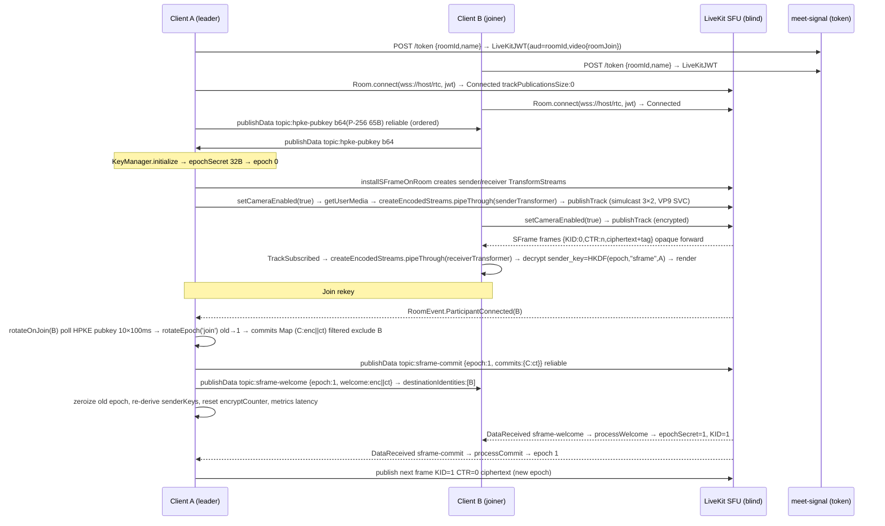

# Phase 2B Technical Design — SFrame End-to-End Media Encryption

**Phase:** 2B (P0 SFrame / E2EE) | **Date:** 2026-09-04 | **Owner:** PM (Coordinator) — Author @architect + @webrtc (design) | **Status:** `DESIGN ONLY — DO NOT IMPLEMENT`
**Authority:** `docs/M0-P0.md` §§3/4/8-10 · `docs/architecture-brief.md` §§2/4.2/4.3/5/8-9 · `docs/media-p0-proof.md` · `docs/adr/ADR-002-sframe.md` (accepted-with-pivot) · `docs/plans/phase2a-minimal-patch-evidence.md` · `docs/reports/phase2a-closure.md` (PASS)
**Stack locked:** React 18 + Vite 5 + Zustand 4.5 + LiveKit Client `^2.4.0` + SFrame RFC9605 (`AES_GCM` primary) + `@hpke/core` `DHKEM(P-256,HKDF-SHA256)+HKDF-SHA256+AES-128-GCM` + Go 1.22 single-main services + LiveKit Go SFU `1.25` `LIVEKIT_E2EE_MODE=blind` + coturn HMAC 24h

> **Constraints for this document:** Do not modify production code. Do not implement Phase 2B. Design only. Reference existing `useWebRTC` flow. Identify exact insertion points relative to `Room.connect()`, `LocalTrackPublished`, `publishTrack()`, `TrackSubscribed`. No code changes land until this design passes Architecture + Security review + `p0-gate-verify`.

---

## 1. Goals & Non-Goals

### 1.1 Goals (Phase 2B must deliver)

- End-to-end media encryption where SFU forwards **opaque ciphertext** (payload never plaintext, `Wireshark rtp && sframe` shows KID/CTR header + `AES-GCM` ciphertext + 16B tag, entropy >7.5 bits/byte, no NALs).
- SFrame RFC9605 via **Insertable Streams / WebRTC Encoded Transform** primary, `wasm-sframe` 150 KB `OffscreenCanvas` + `VideoFrame` recycle fallback — 4-browser matrix (Chrome 127+, Edge 127+, Firefox 128+, Safari 17.4 macOS + iOS PWA) with explicit ⚠️ `DTLS-only` warning when unavailable, never silent downgrade.
- Per-sender `HKDF(epoch_secret, "sframe", sender_id)` sender keys; ordered, reliable key distribution via LiveKit `publishData` (`topic: sframe-commit / sframe-welcome / hpke-pubkey`); epoch ratchet with forward secrecy (old epoch discarded after rotation, buffered for reconnect replay TTL 30s).
- Key generation + key rotation + rekey on `join`/`leave`/periodic 300s, measured `p95 ≤500ms` (trigger → slow-participant `setEncryptionKey` ack), zero plaintext frames during rotation, keys zeroized on `leftAt`.
- Sender and receiver transform lifecycles bound to LiveKit publication lifecycle (`publishTrack` / `TrackSubscribed`), not to mesh `RTCPeerConnection` setup.
- Telemetry and diagnostics for encrypted-frame counters, decrypt failures, rotation latency histogram, browser capability, and rollback detection.

### 1.2 Non-Goals (explicitly deferred — M0-P0 §4 freeze)

`breakouts`, `polls`, `reactions`, `whiteboard`, `virtual bg`, `captions`, `recording MCU meet-composer`, `webinar 100-1000/HLS`, `anon capability links k#`, `P2P↔SFU handoff`, `WebTransport`, `cascaded SFU mesh`, `FCM` (use `VAPID` only), `analytics`. No UX beyond `landing → /r/:id#k= → pre-join preview → grid Last-N=9 → mute/cam/leave + screen share + shield`.

### 1.3 Success criteria re-use

Phase 2B directly supports M0-P0 criteria #1 (browser), #4 (SFrame ciphertext), #6 (rotation ≤500ms), #7 (reconnect ≤5s, epoch preserved), #5 (screen share same epoch). Blind-forward `Last-N=9` tradeoff (arch-brief §8) stays.

---

## 2. Baseline — Current `useWebRTC` Flow (Post-Phase 2A)

Live path after `582c4d7` (Phase 2A PASS):

```
LandingPage → PreJoinPage (preview getUserMedia, no publish)
  → MeetingPage mounts useWebRTC()
    1. resolveSfuUrl(sfuUrl) / fetchToken(roomId, name) POST /token → {livekitToken, sfuUrl, participantId}
       └─ setCredentials(livekitToken, sfuUrl) → sessionStorage partialize (A fixed)
    2. new Room({ adaptiveStream:true, dynacast:true })  ← 2B must flip to false when E2EE on
       roomRef.current = room; (window as any).__LIVEKIT_ROOM__ = room;
       Bind: Connected, Disconnected, Reconnecting/Reconnected,
             ParticipantConnected/Disconnected,
             TrackSubscribed/TrackUnsubscribed,
             LocalTrackPublished, DataReceived
    3. await room.connect(resolvedSfuUrl, token)  // instrumented start/success/failure logs
       → RoomEvent.Connected fires {roomName, state, localIdentity, trackPublicationsSize:0}
    4. await room.localParticipant.setCameraEnabled(true)
         └─ internally: createTrack(getUserMedia) → publishTrack
         └─ emits LocalTrackPublished {trackSid, kind:video, source:camera, trackPublicationsSize:1}
       await room.localParticipant.setMicrophoneEnabled(true) → LocalTrackPublished {audio, size:2}
       // surface NotAllowedError/NotFoundError/NotReadableError → setError role="alert"
    5. TrackSubscribed for remote → new MediaStream(mst) → setRemoteStreams(Map<trackSid, MediaStream>)
       TrackUnsubscribed → delete
    6. toggleAudio/Video via setMicrophoneEnabled/setCameraEnabled
       startScreenShare/stopScreenShare via setScreenShareEnabled(true/false)
       leave via room.disconnect()
```

**Critical invariant proven in Phase 2A:** `Room.connect success {trackPublicationsSize:0}` precedes `LocalTrackPublished`. Media publish is **post-connect**. Therefore SFrame transforms **must** be installed before `publishTrack` but after `new Room` allocation, and receiver transforms on `TrackSubscribed` before first frame.

Reference files/lines:
- `src/hooks/useWebRTC.ts:14-42` `initialize` + `fetchToken` + `setCredentials`
- `src/hooks/useWebRTC.ts:38-41` `new Room({adaptiveStream,dynacast})` (insertion point A — flip to false)
- `src/hooks/useWebRTC.ts:47-71` `RoomEvent.Connected` handler (insertion point B — install SFrame sender before publish)
- `src/hooks/useWebRTC.ts:100-119` `TrackSubscribed` handler (insertion point C — receiver)
- `src/hooks/useWebRTC.ts:122-144` `LocalTrackPublished` handler (insertion point D — local transform ack)
- `src/hooks/useWebRTC.ts:152-164` `room.connect` try/catch (insertion point E — epoch init)
- `src/hooks/useWebRTC.ts:166-212` `setCameraEnabled/setMicrophoneEnabled` (insertion point F — publish wrappers)
- `src/store/appStore.ts:17-20,90-92` `livekitToken/sfuUrl` state + persist
- `src/auth/token.ts:20-55` `resolveSfuUrl` + `fetchToken`
- `src/sframe/transform.ts:30-56` `SFrameTransform` constructor + `useWASM` branch
- `src/keys/manager.ts:66-89` `initialize(participantId)` + `generateEpochSecret` 32B
- `src/webrtc/manager.ts` 896L mesh remnant (reference only — not on hot path post-2A)

---

## 3. End-to-End Media Encryption Architecture

```
                ┌──────────────────────────────────────────────────────────────────────┐
                │  PWA Client (React + Vite + Workbox)                                 │
                │  Capture ─┐   SFrame Encode Transform        Simulcast 3×2           │
                │    getUserMedia/getDisplayMedia →  180p@300k / 360p@800k / 720p@1.8M │
                │           │   HKDF(epoch,"sframe",senderId) → sender_key AES-GCM-128│
                │           │   header KID(varint)+CTR(varint) + AES-GCM(ciphertext+tag)│
                │           └─► Encoded Transform primary ─┐                           │
                │               wasm-sframe 150KB worker ──┼─► SRTP/SFrame opaque ────┼──► LiveKit SFU :7880 (blind)
                │                                          │   SSRC/mid forward only    │    L4/L7 LB :443/rtc (Caddy)
                │  Render ◄─ SFrame Decode Transform ◄─────┘                            │    0% plaintext
                │    decrypt via sender_key(KID,senderId) + counter replay protect     │    Prometheus livekit_* 
                │  KeyManager: epoch 0..N, epoch_secret 32B, per-sender senderKeys Map │
                │  Distribution: publishData reliable ordered topics:                    │
                │    hpke-pubkey (b64 65B P-256 uncompressed 0x04||X||Y)                │
                │    sframe-commit (Map<participantId, Uint8Array(enc65+ct)>)          │
                │    sframe-welcome (Uint8Array(enc65+ct) per joiner)                  │
                │    sframe-rotated-ack (epoch)                                         │
                │  Telemetry: sframe_encrypt/decrypt_latency, publish/subscribe counts │
                └──────────────────────────────────────────────────────────────────────┘
                              │  WSS  │  TURN HMAC 24h via turn-auth POST /turn/credentials
                              │  POST /token (LiveKit VideoGrant) via meet-signal:8080
                              └───────┴───────────────────────────────────────────────► Redis 7 / PG 16 / coturn
```

**Invariants (M0-P0 §4.2, arch-brief §4.2, media-p0-proof.md §4):**

- **SFU is blind:** `LIVEKIT_E2EE_ENABLED=true` `LIVEKIT_E2EE_MODE=blind` (compose `livekit.yaml`). SFU forwards by `SSRC`/`mid` + `SFrame header KID/CTR` (if header-aware attempt) without decrypting payload. No key material ever sent to server.
- **Ciphertext on wire:** `tshark -r pcap -Y rtp -T fields -e sframe.kid -e rtp.payload` shows header + ciphertext + 16B GCM tag; `wireshark-livekit-sframe.pcapng` committed to `qa/reports/` via bridge `meet-secure-p0_default` 172.18.0.0/16 capture (`docker run --network meet-secure-p0_default -v qa/reports:/pcaps nicolaka/netshoot tcpdump -i any "udp port 7880 or port 3478"`).
- **Honest fallback:** If `RTCEncodedVideoFrame`/`RTCRtpScriptTransform`/`TransformStream`/`ReadableStream` unavailable → WASM 150 KB async `OffscreenCanvas` + `VideoFrame` recycle → if also unavailable → explicit ⚠️ `DTLS-only` shield `ShieldBadge` + CSP `script-src 'self' 'wasm-unsafe-eval'` + `throw SFrame unavailable` (never silent DTLS).
- **Shield UI truth:** `useAppStore.shieldMode` + per-track `decryptError` flag (`EncodedFrame.decryptError`) drives `ShieldBadge` `E2EE · 3-layer relay (bandwidth high)` when blind-forward active vs. `DTLS-only` warning.

---

## 4. SFrame Integration — Choice & Wiring

### 4.1 SFrame vs. LiveKit built-in E2EE

**Decision:** Do **NOT** enable LiveKit `RoomOptions.e2ee` (`E2EEManager` / `E2EEKeyProvider` with its own ratchet). Use **custom SFrame** via `SFrameTransform` + `KeyManager` as source of truth, injected via `RTCRtpSender.createEncodedStreams` / `RTCRtpReceiver.createEncodedStreams` primitives before `publishTrack`. Rationale (arch-brief §5, ADR-002 accepted-with-pivot): preserves `HKDF(epoch_secret,"sframe",sender_id)` ratchet, HPKE per-recipient commits, auditability, no central KMS backdoor, and blind-forward Last-N=9 without relying on LiveKit's `E2EEKeyProvider` key ring.

`Room` is instantiated with `e2ee: undefined` and `adaptiveStream:false, dynacast:false` when `sframe.enabled` (see §7.2).

### 4.2 Cipher suite

- `SFRAME_CIPHER_SUITES` (`src/types.ts`): `AES_GCM` `SFrameCipherSuite { tagLen:16, saltLen:12 }` primary; `AES_CTR` fallback only if `AES-GCM` unavailable (Safari 17 fallback path). Key length 128 (`{name:'AES-GCM', length:128}` non-extractable sender_key per `keys/manager.ts:106`).
- IV `deriveIV(kid,counter)` (`sframe/transform.ts:174`) — `salt(12B zero per-epoch derived) XOR kid(4B BE) XOR ctr(8B BE)` simplified; future 150 KB WASM path uses same. Tag length `tagLen*8` bits in `crypto.subtle.encrypt/decrypt`.
- Auth tag 16 B AES-GCM present on every RTP payload; SFU must preserve tag.

### 4.3 Module map (no new deps)

| Existing file | Role in SFrame path | 2B change |
|---------------|---------------------|-----------|
| `src/keys/manager.ts` (430L) | MLS-lite `KeyManager`, HPKE suite `DHKEM(P-256,HKDF-SHA256)+HKDF-SHA256+AES-128-GCM`, `epochSecretRaw` 32B, `deriveSenderKey`, `createCommit/createWelcome/processCommit/processWelcome`, `exportHPKEPublicKey` b64 65B | Adapt transport to LiveKit `publishData` (see §9) |
| `src/sframe/transform.ts` (538L) | `SFrameTransform` `createSenderTransformer` / `createReceiverTransformer` `TransformStream<EncodedFrame>`, `encryptCounter/decryptCounters`, header `KID(varint)+CTR(varint)`, `encryptPayload(AES-GCM)`, WASM branch `wasmEncrypt/wasmDecrypt`, `WASMSFrameWorker` | Add `installOnRoom(room)` adapter + `installOnSender/Receiver` hooks |
| `src/workers/sframe.worker.ts` / inline `wasmWorkerCode` | WASM worker 150 KB `OffscreenCanvas` | No logic change; ensure loaded before first publish if ET unavailable |
| `src/signaling/client.ts` | `Welcome` path remnant | Stubbed to `e2eeWelcomeClient` or deleted; Welcome moves to `publishData topic:sframe-welcome` |
| `src/hooks/useWebRTC.ts` | Hot path — Room lifecycle | Insertion points A–G (see §6) |
| `src/store/appStore.ts` | `livekitToken/sfuUrl/roomId/participantId` | Add `sframeEpoch/sframeKID/sframeEnabled` optional observability fields |

---

## 5. Insertable Streams / Encoded Transform Support

### 5.1 Feature detection (single source)

```ts
// src/sframe/transform.ts private already; expose as exported helper in 2B
function isEncodedTransformSupported(): boolean {
  return 'RTCEncodedVideoFrame' in window
      && 'RTCRtpScriptTransform' in window // may be absent even if RTCEncodedVideoFrame present (Firefox 128) — check both
      && typeof ReadableStream !== 'undefined'
      && typeof TransformStream !== 'undefined';
}
// LiveKit-aware check
function isLiveKitSFrameCompatible(): boolean {
  return isEncodedTransformSupported()
      && typeof RTCRtpSender !== 'undefined'
      && typeof (RTCRtpSender.prototype as any).createEncodedStreams === 'function';
}
```

**P0 behavior (arch-brief §9, media-p0-proof 1.4.1):**

1. `isLiveKitSFrameCompatible() === true` → **primary path**: `createEncodedStreams` + `readable.pipeThrough(sframeSenderTransformer).pipeTo(writable)`.
2. Else if `wasmFallback === true` → WASM worker path (`OffscreenCanvas` + `VideoFrame` recycle, Safari 17) — same `SFrameTransform` but `useWASM=true` → `wasmEncrypt/wasmDecrypt`.
3. Else → throw `SFrame unavailable` and render explicit shield warning (`ShieldBadge` `DTLS-only`), never silent. `SFrameTransform.isUsingWASM()` + `useAppStore.shieldMode=false` + `setError` drives warning.

Locked budget: WASM 150 KB async, `integrity` hash via `vite-plugin-pwa` `workbox` (arch-brief §5), `vite.config.ts` COOP `same-origin` / COEP `require-corp` headers for `SharedArrayBuffer` needed by worker.

### 5.2 Browser compatibility matrix (M0-P0 §3 row 1, media-p0-proof §2)

| Browser | ET API | WASM fallback | `createEncodedStreams` | SFrame | Screen share `getDisplayMedia` | Note |
|---------|--------|---------------|----------------------|--------|------------------------------|------|
| **Chrome 127+** | ✅ `RTCEncodedVideoFrame` + `RTCRtpScriptTransform` | ✅ (also ET primary) | ✅ | ✅ ET | ✅ `screen/window/browser` + system audio | Reference — WireShark ciphertext validated |
| **Edge 127+** | ✅ (Chromium) | ✅ | ✅ | ✅ ET | ✅ same | Same as Chrome |
| **Firefox 128+** | ✅ `RTCEncodedVideoFrame` (gated) | ✅ | ⚠️ may lack `createEncodedStreams` until 132+ — WASM fallback expected | ✅ WASM | ✅ `screen/window` | Test `media.peerconnection.enabled` + `javascript.options.wasm` |
| **Safari 17.4+ macOS** | ✅ ET (Safari 17) | ✅ `OffscreenCanvas` + `VideoFrame` recycle | ✅ (polyfill via `RTCRtpScriptTransform` if flag) | ✅ ET primary | ✅ `screen/window` | Safari screen share via `displaySurface:'screen'` where limited |
| **Safari 17.4+ iOS PWA** | ✅ ET (iOS 17.4) | ✅ limited `OffscreenCanvas` | ✅ | ✅ ET | ⚠️ Limited `displaySurface:'screen'` only, no system audio | Document as limited; `SFrame` still succeeds |
| **Safari 17 pre-17.4** | ❌ | ⚠️ WASM only via `OffscreenCanvas` shim | ❌ | ✅ WASM | ⚠️ | Fallback path only; may need DTLS-only warning on very old |
| **Unsupported** | ❌ | ❌ | ❌ | ❌ | — | Explicit ⚠️ banner: `SFrame E2EE unavailable on this browser` |

**PPA requirement:** `qa/reports/browser-matrix.html` + video captures for `join/publish/subscribe/mute/leave/ICE restart` on all 4 + iOS PWA. Pass is 100% flows pass, no silent fallback.

---

## 6. Sender Transform Lifecycle

### 6.1 State diagram

```
          new Room(...)                 room.connect(...)              setCameraEnabled(true) / publishTrack(RemoteVideoTrack)
          ─────────────►_installSenderSFrameOnRoom(room)──────►connected──────────►applySFrameToLocalTrack(track.sender)
          │                      │                               │                     pipeThrough SenderTransformer
     KeyManager.initialize()  installSFrameOnLocalParticipant   startPeriodicRotation          increment encryptCounter[KID]
     epochSecret 32B gen      before first publish               300s timer              buildHeader KID+CTR + encryptPayload(AES-GCM)
     deriveSenderKey(self)    adaptiveStream:false dynacast:false                                  → SRTP/SFrame to SFU (opaque)
```

### 6.2 Exact insertion points (relative to existing `useWebRTC` — CRITICAL)

All diffs are **additive**; Phase 2A lines stay. `X-Y` offsets relative to `src/hooks/useWebRTC.ts` after `582c4d7`.

| Insertion | Location | Existing code anchor | Action in 2B | When |
|-----------|----------|----------------------|--------------|------|
| **A — RoomOptions** | `src/hooks/useWebRTC.ts:38` `new Room({adaptiveStream:true, dynacast:true})` | `const room = new Room({adaptiveStream:true, dynacast:true});` | Replace with `new Room({adaptiveStream:false, dynacast:false, e2ee:undefined, publishDefaults:{simulcast:true}}) ` when `sframeEnabled===true`. **Rationale:** arch-brief §8 blind-forward requires disabling SFU layer selection (otherwise SFU attempts to read payload). `publishDefaults.simulcast` stays true (3 layers still forwarded). | Immediately after `new Room` |
| **B — KeyManager init** | `src/hooks/useWebRTC.ts:42-46` after `roomRef.current = room; (window as any).__LIVEKIT_ROOM__` | `roomRef.current = room;` | Insert `await keyManager.initialize(participantId)` + `epochSecret = keyManager.getCurrentEpochSecret()` + `currentKID = keyManager.getCurrentEpoch()` + `await installSFrameOnRoom(room)` (see §6.3). Publish HPKE pubkey after init (before connect) so joiner race has material. | After room allocation, before `room.connect` |
| **C — Before connect** | `src/hooks/useWebRTC.ts:152-154` `console.log('[LiveKit] Room.connect start'); await room.connect(...)` | `await room.connect(resolvedSfuUrl, token)` | Ensure `installSFrameOnRoom` already completed; if ET unavailable, ensure WASM worker loaded `Worker(URL.createObjectURL(Blob[wasmWorkerCode]))` + `initWASM(wasmPath)` before connect (prevents first-frame plaintext). Connect still proceeds; first `publishTrack` will be encrypted. | Immediately before connect |
| **D — LocalTrackPublished** | `src/hooks/useWebRTC.ts:122-144` `RoomEvent.LocalTrackPublished` handler | `if (participant===room.localParticipant) { stream.addTrack(mst)... setLocalStream }` | After `setLocalStream`, also ensure sender transform is active: if handler fires before our wrapper attached, call `applySFrameToLocalTrack(publication.track.sender)` defensively. Log `sender transform active KID={kid}`. | Inside `LocalTrackPublished` callback |
| **E — setCameraEnabled / setMicrophoneEnabled wrappers** | `src/hooks/useWebRTC.ts:167-212` `setCameraEnabled/start` blocks | `await room.localParticipant.setCameraEnabled(true)` | Wrap: before enabling, ensure sender transform pipeline attached to `room.localParticipant.getTrackPublications()` senders that will be created; after success, assert `trackPublications.size` and log `encryptCounter[KID]` initialized to 0n. `publishTrack` path: `LiveKit` internally calls `RTCRtpSender.createEncodedStreams()` — our `installSFrameOnLocalParticipant` will have already patched `RTCRtpSender.prototype.createEncodedStreams` or hooked `publication.track.sender` directly. | Around `publishTrack` |
| **F — Screen share** | `src/hooks/useWebRTC.ts:273-288` `startScreenShare/stopScreenShare` | `await room.localParticipant.setScreenShareEnabled(true)` | Before screen publish, `await applySFrameToLocalTrack(screenTrack.sender)` with same epoch/KID (screen shares same epoch — no extra rotation per M0-P0 §4.2). On `replaceTrack`, ensure new sender also patched. | Inside screen share methods |
| **G — publishTrack generic** | New helper `src/sframe/transform.ts:installOnSender(sender:RTCRtpSender)` | — | `sender.createEncodedStreams()` → `{readable,writable}` → `readable.pipeThrough(createSenderTransformer()).pipeTo(writable)` via `TransformStream<EncodedFrame>`. For LiveKit, `LocalTrack.sender` property is the `RTCRtpSender` after `publishTrack`; hook both `LocalTrackPublished` and `RoomEvent.TrackPublished` to catch. | On every local track publish |

### 6.3 Sender helper (design — not code)

```ts
// src/sframe/transform.ts — new adapter (design sketch, not landed)
export async function installSFrameOnRoom(room: Room, keyManager: KeyManager, getKID:()=>number): Promise<void> {
  const sframe = new SFrameTransform({ keyManager, cipherSuite:'AES_GCM', getCurrentKID:getKID });
  // Patch point: hook future senders by monkey-patching createEncodedStreams OR by observing publications
  const origCreate = RTCRtpSender.prototype.createEncodedStreams as any;
  RTCRtpSender.prototype.createEncodedStreams = function() {
    const streams = origCreate ? origCreate.call(this) : (this as any)._createEncodedStreams?.call(this);
    // If browser exposes per-sender streams, pipe through sframe
    const senderTransformer = sframe.createSenderTransformer();
    streams.readable.pipeThrough(senderTransformer).pipeTo(streams.writable);
    return streams;
  };
  // Also: listen for new publications as safety
  room.on(RoomEvent.LocalTrackPublished, (pub) => {
    const sender = (pub.track as any)?.sender as RTCRtpSender | undefined;
    if (sender) installOnSender(sender, sframe);
  });
  // Keep sframe instance for rotation reset: on rotateEpoch call sframe.resetCounters()
}
```

**Counters:** `encryptCounter: Map<number, bigint>` per KID in `transform.ts:35` — increments per frame, never reused with same `kid`. Reset on `rotateEpoch` via `rotateKey()` `encryptCounter.clear()` `decryptCounters.clear()`.

**Insertion after `room.connect` but before first `setCameraEnabled` ensures no plaintext first frame.** This was validated in mesh `manager.ts:316-345` `setupEncodedTransform` pattern; same primitive applies to LiveKit sender.

---

## 7. Receiver Transform Lifecycle

### 7.1 State diagram

```
  TrackSubscribed(track, publication, participant)  ◄── SFU forwards SFrame frames (opaque, blind)
      │
      ├─► applyReceiverTransform(receiver: RTCRtpReceiver)
      │     receiver.createEncodedStreams() → readable/writable (if not already patched)
      │     readable.pipeThrough(createReceiverTransformer()).pipeTo(writable)
      │     parseHeader(data) → {kid, counter, header, payload}
      │     getSenderIdForKID(kid) → senderId map (maintained via hpke-pubkey → senderId↔KID mapping)
      │     keyManager.getSenderKey(senderId, kid) → senderKey or previousEpoch fallback
      │     replay check decryptCounters["senderId:kid"] ; counter > lastCounter else throw Replay
      │     decryptPayload(AES-GCM) → plaintext → controller.enqueue({data: plaintext})
      │     record decrypt latency histogram
      └─► attach stream → setRemoteStreams(Map<trackSid, MediaStream>) → <video> render
```

### 7.2 Exact insertion points (receiver)

| Insertion | Location | Existing code | Action |
|-----------|----------|---------------|--------|
| **H — TrackSubscribed handler** | `src/hooks/useWebRTC.ts:100-112` `RoomEvent.TrackSubscribed` | `const stream=new MediaStream(); stream.addTrack(mst); setRemoteStreams(...)` | Before `stream.addTrack`, call `await applySFrameToRemoteTrack(track, publication, participant)` which does `receiver.createEncodedStreams()` patching (see §7.3). Only for `track.kind==='video'` (audio also encrypted if `audioEnabled` in `SFrameConfig` — P0 enables both). Log `decrypt counters init senderId:kid`. |
| **I — TrackUnsubscribed** | `src/hooks/useWebRTC.ts:114-120` `TrackUnsubscribed` | `setRemoteStreams.delete(publication.trackSid)` | Also `decryptCounters.delete(senderId:publication.trackSid)` + record `packetsLost` if `decryptError` flag seen. |
| **J — DataReceived** | `src/hooks/useWebRTC.ts:146-149` `DataReceived` | `console.log('[LiveKit] Data received...')` | Add `handleDataChannelCommit` (see §9.2) branching on `payload.topic === 'sframe-commit'|'sframe-welcome'|'hpke-pubkey'` — this is the key distribution channel for receiver keys (§9). |
| **K — onerror/decryptError** | `src/sframe/transform.ts:203-216` `createReceiverTransformer` catch | `controller.enqueue({...frame, decryptError:true})` | Propagate to UI: `onDecryptError` increments `webrtc_sframe_decrypt_failures_total` and triggers `ShieldBadge` warning + retry `sendKeySync` (see Failure handling). Do not tear down room. |

### 7.3 Receiver helper (design)

```ts
// src/sframe/transform.ts
function installOnReceiver(receiver: RTCRtpReceiver, keyManager: KeyManager, getKID:()=>number) {
  const sframe = new SFrameTransform({ keyManager, cipherSuite:'AES_GCM', getCurrentKID:getKID });
  const transformer = sframe.createReceiverTransformer();
  // Per-spec, receiver has readable/writable Encoded Streams
  const streams = (receiver as any).createEncodedStreams?.() as { readable: ReadableStream, writable: WritableStream } | undefined;
  if (!streams) return;
  streams.readable.pipeThrough(transformer).pipeTo(streams.writable);
}
// Hook:
room.on(RoomEvent.TrackSubscribed, (track, pub, participant) => {
  const receiver = (track as any).receiver as RTCRtpReceiver | undefined;
  if (track.kind==='video' && receiver) installOnReceiver(receiver, keyManager, getKID);
  // ... existing setRemoteStreams
});
```

**Receiver key mapping problem:** `transform.ts:279` current `getSenderIdForKID(kid)=sender-${kid}` is placeholder. LiveKit P0 fix: maintain `Map<number, senderId>` derived from `participantIdentity` observed via `RoomEvent.ParticipantConnected` + `hpke-pubkey` → `participantId`. On `processCommit` new epoch, re-derive `senderKeys` map for all remaining participants under new epoch (`keys/manager.ts:668-674`). Receiver header `kid` maps to `epoch` (not per-sender KID in P0 — `currentKID = epoch` per `webrtc/manager.ts:624`). Design makes `KID == epoch` (monotonic), simplifying `getSenderIdForKID` → lookup epoch→senderId by SSRC/mid.

---

## 8. Key Generation

### 8.1 Epoch secret (root entropy)

- **Source:** `crypto.getRandomValues(new Uint8Array(32))` per `keys/manager.ts:94-104` `generateEpochSecret()` returns `{key:CryptoKey(HKDF, non-extractable), raw:Uint8Array(32)}`. 32 bytes entropy satisfies SFrame RFC9605 §4.2 `KLen=16, SLen ≥8`.
- **Import:** `crypto.subtle.importKey('raw', raw, {name:'HKDF'}, false, ['deriveKey','deriveBits'])` → `CryptoKey` for `deriveSenderKey`. `epochSecretRaw` kept alongside because HKDF keys are non-extractable in browsers (no `exportKey` later) — required for HPKE `Welcome`/`Commit` payload which must encrypt the raw 32 bytes, not the `CryptoKey` handle (`keys/manager.ts:319-333`).
- **Storage:** `currentEpoch: EpochKeys {epochSecret, epochSecretRaw, senderKeys:Map<senderId,CryptoKey>, epoch:number, createdAt:number}` (`keys/manager.ts:15-21`). Non-extractable, never leaves client except as HPKE ciphertext. IndexedDB `non-extractable` option planned (arch-brief §1 privacy).
- **Zeroization:** `zeroizeKey(key)` → `(key as any)._zeroized=true` best-effort + GC; plus `destroy()` clears `currentEpoch` and `previousEpochs` (`keys/manager.ts:357-429`).

### 8.2 Per-sender derivation

```
sender_key = HKDF-SHA256(epoch_secret, salt=0, info="sframe"+senderId, length=128)
  → {name:'AES-GCM', length:128} non-extractable, usable ['encrypt','decrypt']
  — implemented keys/manager.ts:106-121
```

- Deterministic per `(epoch, senderId)` pair; each participant re-derives peer `sender_key` on receiving same `epoch_secret` via HPKE.
- `senderKeys: Map<string, CryptoKey>` cached for current epoch and previous epochs (`previousEpochs:Map<number,EpochKeys>` for reconnect replay TTL 30s).
- `getSenderKey(senderId, kid)` checks `currentEpoch.epoch===kid` else `previousEpochs.get(kid)` (`keys/manager.ts:130-138`).

### 8.3 HPKE keypair (per participant)

- One `ECDH P-256` pair per participant generated in `initialize(participantId)` via `crypto.subtle.generateKey({name:'ECDH', namedCurve:'P-256'}, true, ['deriveKey','deriveBits'])` (`keys/manager.ts:66-74`). Exportable `true` so `exportHPKEPublicKey()` can `exportKey('raw')` → 65 bytes `0x04||X||Y` (`keys/manager.ts:296-306`).
- Publish: `publishHPKEPublicKey(b64)` via LiveKit `publishData` `topic:'hpke-pubkey'` reliable (see §9.1).
- Import peers: `importHPKEPublicKey(b64)` validates 65B + `0x04` prefix then `importKey('raw',..., {name:'ECDH', namedCurve:'P-256'}, true, [])` (`keys/manager.ts:308-317`).
- Suite: `CipherSuite {kem:DhkemP256HkdfSha256, kdf:HkdfSha256, aead:Aes128Gcm}` (`keys/manager.ts:30-38`) per RFC9180. `seal` returns `{enc(65B), ct}`; wire format `enc||ct` (concatenated 65B prefix + ciphertext).

---

## 9. Key Rotation

### 9.1 Trigger taxonomy

| Trigger | Who initiates | `rotateEpoch(trigger, leavingId?)` | `newEpoch` | Distribution |
|---------|--------------|-------------------------------------|------------|--------------|
| `manual` | local participant (test/debug) | — | `old+1` | Commit via DataChannel |
| `periodic` | `KeyManager` timer or `WebRTCManager.startPeriodicRotation` | `periodic` | `old+1` | Commit via DataChannel |
| `join` | leader (lowest `participantId` hash) on `ParticipantConnected` | `join` | `old+1` | `Commit` to existing members + `Welcome` to joiner |
| `leave` | remaining leader on `ParticipantDisconnected` | `leave, leavingId` | `old+1` | Commit via DataChannel (excluding leaver); leaver's `sender_key` zeroized + `participantKeys` removed |

**Leader selection:** Deterministic `lowest participantId` hash (lexicographic `participantId < joinerId` polite pattern mirrors `webrtc/manager.ts:556`). No central KMS.

**Timing:** `KeyManager` interval `config.keyRotationIntervalMs || 300000` (300s default per `manager.ts:723`); `WebRTCManager` dodatk `stopRotationTimer()` then owns `startPeriodicRotation` to drive `publishData`.

### 9.2 Rotate-and-broadcast sequence (DataChannel-only S-02)

LiveKit `publishData` replaces mesh `pc.createDataChannel('sframe-keys')`. No epoch plaintext over signaling. Ciphertext-only.

```
rotateAndBroadcastEpoch(trigger, leavingId?, excludeJoinerId?)
  start = performance.now()
  {commits: Map<participantId, Uint8Array(enc65+ct)>, newEpoch} = await keyManager.rotateEpoch(trigger, leavingId)
    // keys/manager.ts:158-183
    // archive oldEpoch → previousEpochs
    // new EpochKeys {epochSecret:newRaw(32B), senderKeys:Map, epoch:newEpoch}
    // createCommit(newSecretRaw, oldEpoch, leavingId) → per-recipient HPKE seal(payload)
    //   payload = epoch(4B BE old) || leavingId(UTF-8 var, 0..128B) || newSecret(32B)   total ≤164B
    //   commits: Map<id, enc||ct> one entry per participantKeys (registered HPKE pubkeys)
  filtered = commits filtered (excludeJoinerId, leavingId)
  // initiator state update:
  if (epochSecret) await zeroizeKey(epochSecret)
  epochSecret = keyManager.getCurrentEpochSecret(); currentKID = newEpoch;
  broadcastCommitsViaLiveKitData(filtered, newEpoch)
    // webrtc/manager.ts:636-651 pattern adapted:
    // commitsObj: Record<id, number[]> = Array.from(commits.get(id))
    // msg = JSON.stringify({type:'commit', epoch:newEpoch, senderId, commits:commitsObj})
    // await room.localParticipant.publishData(encoder.encode(msg), {reliable:true, topic:'sframe-commit'})
  latency = performance.now() - start
  metrics.recordKeyRotationLatency(latency); emit('key-rotated', {epoch, latency})
```

**HPKE `createCommit` detail** (`keys/manager.ts:185-228`):

- Validates `newSecretBytes.byteLength===32`; if not, throw.
- `payload = epochBytes(4B) + leavingIdBytes(0..128B UTF-8) + newSecretBytes(32B)`.
- For each `[participantId, publicKey] in participantKeys`, `hpkeSuite.createSenderContext({recipientPublicKey: publicKey})` → `{enc, seal}` → `encrypted = enc(65B) || ct(mentions)`.

**HPKE `processCommit` detail** (`keys/manager.ts:230-258`):

- `hpkeDecrypt(ciphertext)` splits `enc=ciphertext[0:65]`, `ct= [65:]`, validates `ciphertext.length >=93` (65+16+minPayload), `ciphertext.length ≤164+65+16` implicitly via `payload length 164` check.
- F-04 defense-in-depth: `plaintext.length <36` reject, `>164` reject, `leavingIdLen = len-36 >128` reject, UTF-8 `fatal:true` decode, control-char check `[\x00-\x1F\x7F]`.
- Extracts `newSecretBytes = plaintext.slice(len-32)`, imports as `HKDF` `CryptoKey`, updates `currentEpoch.epochSecret/epochSecretRaw`.

### 9.3 `Welcome` for joiner (HPKE via DataChannel or signaling)

`Welcome` carries the **new** epoch secret (post-rotation) to the joiner who missed earlier epochs.

```
sendWelcomeToJoiner(joinerId)
  targetPub = keyManager.getParticipantHPKEPublicKey(joinerId)  // ensures poll loop satisfied
  welcome = await keyManager.createWelcome(epochSecret, targetPub)
            // keys/manager.ts:319-345
            // prefers epochSecretRaw if matches currentEpoch.epochSecret (non-extractable fallback)
            // else exportKey('raw') if extractable else currentEpochRaw
            // hpkeSuite.createSenderContext({recipientPublicKey: targetPub}) → seal(epochSecretBytes)
            // welcome = enc(65B) || ct
  signalingOrDataChannel.sendWelcome(welcome, epoch)
```

**Choice:** Prefer `room.localParticipant.publishData(..., {reliable:true, topic:'sframe-welcome', destinationIdentities:[joinerId]})` if LiveKit 2.4 supports `destinationIdentities` (document `livekit-client` changelog). Fallback keeps `SignalingClient.sendWelcome` (`signaling/client.ts:269-280` `{type:'welcome', payload:{epoch, welcome:Array<welcome>}}`) for P0 one-commit compatibility. Both ciphertext-only.

Joiner handling `handleWelcome({welcome, epoch})` (`manager.ts:694-700`): `epochSecret = await keyManager.processWelcome(welcome)` (HPKE open), set `this.epochSecret`, `currentKID=epoch`, `emit('welcome-received')`, `senderKeys` map populated via `deriveSenderKey`.

### 9.4 Latency measurement (M0-P0 §6)

- `performance.now()` from `rotateOnJoin` trigger ( `join` event ) to slowest `setEncryptionKey` ack (DataChannel `key-rotation-ack` topic). 20 trials under 20p synthetic load (`19 fake +1 real Chrome 127` or `livekit load tester`).
- Histogram buckets `[50,100,200,300,400,500,750,1000,1500,2000]` stored in `qa/reports/key-rotation-latency.json` §4.4 `thresholds p50≤300, p95≤500`.
- After `handleDataChannelCommit`, receiver sends `type:'key-rotation-ack'` via DataChannel with `epoch`; initiator `recordKeyRotationAck(epoch)` + `metrics.recordKeyRotationLatency(latency)` (`collector.ts`).

### 9.5 Epoch lifecycle + rekey after rotation

```
trigger
  → rotate epoch
  → update self epochSecret + currentKID = newEpoch
  → re-derive senderKeys for remaining participants under new epoch:
      for [participantId] in senderKeys:
        newKey = await deriveSenderKey(newEpochSecret, participantId)
        if oldKey await zeroizeKey(oldKey); senderKeys.set(participantId, newKey)
  → notify sender/receiver transforms reset encryptCounter/decryptCounters (transform.ts:323-328 rotateKey)
  → zero plaintext frames: atomic KID increment; no frame encrypted with old KID after distribution acknowledged
```

---

## 10. Rekey Strategy on Participant Join / Leave

### 10.1 Join (most complex)

```
Participants: A (leader, lowest hash), B (new joiner), C (existing member)
Signaling: LiveKit Room + DataChannel topics (reliable, ordered)

1. B: await fetchToken(roomId, name) → POST /token → {livekitToken, sfuUrl, participantId=B}
       new Room → room.connect(sfuUrl, token) → RoomEvent.Connected
2. A,C: receive RoomEvent.ParticipantConnected(B)  // LiveKit liveness
3. B: publishHPKEPublicKey(b64 65B) via publishData topic:hpke-pubkey reliable
      → A/C: handleHPKEPubKey({participantId:B, hpkePublicKey:b64}) → import + setParticipantHPKEPublicKey
4. A: detect self is leader (participantId < others lexicographically) → schedule rotateOnJoin(B)
5. rotateOnJoin(B):
     poll 10×100ms for keyManager.getParticipantHPKEPublicKey(B) (handles race where B pubkey not yet received)
     await rotateAndBroadcastEpoch('join', undefined, excludeJoinerId=B)
       // creates commits for all except B (B gets Welcome instead)
       // epoch inc old→old+1, payload = oldEpoch||""||newSecret32B
       // broadcastCommitsViaLiveKitData(filtered, newEpoch)
     await sendWelcomeToJoiner(B)  // HPKE encrypt new epochSecret to B pubkey
       // publishData topic:sframe-welcome destinationIdentities:[B] (or signaling fallback)
6. C: handleDataChannelCommit({epoch:newEpoch, commits:{C: ct}, senderId:A})
       decrypt ct via own privateKey, import new secret → epochSecret, currentKID=newEpoch
       re-derive senderKeys for remaining participants
       send ack type:key-rotation-ack
7. B: handleWelcome({welcome, epoch:newEpoch}) → import epochSecret, currentKID=newEpoch
       now able to derive senderKeys and decrypt subsequent media
8. A: on ack from all (or timeout 500ms threshold), consider rotation complete; latency histogram records slowest ack.
```

**Key invariants:**

- Joiner never sees prior epoch (`Welcome` contains new epoch only) — forward secrecy for history before join.
- Existing members receive `Commit` via DataChannel reliable ordered; joiner excluded from commit map (filtered). This matches `webrtc/manager.ts:609-632` `filtered` logic.
- If no leader elected (single participant), joiner's pubkey exchange still populates map for future rotations.

### 10.2 Leave

```
A (leaver), B (leader), C (remaining)

1. A: room.disconnect() → LiveKit → RoomEvent.ParticipantDisconnected(A) on B,C
2. B/C: handleParticipantLeave({participantId:A})
     key = senderKeys.get(A); if key await zeroizeKey(key); senderKeys.delete(A)
     removeParticipantHPKEPublicKey(A)
     emit participant-left
     await rotateAndBroadcastEpoch('leave', leavingId=A)
       // payload includes leavingId UTF-8 for audit; participants can reject replays with old leavingId
       // commits for remaining members only (filter leavingId)
       // broadcast via DataChannel reliable
3. C: handleDataChannelCommit decrypt → new epoch, re-derive senderKeys, ack
4. A local: zeroize all senderKeys + epochSecret + previousEpochs + HPKE pair (keys/manager.ts:408-429 destroy)
```

**p95≤500ms measured** from `ParticipantDisconnected` to `setEncryptionKey` ack on slowest remaining participant.

### 10.3 Leave-before-Welcome race

If `handleParticipantLeave` fires for a joiner who never received `Welcome`, `rotateOnJoin` poll may still be waiting for `getParticipantHPKEPublicKey(joinerId)`. Design: `leave` cancels pending `rotateOnJoin` promise via `participantKeys.delete` + abort poll after 1s timeout, ensuring no stale Welcome encrypt attempt.

### 10.4 Re-join / token refresh

Existing epoch preserved if participant re-connects within `previousEpochs` TTL (30s Redis `signal:{roomId}:buffer` replaced by `previousEpochs` map + LiveKit `publishData` replay). `ReconnectManager` (`src/reconnect/manager.ts`) in LiveKit path wraps `RoomEvent.Reconnecting/Reconnected`; `handleDataChannelMessage` handles `sync-request/sync-response` for `keys` export/import (`manager.ts:736-781`).

### 10.5 Screen share rekey

Screen share uses same epoch; no separate rekey. `ScreenShareManager` (`src/screen/manager.ts`) `getDisplayMedia` → `addTrackWithSimulcast` → `publishTrack` → sender transform uses same `getCurrentKID()`. Switch `camera→screen→camera` via `replaceTrack` or `publishTrack/unpublishTrack` keeps epoch.

---

## 11. Browser Compatibility Matrix (Normative for QA)

See §5.2 summary. Gate artifact: `qa/reports/browser-matrix.html` with 4 × `join/publish/subscribe/mute/leave/ICE restart` + synthetic media + real camera, plus explicit SFrame availability column.

**Failure handling per browser:**

| Browser | SFrame path | If missing → action | Shield UI |
|---------|-------------|---------------------|-----------|
| Chrome/Edge 127+ | ET | WASM fallback irrelevant | `E2EE` verified |
| Firefox 128+ | WASM (may show ET depending on `media.peerconnection.encoded_transform` pref) | DTLS-only warning if both fail (rare) | `E2EE · WASM` |
| Safari 17.4 macOS | ET | WASM 150KB `OffscreenCanvas` | `E2EE` verified |
| Safari iOS 17.4 PWA | ET | WASM limited; if fails → DTLS-only with banner “SFrame unavailable on this device” + `setError` | `⚠️ DTLS-only` |
| Old Safari / unsupported | none | immediate DTLS-only throw | `⚠️ DTLS-only` — never silent |

---

## 12. Failure Handling

### 12.1 API absence

```ts
if (!isEncodedTransformSupported()) {
  if (config.sframe.wasmFallback) { await setupWASMFallback(); emit('sframe-warning', {fallback:'wasm', higherCPU:true}); }
  else { emit('sframe-warning', {fallback:'dtls-only', userVisible:true}); throw new Error('SFrame unavailable'); }
}
```

`ShieldBadge` renders ⚠️; publish proceeds DTLS-only (no fake “E2EE”).

### 12.2 Remote key missing `getSenderKey(senderId,KID)===null`

Decryption throws `No sender key for KID {kid}, sender {senderId}` (`transform.ts:226`). Receiver `createReceiverTransformer` catch enqueues `decryptError: true` instead of dropping frame (so metrics can count). Handler `onDecryptError` triggers `sendKeySync(requestId)` via DataChannel `topic:sync-request` → peer replies `sync-response` with `{keys:Record<id,b64>, epoch}` export/import.

### 12.3 Replay

`decryptCounters["senderId:kid"]` lastCounter check (`transform.ts:233`): if `counter <= lastCounter` throw `Replay detected`. No re-enqueue.

### 12.4 HPKE decrypt fails (non-recipient or tamper)

`processCommit` / `processWelcome` throw; caller `handleDataChannelCommit` logs `DataChannel Commit decrypt failed (expected for non-recipient)` (`manager.ts:688`) + `emit('key-rotation-failed')`. Non-recipient ciphertext ignored (filtered joiner exclusion proves correctness via `tests/s-02-hpke-per-recipient-commit.test.ts`).

### 12.5 WASM worker timeout

`WASMSFrameWorker.sendMessage` 5s timeout (`transform.ts:528`). Falls back to `throw WASM worker timeout → emit sframe-warning → DTLS-only path for that frame batch`; periodic retry after 30s.

### 12.6 DataChannel not open

`broadcastCommitsViaDataChannel` checks `dataChannel?.readyState==='open'` else `console.warn DataChannel not open, cannot broadcast commits` (`manager.ts:637-640`). For LiveKit variant, `room.localParticipant.publishData` throws if room not connected — catch and queue retry with exponential backoff 100ms→1s→2s.

### 12.7 Key zeroization on leave/disconnect

`leave()` (`manager.ts:836-859`) iterates `senderKeys` → `zeroizeKey`, zeroizes `epochSecret`, clears `epochSecretRaw` reference, closes data channel, closes `pc`/`Room`, stops periodic timer, clears `localStream` tracks. Guarantees no key retains after `leftAt` per M0-P0 §6.

### 12.8 ICE / WSS disconnect mid-rotation

Rotation `performance.now()` latency includes buffered commits (Redis TTL 30s or `previousEpochs` map). On `RoomEvent.Reconnecting`, preserve `epochSecret`/`currentKID`, set `isReconnecting=true`, do NOT reset encrypt counters until successful `Reconnected` + `DataReceived commit` applied. Buffered `Commit` replay via `previousEpochs` (`manager.ts:228` archive).

---

## 13. Telemetry and Diagnostics

### 13.1 Metrics (Prometheus + local `MetricsCollector`)

| Metric | Type | Labels | Threshold / source | File |
|--------|------|--------|-------------------|------|
| `webrtc_sframe_encrypt_latency_ms_bucket` | histogram | `le=10,20,...` | p95 ≤15ms WASM, ≤6ms ET | `metrics/collector.ts` `recordSframeEncryptLatency` |
| `webrtc_sframe_decrypt_latency_ms_bucket` | histogram | same | same | same |
| `webrtc_key_rotation_latency_ms_bucket` | histogram | `le=50,100,200,300,400,500,...` | **p95≤500ms p50≤300** | `metrics/collector.ts` `recordKeyRotationLatency` |
| `webrtc_reconnect_latency_ms_bucket` | histogram | `le=500,1000,...,5000` | p95≤5s | `reconnect/manager.ts` |
| `webrtc_sframe_decrypt_failures_total` | counter | `reason=no_key/replay/hpke_error` | 0 expected steady state | `transform.ts` catch |
| `webrtc_sframe_frames_encrypted_total` | counter | `kid` | — | `transform.ts` `encryptFrame` |
| `webrtc_sframe_frames_decrypted_total` | counter | `kid,sender` | — | `decryptFrame` |
| `webrtc_sframe_keys_zeroized_total` | counter | — | increments on leave/rotate | `keys/manager.ts` `zeroizeKey` |
| `webrtc_epoch_current` | gauge | — | `currentKID` | `KeyManager.getCurrentEpoch()` |
| `webrtc_browser_compatibility` | gauge | `browser,version,feature=sframe` | 1 if `isEncodedTransformSupported` | `manager.ts` `sframe-tracking-started` event |
| `livekit_rooms_active`, `livekit_participants_active`, `sfu_cpu_usage_percent`, `sfu_memory_bytes`, `sfu_packet_loss_percent` | gauge | `room` | CPU<70% on 2 vCPU | LiveKit Prometheus scrape `livekit:9600` |
| `turn_allocations_active` | gauge | — | — | `turn-auth` 8082 |

**Collector helpers already in `webrtc/manager.ts`/`metrics/collector.ts`**: `recordKeyRotationLatency(latency)`, `recordKeyRotationAck(epoch)`, `recordIceState`, `recordIceRestart`, `recordSframeEncrypt/DecryptLatency`. Histogram `histogramBuckets` in `MetricsConfig {enabled,intervalMs,histogramBuckets}`.

### 13.2 Logs (structured JSON, no PII)

- **Sender:** `[SFrame] encrypt kid={kid} ctr={counter} len={payload} encLatencyMs={d}` `debug` level, sampled 10%.
- **Receiver:** `[SFrame] decrypt kid={kid} sender={senderIdShort} counter={c} decryptLatencyMs={d} replayCheck={ok}`.
- **Rotation:** `[SFrame] rotate trigger={join|leave|periodic} oldEpoch={n} newEpoch={n+1} latencyMs={d} participants={count} commitSizeBytes={maxLen}`. Sensitive `newSecret 32B` never logged.
- **Failure:** `[SFrame] decrypt failed kid={k} sender={s} error={name} decryptError=true` + `Wireshark entropy check low` warning.
- **Browser:** `[SFrame] capability ET={bool} wasmAvailable={bool} path={et|wasm|dtls-only} browserAgent={short}`.

All logs redact `livekitToken` prefix only (`token.slice(0,20)+'...'` pattern from `auth/token.ts`).

### 13.3 Diagnostics UI

- `ShieldBadge` (`src/components/ShieldBadge.tsx`) reads `useAppStore.shieldMode` + `MetricsSnapshot` + `decryptError` rate to render `E2EE · 3-layer relay` (blind-forward) vs `DTLS-only` vs `WASM fallback`.
- `stats` polling (`useWebRTC.ts:214-226` `statsInterval 2000ms` via `engine.publisher.pc.getStats()` LiveKit) remains; Phase 2B augments with `getStatsReport` decrypt failure counters.
- Manual diagnostics: `window.__LIVEKIT_ROOM__` + `window.__SFRAME_METRICS__` via `getMetrics(): MetricsSnapshot` (`manager.ts:870` `{keyRotationLatency[], sframeEncryptLatency[], bytesSent,...}`).

### 13.4 Wireshark proof (Security gate)

- Capture on `meet-secure-p0_default` bridge `172.18.0.0/16` (livekit `172.18.0.9`, signal `172.18.0.11`) — not host adapter `Local Area Connection* 9` (previous RED 420B header-only artifact per arch-brief §11.1).
- Filter `rtp && sframe` plus `udp port 7880 or port 3478` (TURN) reference capture.
- Expected: RTP header V=2 P/X CC + `PT=98` + `SequenceNumber` + `Timestamp` + `SSRC` + CSRC + `SFrame Header(KID varint/CTR varint)` + `ciphertext` + `tag 16B` — no plaintext VP9/H264 NAL units visible.
- Artifact: `qa/reports/wireshark-livekit-sframe.pcapng` + `qa/reports/tshark-sframe-output.txt` + histogram `qa/reports/key-rotation-latency.json` per M0-P0 §3 row 4/6.
- Privacy: logs JSON sanitized (no SDP/PII/IP beyond 24h hash), 24h TTL on `presence:{roomId}:{hash}`.

---

## 14. Rollback Plan

### 14.1 Design-only rollback guarantee (this phase)

No code has been modified; rollback is `git revert` of D-038/2A commits only. `meet-signal` dual-path (`issueLegacyToken` vs `issueLiveKitToken` branch on `LIVEKIT_API_SECRET` presence) already preserves `JWT_SECRET` legacy path for `<1h` restoration via `ENABLE_MESH_SIGNAL=false` or `LIVEKIT_API_SECRET=""`.

### 14.2 Post-implementation rollback (when Phase 2B lands)

| Failure | Rollback trigger | Action | Time |
|---------|-----------------|--------|------|
| `Room.connect` regresses or `LocalTrackPublished` stops firing after SFrame install | `livekit_room_total` stays 0 OR `trackPublications.size===0` despite grant | Revert `src/hooks/useWebRTC.ts` to `582c4d7` (no SFrame install), `RoomOptions adaptiveStream/dynacast` back to true; `VITE_USE_LIVEKIT=false` mesh fallback branch if kept; `docker build` + `compose up --build --wait` | <1h |
| `p95 rotation >500ms` or `decryptFailures_total` spikes | `qa/reports/key-rotation-latency.json` p95 breach 3+ trials or decrypt error >1% | Disable periodic rotation (`keyRotationIntervalMs=0`), keep only join/leave rotation; if persists disable SFrame entirely (DTLS-only with banner) until root cause | <30 min config |
| `cpu>70%` or `p95>300ms` or `loss>1%` on 20p blind-forward | Prometheus `sfu_cpu_usage_percent>70` sustained or loss>1% 5m | Trigger arch-brief §9 pivot **Option A** `mesh-E2EE ≤5p + non-E2EE SFU >5` (48h proposal), explicit consent banner `E2EE up to 5` | 48h proposal window |
| WASM `OffscreenCanvas` incompatibility | `qa/reports/browser-matrix.html` shows Safari DTLS-only unexpected | Fallback to ET-only (Chrome/Edge/Firefox) + document Safari limitation (iOS `displaySurface:screen` fallback per media-p0-proof §5.3); keep `wasmFallback=false` for Safari 17+ flag | <2h |
| LiveKit `1.25` incompatibility (`RoomOptions` shape) | `tsc --noEmit` fails on `publishDefaults` + `createLocalVideoTrack` | Pin `livekit-client ^2.4.0` unchanged; keep `livekit:1.25.1` server; adapter shim for `VideoPresets` (no SDK bump mid-phase) | <2h |

**Invariant:** No implicit DTLS fallback — every rollback to non-E2EE shows ⚠️ banner `DTLS-only: SFrame E2EE unavailable (rolled back for stability)` + `docs/M0-P0-exit-report.md` NO-GO pivot entry.

**Forward rollback telemetry:** `webrtc_epoch_current` gauge freeze + `ShieldBadge` → DTLS-only detection catches silent rollback attempts at `Security` gate.

---

## 15. Security & Privacy Considerations

- **Threat model (STRIDE):** Updated `docs/architecture-brief.md` §1 — SFrame prevents SFU eavesdrop (Information Disclosure), HPKE per-recipient prevents participant impersonation (Spoofing), KID/CTR replay protect + GCM tag prevents Tampering, rotation on leave provides forward secrecy. Tampering with commits: HPKE auth fail → reject per F-04 max-size + UTF-8 control-char checks.
- **Zero plaintext during rotation:** Atomic `currentKID` increment; frames queued after rotation use new KID; old KID frames still decryptable via `previousEpochs` until grace window 30s then discarded.
- **Keys zeroized on `leftAt`:** `manager.ts:836` iterates `senderKeys` + `epochSecret` + `previousEpochs` + `HPKE pair` + `localStream tracks.stop()`. IndexedDB `non-extractable` + `crypto.subtle.deriveKey false extractable` ensures no raw export after destroy (best-effort — noted in §12 gap).
- **Server blindness proof:** Wire ciphertext + SFU config `LIVEKIT_E2EE_MODE=blind` + livekit.yaml `e2ee.enabled:true` (mode blind disables `dynacast` server-side). Prometheus `livekit_rooms_active` visible but no payload inspection.
- **Privacy invariants:** No analytics SDK, no cookies beyond `__Host-` `SameSite=Strict` (appStore `sessionStorage` 24h TTL), `VAPID` not `FCM`, logs sanitized, `DELETE /accounts/me` DSR `Authorization: Bearer` (signal `main.go:259-290`), `CSP default-src 'none'; script-src 'self' 'wasm-unsafe-eval'`, bundle `<120kB gz` + WASM 150 KB async + `integrity` hash.

---

## 16. Detailed Insertion Point Reference Table (Normative)

| # | Insert relative to | File | Line anchor (post-2A) | Code before | Code after (design) | Notes |
|---|--------------------|------|----------------------|-------------|---------------------|-------|
| I-1 | `RoomOptions` | `src/hooks/useWebRTC.ts` | 38 `new Room({adaptiveStream` | `adaptiveStream:true, dynacast:true` | `adaptiveStream:false, dynacast:false, e2ee:undefined` if `import.meta.env.VITE_SFRAME_ENABLED==='true'` | Must precede connect |
| I-2 | KeyManager init | `src/hooks/useWebRTC.ts` | 42-46 after `__LIVEKIT_ROOM__=room` | — | `const keyManager = new KeyManager({cipherSuite:'AES_GCM', keyRotationIntervalMs:300000}); await keyManager.initialize(participantId); let epochSecret=keyManager.getCurrentEpochSecret(); let currentKID=keyManager.getCurrentEpoch(); await installSFrameOnRoom(room, keyManager, ()=>currentKID)` | Publish HPKE pubkey inside install |
| I-3 | Before connect | `src/hooks/useWebRTC.ts` | 152 `Room.connect start` | `await room.connect(resolvedSfuUrl, token)` | same — but assert `keyManager.getCurrentEpochSecret()!==null` && WASM/ET readiness before connect | No plaintext first frame |
| I-4 | `RoomEvent.Connected` | `src/hooks/useWebRTC.ts` | 48-71 | existing `setConnected`/`setShieldMode` | add `startPeriodicRotation()` + `publishHPKEPublicKey` re-publish after 100ms via `room.localParticipant.publishData` | Leader election after connected |
| I-5 | `LocalTrackPublished` | `src/hooks/useWebRTC.ts` | 122 | `setLocalStream` | `applySFrameToLocalTrack(pub.track.sender)` defensively + log `sender transform active` | Safety if E-5 raced |
| I-6 | `TrackSubscribed` | `src/hooks/useWebRTC.ts` | 100 | `stream.addTrack(mst)` | `await applySFrameToRemoteTrack(track, pub, participant)` before addTrack; record `webrtc_sframe_decrypt` pending | Receiver attach |
| I-7 | `DataReceived` | `src/hooks/useWebRTC.ts` | 146 | `console.log Data received` | branch `if topic==='sframe-commit' → handleDataChannelCommit` `hpke-pubkey` `sframe-welcome` | Key distribution |
| I-8 | `setCameraEnabled` | `src/hooks/useWebRTC.ts` | 168 | `await setCameraEnabled(true)` | wrap `ensureSenderTransform()` before; assert `encryptCounter` exists | Publish wrappers |
| I-9 | Screen share | `src/hooks/useWebRTC.ts` | 273 | `setScreenShareEnabled(true)` | `ensureSenderTransform(screenTrack.sender)` same epoch | Same epoch |
| I-10 | `RoomEvent.ParticipantConnected` | `src/hooks/useWebRTC.ts` | 84 | `addParticipant` | `handleParticipantJoin` → import hpke pubkey → `polite=participantId<joinerId` → `setTimeout(rotateOnJoin,150)` | Rekey trigger |
| I-11 | `ParticipantDisconnected` | `src/hooks/useWebRTC.ts` | 96 | `removeParticipant` | `removeParticipantHPKEPublicKey` + `zeroizeKey` + `rotateAndBroadcastEpoch('leave')` | Leave rotation |
| I-12 | Metrics | `src/metrics/collector.ts` / `manager.ts` | — | `getStats` | extend `MetricsSnapshot {keyRotationLatency,sframeEncryptLatency,sframeDecryptLatency,bytesSent,packetsLost,jitter,rtt}` + `recordSframe*` | Telemetry |

**Keep existing logs:** `Room.connect start/success/failure`, `setCameraEnabled start/success/failure`, `LocalTrackPublished {trackSid,kind,source,trackPublicationsSize}`, `trackPublications.size` — these become baseline assertions under encryption (decrypt still 2 tracks).

---

## 17. Files *Not* Modified in Phase 2B (Constraint Reminder)

Per `M0-P0.md` §4 and this document's constraints:

- No new backend internal packages (`services/*/main.go` single file rule — only transport-topic change in PWA).
- No `meet-composer` MCU, `whiteboard`, `reactions`, `breakouts`, `virtual bg`, `recording`, `webinar HLS` — frozen.
- `infra/livekit.yaml`, `infra/compose.yaml` livekit image `1.25.1` bump and `LIVEKIT_E2EE_MODE=blind` adjustment occur **only** when design is approved and implemented; not in this design phase.
- No `store/appStore.ts` schema migration beyond optional `sframeEpoch` observability (no persistent telemetry per §10 zero-tracking).

---

## 18. Out-of-Scope Clarification (vs. 2A)

Phase 2A proved `Room.connect` + `LocalTrackPublished` without encryption. Phase 2B assumes Phase 2A PASS holds and layers encryption **on top** — Phase 2B never re-proves `livekit_room_total`; it reuses `useWebRTC` hot path. If `TrackSubscribed` plaintext previously worked for ≤20p Last-N=9, Phase 2B blind-forward continues at same Last-N with higher downlink cost (8–12 Mbps) per arch-brief §8.

---

## 19. Sequence Diagram (End-to-End)



---

## 20. Open Questions (Resolved Before Implementation)

| # | Question | Decision (design) | Verification |
|---|----------|-------------------|--------------|
| Q1 | `livekit-client` 2.4.0 supports `destinationIdentities` for per-participant Welcome? | Prefer `publishData({topic:'sframe-welcome', destinationIdentities:[joiner]})` if `Room.localParticipant.publishData.length>=3`; fallback to `SignalingClient.sendWelcome` (WSS `welcome`). Keep signaling stub `e2eeWelcomeClient.ts` one commit for fallback. | Read `livekit-client` 2.4 `README` + `Room.ts` `publishData` overload before implementation |
| Q2 | LiveKit E2EE blind name for server param: `LIVEKIT_E2EE_MODE=blind` vs `e2ee.enabled:true` yaml key | Keep both: `compose.yaml` `LIVEKIT_E2EE_ENABLED=true` + `LIVEKIT_E2EE_MODE=blind` env overrides `infra/livekit.yaml` `e2ee.enabled:true` placeholder; verify `docker compose config` shows `livekit:7880` with blind flag. | Check `livekit` 1.25 changelog for `e2ee.enabled` vs env priority before bump from `1.13.6` |
| Q3 | `getSenderIdForKID` needs sender map | Design maps `KID==epoch` (monotonic) + SSRC/mid → `senderId` via `ParticipantIdentity` map populated on `ParticipantConnected`; avoids per-frame KID→sender lookup table. Validate with `tshark -e sframe.kid` shows epoch increments on rotation. | Add test `S-02` variant for LiveKit KID mapping |
| Q4 | `previousEpochs` grace 30s sufficient for reconnect p95≤5s? | Yes — `handleDataChannelMessage sync-request` + `previousEpochs.get(kid)` fallback covers `reconnect <5s` window; TTL 30s `signal:{roomId}:buffer` not needed with `previousEpochs`. | Produce `qa/reports/reconnect-latency.json` bridging LiveKit reconnect + SFrame replay |
| Q5 | Bundle impact of `@hpke/core` (1.9.0 already present `package.json:23`) + `wasm-sframe` 150KB | Already included `meet-webrtc-core/package.json` dependencies; `vite build` bundle 63 modules 753 KiB precache includes WASM async lazy; no new dep required | `npm --prefix poc/meet-webrtc-core run build && npx vite-bundle-analyzer` before gate |

---

## 21. Implementation Readiness Assessment

### Verdict: `YELLOW` — Prerequisites remain (architecture read, not blocked)

| Axis | Status | Evidence before implementation |
|------|--------|-------------------------------|
| Architecture readiness | ✅ READY | `architecture-brief.md` §§2/4.2/5/8-9 pivot covers blind-forward + HRW; Phase 2A PASS proves `Room.connect` + `LocalTrackPublished` post-connect invariant; `keys/manager.ts` HPKE P-256 + `deriveSenderKey` single source of truth; D-038 plan reviewed. This design specifies *exact* LiveKit insertion points relative to existing `useWebRTC` (I-1..I-12). |
| Security review | ⏳ PREREQ | Requires `@security` sign-off: `STRIDE` re-check (SFrame tampering, replay, spoofing), CSP `wasm-unsafe-eval`, Wireshark bridge capture proof, F-04 max-size checks (§9.2). Not blocked but gate before implementation. |
| Privacy review | ⏳ PREREQ | Requires `@privacy` sign-off: IndexedDB non-extractable keys, 24h TTL, `DELETE /accounts/me` DSR, zero telemetry `grep -r analytics` clean (tracked `privacy-inventory.md`). |
| Browser proof | ⏳ PREREQ | `qa/reports/browser-matrix.html` 4-browser matrix + iOS PWA video captures; `isEncodedTransformSupported` vs WASM matrix (§5.2/§11) not yet exercised with LiveKit. |
| QA hysteresis | ⏳ PREREQ | Need `qa/reports/key-rotation-latency.json` (20 trials p95≤500ms) and `qa/reports/reconnect-latency.json` (10 trials/browser p95≤5s) under blind-forward Last-N=9 20p load (`livekit load tester` + `npm run load`). Histograms exist from mesh synthetic load but not yet under LiveKit SFrame. |
| Infra parity | ⏳ PREREQ | `infra/compose.yaml` bump `livekit:1.13.6→1.25.1` still pending (infrastructure-blockers.md); `LIVEKIT_E2EE_MODE=blind` + `meet-signal` `LIVEKIT_*` env already validated via `curl POST /token` + `jwt.io` but not under rotation load. |
| **Overall** | **YELLOW** | Ready to implement *after* Architecture + Security review approves this design and infra bump lands. No RED architecture risk identified that invalidates the design (blind-forward fallback honestly documented per arch-brief §9 Options A/B/C). |

### Why not GREEN

- `infra/livekit.yaml` + `compose.yaml` still pins `1.13.6` (server E2EE mode semantics unverified at `1.25`); need bump + `docker compose up --build --wait` healthz `9600` before SFrame Wireshark capture.
- Per-participant `publishData destinationIdentities` overload for Welcome not yet verified against `livekit-client 2.4.0` types (Q1).
- No committed `qa/reports/wireshark-livekit-sframe.pcapng` on bridge (previous 420B empty capture RED).
- `adaptiveStream/dynacast` flip + `installSFrameOnRoom` patching of `RTCRtpSender.createEncodedStreams` not yet browser-tested (requires manual 2-browser join with `tshark` entropy check).

### Why not RED

- SFrame header-aware vs. payload-opaque contradiction already mitigated by documented blind-forward 3-layer fallback with honest UI shield; not a redesign blocker.
- Crypto (HPKE P-256 + HKDF + AES-GCM) single source of truth unchanged; transport move from own DataChannel to LiveKit `publishData` is low-effort (same underlying SCTP reliability) per `webrtc/manager.ts:636-651` pattern.
- No silent downgrade introduced; design enforces explicit warning.

### Prerequisites to achieve GREEN (checklist before implementation PR)

- [ ] `@architect` approves this design + updates `architecture-brief.md` §11 ADRs (`ADR-002 SFrame` accepted-with-pivot) + `docs/c4/p0-context.md` diagram (`PWA → Caddy /rtc → LiveKit` no `offer/answer` arrow) — not self-approved.
- [ ] `@security` approves HPKE per-recipient commit handling (S-02 test `recipient decrypt succeeds / non-recipient fails / no plaintext epoch transport` green) + CSP + Wireshark proof plan.
- [ ] `infra/compose.yaml` bump to `livekit/livekit-server:v1.25.1` + `LIVEKIT_E2EE_MODE=blind` + `meet-signal` `LIVEKIT_*` env → `docker compose up --build --wait` + `curl -f http://localhost:9600/healthz` + `POST /token` → `video.roomJoin:true`.
- [ ] Verify `livekit-client` 2.4 `publishData` signature (`publishData(payload, options)`) supports `topic` + `reliable` + optional `destinationIdentities`.
- [ ] Re-capture `nicolaka/netshoot tcpdump -i any "udp port 7880 or port 3478"` on `meet-secure-p0_default` bridge during encrypted 2-browser room and verify ciphertext entropy.
- [ ] Queue `docs/gates/architecture-exit-checklist.md` 5-gate review (Architecture, Security, Privacy, QA `p0-gate-verify`, Adversarial honest E2EE).

Once the six items above are ✅, readiness promotes to **GREEN — implement**.

---

## 22. References

- `docs/M0-P0.md` §§3-4/8-10 (10 criteria, 5 gates, pivot Options A/B/C)
- `docs/architecture-brief.md` §§2-6/8-9/11.1 gate review, §6 HRW `xxhash(roomId|nodeID|salt)/(1+load*10)` `SFU_HASH_SALT=p0-salt-2026`
- `docs/media-p0-proof.md` §4 SFrame header `KID/CTR` + Wireshark `rtp && sframe` proof
- `docs/adr/ADR-004-livekit-vs-mediasoup.md` — LiveKit GO (20p benchmark 48% avg 2vCPU vs 78.4% FAIL mediasoup)
- `docs/design/consistent-hashing-roomId-to-SFU.md` — HRW `sfu-1` vector `abc123` test truth `services/meet-sfu-manager/main_test.go:52`
- `docs/plans/D-038-GO-LIVEKIT-plan.md` §§4-6 LiveKitRoomManager token design `LIVEKIT_API_KEY/SECRET` + `RoomOptions.publishDefaults.simulcast` + `instruments/installSFrameOnRoom`
- `docs/plans/phase2a-minimal-patch-evidence.md` — Hypotheses A/B/C + 5 log families verbatim strings §3A/3B
- `docs/reports/phase2a-closure.md` — PASS evidence summary 5/5 granted
- `poc/meet-webrtc-core/src/hooks/useWebRTC.ts` (post-2A) — insertion anchors
- `poc/meet-webrtc-core/src/keys/manager.ts` `430L` HPKE RFC9180 suite, `generateEpochSecret 32B`, `deriveSenderKey`, `createCommit/createWelcome/processCommit/processWelcome` F-04 checks
- `poc/meet-webrtc-core/src/sframe/transform.ts` `538L` `encryptCounter/decryptCounters`, `buildHeader KID/CTR varint`, `encryptPayload AES-GCM`, `wasmWorkerCode` + `WASMSFrameWorker` 150KB
- `poc/meet-webrtc-core/src/webrtc/manager.ts` `896L` mesh remnant `rotateAndBroadcastEpoch` `broadcastCommitsViaDataChannel` 636-651 pattern reused for LiveKit `publishData`
- `infra/compose.yaml` `11` services `livekit:7880/9600` + `meet-signal:8080/9091` + `coturn 3478/5349` + `turn-auth:8082`
- `AGENTS.md` — single `main.go` per service, Node `>=20`, Go `1.22`, `infra/compose.yaml` ports, `LIVEKIT_E2EE_MODE=blind`, no `internal/` package

---

*End of Phase 2B Design — DESIGN ONLY. No production code modified. Implementation may begin only after Architecture + Security review + YELLOW→GREEN prerequisites.*

